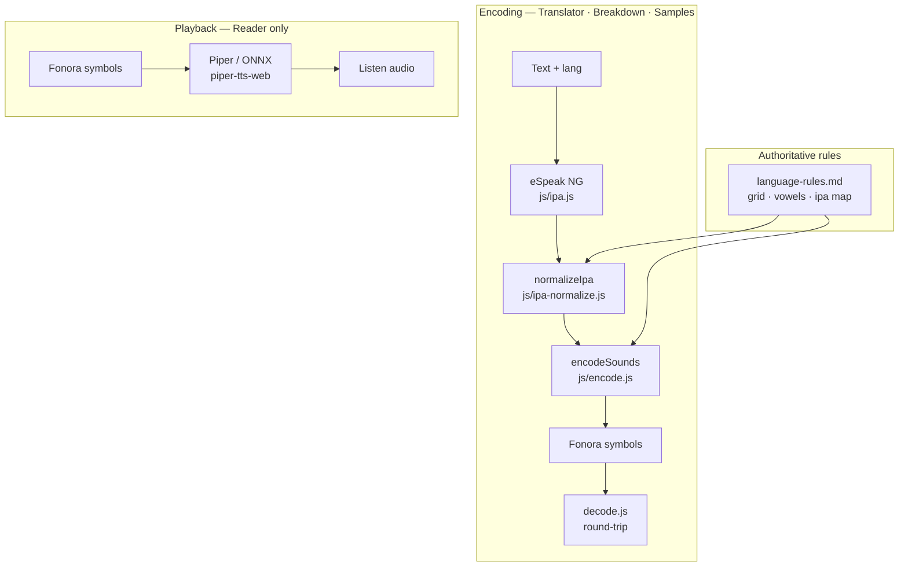

# IPA Pipeline Implementation Report
> **Now a research note.** This document is preserved as a primary source. Related narrative in the research notebook: [RN-02 · Teaching the machine to hear](/research/notes/teaching-the-machine-to-hear).

## Architecture

Fonora uses a single pronunciation pipeline for **Translator, Breakdown, and Samples**. The **Reader** replays Fonora symbols with Piper TTS — it does not re-run encoding.

Legacy English spelling encoder removed. Every word uses eSpeak IPA as pronunciation source (`js/ipa-pipeline.js`).

See also: [multilingual-support.md](multilingual-support.md) (language matrix) · [ipa-normalize.md](ipa-normalize.md) (consonant/vowel maps) · [espeak-integration.md](espeak-integration.md)

## eSpeak NG integration

| Item | Detail |
|------|--------|
| Package | [`espeak-ng`](https://www.npmjs.com/package/espeak-ng) v1.0.2 |
| WASM path | `vendor/espeak-ng/espeak-ng.js` + `vendor/espeak-ng/espeak-ng.wasm` |
| Module | `js/ipa.js` |
| Voices | `en-us`, `es`, `fr-fr`, `de`, `ja`, `ar`, `zh` (+ English dialect variants) |
| License | GPL-3.0-or-later |

See [espeak-integration.md](espeak-integration.md) for setup and voice codes.

## Key modules

| File | Role |
|------|------|
| `js/ipa.js` | eSpeak NG wrapper |
| `js/ipa-normalize.js` | IPA → Fonora phoneme inventory |
| `js/ipa-to-fonora.js` | Phonemes → symbols via `language-rules.md` |
| `js/ipa-pipeline.js` | Pipeline orchestration (phrase + word) |
| `js/language-preferences.js` | UI language and English dialect persistence |
| `js/encode.js` | Longest-match phoneme string → symbol encoding |
| `js/decode.js` | Longest-match symbol string → phoneme keys |
| `js/fonora-config.js` | Active rules bundle for app and pipeline |

## Vowel system (v3)

Vowels use recipe-composed symbols from `language-rules.md`:

- Simple vowels: `⚬X` (vowel indicator + place or manner glyph)
- Diphthongs: `⚬XᵔY` (includes approximant modifier `ᵔ`)

The legacy v2 double-vowel marker `⚬⚬` is retired. See [FONORA_VOWEL_DECISION_REPORT.md](archive/FONORA_VOWEL_DECISION_REPORT.md) for historical v2 analysis only.

## Browser compatibility

- Requires HTTP server (not `file://`)
- ~18 MB first load for eSpeak WASM
- ~32 MB WASM heap typical
- GPL applies to eSpeak NG bundle

## Unmapped IPA phonemes

Retroflexes, tones, Arabic emphatics, and other sounds outside the Fonora inventory map to `?` fallback. Arabic **ʕ** is documented on reserved grid cell **ᵔ⊃** (`/ʕ/`) but has no encoder phoneme key yet. Throat nasal **⏌⊃** is intentionally undefined — no attested glottal nasal. Vowels map to v3 phoneme keys defined in `language-rules.md`, not English orthography.

## Split source of truth (documented gaps)

| Concern | Where it lives today |
| --- | --- |
| Places, modifiers, grid, vowels, derived sounds | `language-rules.md` |
| Consonant IPA→phoneme map | Built from grid + derived at load; supplemental variants in `SUPPLEMENTAL_CONSONANT_MAP` | See [ipa-normalize.md](ipa-normalize.md) |
| Throat `/h/` encoding | Grid documents plain `⊃`; unit tests expect `h` ↔ `⊃` |
| Alphabet primaries | Defined in `language-rules.md`; rendered read-only in the Alphabet tab (localStorage override experiment retired) |

## Recommendations (future work)

1. Native script input for better CJK/Arabic IPA quality
2. Per-language normalize tweaks, English overlay exists; see [multilingual-support.md](multilingual-support.md)
3. Extend `SUPPLEMENTAL_CONSONANT_MAP` when eSpeak emits IPA not covered by markdown cells
4. Document or encode throat `/h/` behavior explicitly in `language-rules.md` if behavior changes
5. Consider `@echogarden/espeak-ng-emscripten` if the npm package stalls

## Related tools

- **Translator tab**: interactive pipeline with editable Fonora output
- **Pronunciation Validation**: automated encode/decode IPA round-trip ([pronunciation-validation.md](pronunciation-validation.md))
- **Pronunciation Testing**: manual multilingual review harness with export
