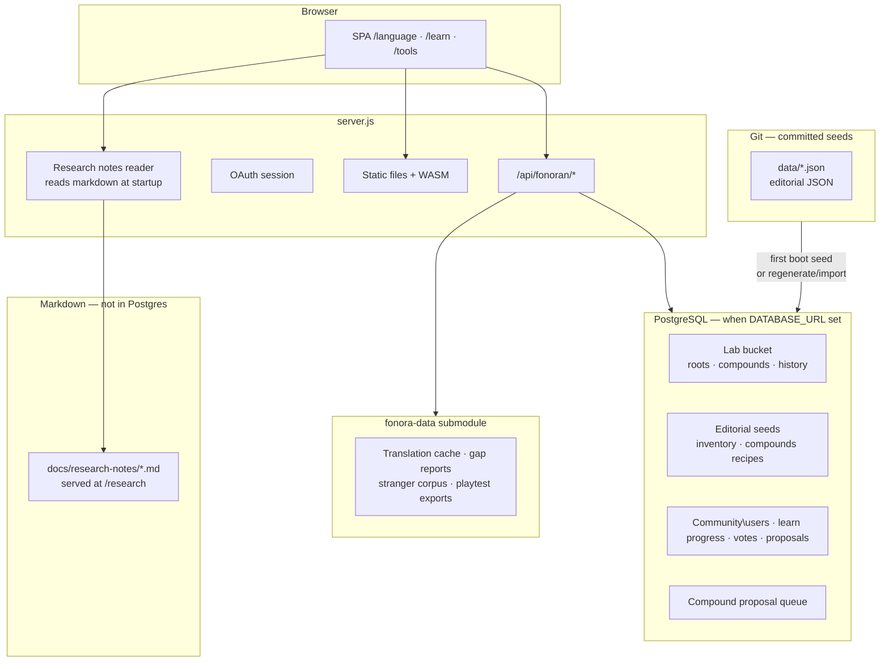

# Deployment
> **Research notebook.** Operational docs for the open research project live alongside the [Research notebook](/research).


Fonora is a **browser-based single-page app** with WASM dependencies. It is not a traditional API backend, but it **does need an HTTP server** in production, not because of server-side logic, but because:

- ES modules (`import`) require HTTP(S)
- `fetch('docs/language-rules.md')` must be served with correct MIME types
- eSpeak NG, ONNX Runtime, and Piper load `.wasm` and `.data` assets
- Opening `index.html` directly (`file://`) is unsupported

The included [`server.js`](../server.js) is a small static file server. Heroku, Railway, Fly.io, or any Node host can run `npm start`.

## Heroku (recommended)

### Prerequisites

- [Heroku CLI](https://devcenter.heroku.com/articles/heroku-cli)
- GitHub repo pushed to `github.com/Fonora/fonora` (or your fork)
- Domain `fonora.org` configured in Heroku + DNS

### Deploy

```bash
heroku login
heroku create fonora   # or link an existing app
heroku buildpacks:set heroku/nodejs
git push heroku main
```

The [`Procfile`](../Procfile) runs `web: npm start`. Heroku sets `$PORT`; the server binds to `0.0.0.0`.

### Build

`npm install` runs `postinstall`, which copies WASM bundles into `vendor/`:

- `vendor/espeak-ng/`, IPA pipeline
- `vendor/espeak-audio/`, Reader audio playback
- `vendor/onnx/`, Piper neural TTS (copied from `onnxruntime-web@1.20.x`, must match `piper-tts-web`)
- `vendor/piper-tts-web/`, Piper browser bundle

`node_modules/` is also present on Heroku; the server falls back to `node_modules/` when `vendor/` copies are missing (see `URL_ALIASES` in [`server.js`](../server.js)). The browser also falls back to unpkg for ONNX WASM if `/vendor/onnx/` returns 404.

### Custom domain

```bash
heroku domains:add fonora.org
heroku domains:add www.fonora.org
```

Point DNS (registrar) to the Heroku DNS targets shown by `heroku domains`. Enable automatic HTTPS in the Heroku dashboard.

### Health check

```
GET /health → 200 ok
```

Use for uptime monitors.

## Environment variables

| Variable | Default | Purpose |
| --- | --- | --- |
| `PORT` | `8000` | HTTP port (set by Heroku) |
| `HOST` | `0.0.0.0` | Bind address |
| `DATABASE_URL` | - | PostgreSQL connection string for Fonoran lab data |
| `FONORAN_STORAGE` | `postgres` if `DATABASE_URL` set, else `json` | Force `json` or `postgres` storage |
| `FONORAN_SKIP_JSON_MIRROR` | - | Set to `1` to skip writing JSON mirror when using PostgreSQL |
| `PGSSLMODE` | - | Set to `disable` for local PostgreSQL without SSL |
| `GOOGLE_CLIENT_ID` | - | Google OAuth client ID (Fonoran write auth) |
| `GOOGLE_CLIENT_SECRET` | - | Google OAuth client secret |
| `SESSION_SECRET` | - | Random secret for signing session cookies (32+ chars) |
| `ALLOWED_DOMAIN` | - | **Legacy** — no longer restricts community sign-in. Use `ADMIN_EMAILS` for admin-tier access. |
| `ADMIN_EMAILS` | - | Comma-separated allowlist of Google emails with full admin write access |
| `AUTH_CALLBACK_URL` | derived from request | OAuth redirect URI override |
| `FONORAN_AUTH` | omit in production | Opt-out only: set to `off` locally to disable auth when OAuth is configured |

No secrets are required for the **public script app** alone. When all three OAuth vars are set (`GOOGLE_CLIENT_ID`, `GOOGLE_CLIENT_SECRET`, `SESSION_SECRET`), Fonoran uses a two-tier auth model: any signed-in Google user may vote and submit proposals (community tier); admin writes require an email in `ADMIN_EMAILS`. Omit `FONORAN_AUTH` in production; it is an opt-out flag only (`off` disables auth for local builder work). Copy [`.env.example`](../.env.example) for local testing. See [fonoran-auth-and-release.md](fonoran-auth-and-release.md) for the full tier breakdown.

## PostgreSQL (Fonoran storage)

All **runtime Fonoran lab state** lives in **PostgreSQL** when `DATABASE_URL` is set:



- Lab bucket (roots, words, review state, history)
- Concept inventory, root candidates, approved roots
- English word banks (`localizations/en.json`)
- Build inputs (compound recipes, phonetics config)
- **Compound proposal queue** (`fonoran:vocab-survey`, Review tab)
- Community users, learn progress, community proposals/votes

**Not in PostgreSQL:** research notes (`docs/research-notes/*.md` — read from disk at startup), fonora-data artifacts (translation cache, stranger corpus, refine logs).

**fonora-data submodule** (via `FONORAN_DATA_DIR` / `external/fonora-data`): translation cache, gap reports, stranger corpus, playtest exports, refine iteration logs — research artifacts, not live lab state.

Git-tracked JSON under `data/` is the **seed** format. On first boot with an empty database, the server seeds from those files automatically.

### Heroku Postgres

```bash
heroku addons:create heroku-postgresql:essential-0
heroku config:get DATABASE_URL
heroku config:set FONORAN_SKIP_JSON_MIRROR=1
```

Set `FONORAN_SKIP_JSON_MIRROR=1` on Heroku so the dyno filesystem is not relied on for persistence.

On first boot with an empty database, the server **seeds** from git JSON if present. Your seed files are **not deleted**.

### Snapshots (backup & disaster recovery)

Full-state backups use the same JSON layout as seed files, bundled in a zip with `manifest.json`.

**Advanced UI** (More → Advanced → Backup & sync):

- **Download snapshot** — zip of all runtime + build-input docs
- **Import snapshot** — replace all state (requires typing `RESTORE`)

**CLI:**

```bash
# Export to timestamped zip (default: backups/fonoran-YYYY-MM-DD.zip)
npm run fonoran:snapshot:export

# Export Postgres → local seed paths (for git commit)
npm run fonoran:snapshot:export -- --to=data/

# Import zip → Postgres
npm run fonoran:snapshot:import -- backups/fonoran-2026-06-28.zip

# Import local seed paths → Postgres (local bootstrap)
npm run fonoran:snapshot:import -- --from=data/
```

Legacy lab-only commands (still supported):

```bash
npm run fonoran:import   # lab bucket JSON → PostgreSQL only
npm run fonoran:export   # lab bucket PostgreSQL → JSON only
```

### Local development

Without `DATABASE_URL`, storage falls back to JSON files under `data/`. Use snapshot export/import to sync between JSON mode and a local Postgres instance.

**External research data:** LLM evaluations, playtests, translation snapshots, and the research-notes JSON store live in [Fonora/fonora-data](https://github.com/Fonora/fonora-data), checked out as `external/fonora-data` (git submodule). After clone:

```bash
git submodule update --init
npm run fonoran:data:status
```

Optional `.env`: `FONORAN_DATA_DIR=external/fonora-data`. The main repo pins the data version in `data/fonora-data.manifest.json`.

**Heroku:** GitHub deploy does not checkout git submodules. `postinstall` and the `release:` phase run `scripts/fonoran-data-fetch.js`, which downloads the pinned commit from GitHub into `external/fonora-data` (no `git` required on the dyno). Set `FONORAN_DATA_DIR=external/fonora-data` on Heroku.

See [platform-overview.md](platform-overview.md) for the data architecture overview.

**Fonoran vocabulary pipeline (optimize → build → Heroku):** [fonoran-compound-workflow.md](fonoran-compound-workflow.md). On Heroku after deploy, use **Advanced → Regenerate dictionary from git seeds** at `/tools#advanced` (admin sign-in required).

### Research notes (markdown)

**Source of truth:** [`docs/research-notes/RN-XX-slug.md`](research-notes/RN-01-writing-sound-instead-of-spelling.md) — one markdown file per note. Optional YAML frontmatter for `status`, `date`, and `phase`.

At **runtime**, the server reads those files at startup, caches them in memory, and embeds the index in the research HTML shell. No Postgres, no fonora-data, no deploy sync step.

Verify before merge:

```bash
npm run research:verify-md
```

See [research-notes-authoring.md](research-notes-authoring.md).

## Static hosting alternatives

Platforms like **Netlify**, **Cloudflare Pages**, or **GitHub Pages** can host the files, but you must:

1. Run `npm install` in CI to populate `vendor/`
2. Publish `index.html`, `app.css`, `js/`, `docs/`, `vendor/`
3. Configure WASM MIME type (`application/wasm`)
4. Ensure ES module paths resolve (no bundler today)

Because WASM assets are large (~90 MB in `vendor/` after install), a Node static server on Heroku is the simplest path that matches local development.

## Production checklist

### Fonora (script app)

- [ ] `npm install && npm test` pass
- [ ] `npm start`, Translator, Reader, and Sound Grid work
- [ ] `https://fonora.org` serves with valid TLS
- [ ] Canonical URL and Open Graph tags point to `https://fonora.org/` (see `index.html`)
- [ ] Custom domain redirects `www` → apex or vice versa (your preference)

### Fonoran (language builder)

- [ ] Google Workspace + OAuth credentials configured ([fonoran-auth-and-release.md](fonoran-auth-and-release.md))
- [ ] `GOOGLE_CLIENT_ID`, `GOOGLE_CLIENT_SECRET`, `SESSION_SECRET`, `ADMIN_EMAILS` set on Heroku
- [ ] `FONORAN_AUTH` omitted in production (opt-out only; do not set to `off` on Heroku)
- [ ] Community users can vote/propose; admin writes require a listed `ADMIN_EMAILS` session
- [ ] `DATABASE_URL` set; `FONORAN_SKIP_JSON_MIRROR=1` on Heroku
- [ ] On first deploy: run `npm run fonoran:regenerate` (via **Advanced** at `/tools#advanced`, or Heroku one-off dyno) to populate Postgres from git seed data — `data/fonoran-compounds.json` + `data/fonoran-approved-roots.json` are the canonical sources
- [ ] Verify dictionary via `GET /api/fonoran/lab/compounds` (run `npm run fonoran:compound-audit` for live count)
- [ ] Research notes: served from `docs/research-notes/` markdown at runtime — no Postgres sync needed; verify with `npm run research:verify-md`
- [ ] Contributor Google Form linked from `/language/` lander
- [ ] Periodic backup: **Advanced** at `/tools#advanced` → Download snapshot, or `npm run fonoran:snapshot:export`

## CI

GitHub Actions runs `npm test` on push/PR, see [`.github/workflows/ci.yml`](../.github/workflows/ci.yml).
