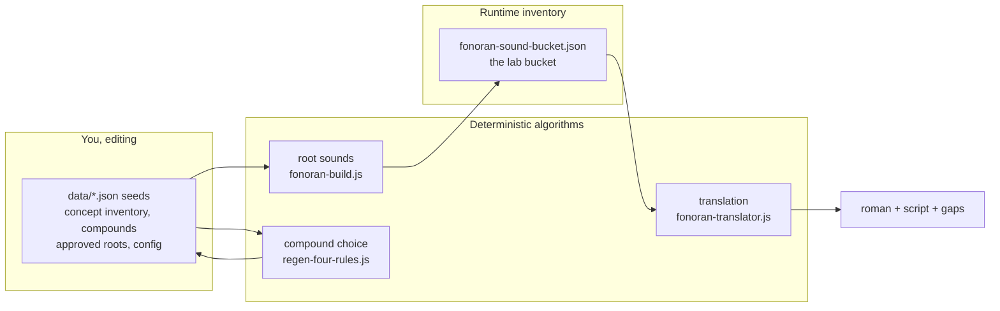
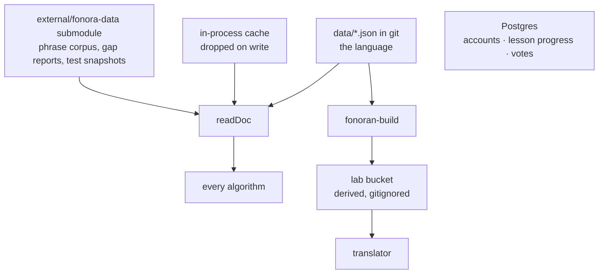
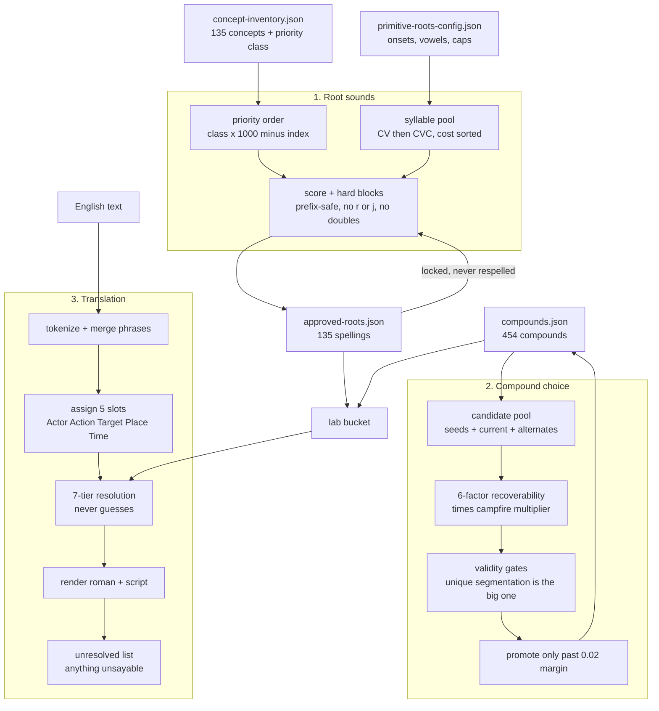

# Architecture: how it is all connected

> **One page. What reads what, where the truth lives, and where the fat is.**
> Everything below is measured from the real import graph, not remembered. Regenerate the counts with `node scripts/fonoran-verify-llm-quarantine.js --map`.
>
> **The five source-of-truth docs:** [rulebook](fonoran-rulebook.md), [roots](fonoran-algorithm-roots.md), [compounds](fonoran-algorithm-compounds.md), [translation](fonoran-algorithm-translation.md), and this page.

## The shape in one diagram

Read that middle path carefully, because it is the whole problem. Root generation writes the **lab bucket**, and translation reads the **lab bucket**, not the seeds. Editing a seed changes nothing a reader can see until the build runs.

## Where the truth lives

One place: the committed files under `data/`.

| Editorial doc | Seed path |
| --- | --- |
| concept_inventory | `data/fonoran-concept-inventory.json` |
| approved_roots | `data/fonoran-approved-roots.json` |
| compounds | `data/fonoran-compounds.json` |
| root_candidates | `data/fonoran-root-candidates.json` |
| phonetics_config | `data/fonoran-primitive-roots-config.json` |
| localization_en | `data/localizations/en.json` |

Postgres is still in the system, holding accounts, lesson progress, community proposals, and votes. It holds no part of the language.

### Why this is worth stating

It used to be otherwise, and the cost was high enough to be worth remembering. The same document could exist in four places: an in-process cache, Postgres rows active whenever `DATABASE_URL` was set, the git seed file, and a fifth copy of the vocabulary in the lab bucket that the translator actually read. `readDoc` checked the cache, then Postgres, and reached the git file last, so on any machine with a database configured, the file you had just edited was the last place the code looked.

That produced translations that looked finished while running on the wrong seeds, and an automated refine loop that accepted compounds into `fonoran-compounds.json`, reported success, and changed nothing, because the build was reading the database. There was no bug to find either time. It was the design.

The lab bucket still exists, but it is derived rather than authoritative: `fonoran-build` writes it from the seeds, it is gitignored, and it carries only state no seed has a place for, namely the undo history, the activity log, and the DDA cache. Editing a seed still changes nothing a reader can see until the build runs, which is the one piece of indirection that remains, and it is a build step rather than a second source.

## How it reaches the browser

The language is small; getting it to a page was not. A first visit to `/language` used to transfer **48 MB**, and a first visit to the home page **560 MB**. Both now sit around 600 KB and 9 MB. Nothing about the language changed, so it is worth naming what did, because every one of these was invisible from the import graph above.

| What was wrong | What it cost | Where it is handled now |
| --- | --- | --- |
| No compression anywhere | Bootstrap went out as 1.1 MB instead of 98 KB | `tools/http-compress.js`, used by `server.js` and the API |
| `Cache-Control: no-cache` with no validator | Every asset re-downloaded in full on every visit | ETag and 304 in `server.js` |
| `/vendor/` treated as volatile app code | 44 MB speech bundle revalidated per page load | Vendored bundles are version-pinned, so they are `immutable` |
| Speech engines warmed during page setup | 44 MB in front of first paint, for everyone | `js/warm-on-engage.js` waits for a real visitor |
| Seven modules each fetching the bootstrap | The same 1.1 MB fetched 18 times per load | `js/fonoran-bootstrap.js`, one shared promise |
| eSpeak re-instantiated per phrase | 18 MB fetched and compiled ~31 times | Compiled once in `js/ipa.js`, reused per call |

Two lessons generalise. **Caching a result is not caching a request**: the bootstrap and the course phrases both had result caches, and both still fetched many times over, because the callers all start together during page setup and every one of them looks before the first answer arrives. The fix is to cache the promise. And **a cache header without a validator is not a cache**: `no-cache` means revalidate, but with no ETag to revalidate against, it means re-send everything.

## The three pipelines, in detail

## How big it actually is

Each row is the transitive import closure of one entry point, so a module needed by two stages is counted in both.

| Scope | Entry point | JS modules |
| --- | --- | --- |
| Root generation, everything it needs | `tools/fonoran-root-sound-assign.js` | 8 |
| Compound selection, everything it needs | `tools/fonoran-preferred-select.js` | 15 |
| Translation, everything it needs | `tools/fonoran-translate.js` | 35 |
| **The language, all three combined** | | **49** |
| Booting the web server | `server.js` | 71 |
| The whole repo, excluding vendored code | | 234 |

Supporting cast: 114 browser files under `js/`, 76 under `tools/`, 35 under `scripts/`, 38 vendored text-to-speech files, 47 JSON files in `data/`, and 4 more in the external data repo.

**38 of the 76 `tools/` files are not part of the language at any point.**

## So could it be five files?

Not five, but 49 is closer than the 56 this page reported before the hand-written English rules came out. Translation fell from 48 modules to 35 when the pattern cascade, the irregular verb table, and the second and third lemmatizers were deleted and `wink-nlp` was left to own English. Fonoran itself was never the big part; understanding English was.

A realistic target is still one module per stage, roughly 10 to 15 for the language.

## The fat, named

Measured, not guessed. Each is a candidate, not a decision.

**Nothing outside `vendor/` is currently unreachable.** Every JS file is imported by another module, named in an npm script, or loaded by a `<script>` tag. The eleven files this section used to list have been deleted, except `scripts/fonoran-word-ownership.js`, which turned out to be a live maintenance CLI: it writes `data/fonoran-word-ownership.json`, which `tools/fonoran-invariants.js` reads on every `npm test`.

**A dead-code sweep must check HTML script tags as well as imports**, or it will propose deleting the main page. No JS file imports these:

| File | Entry point |
| --- | --- |
| `language/fonoran-app.js` | `language/index.html`, the whole `/language` page |

**Structural fat, in the order that would help most:**

1. ~~**Collapse the store to one source.**~~ Done. The Postgres path is gone and the seeds are read directly; the lab bucket survives as a derived build artifact.
2. ~~**Isolate the English front end.**~~ Mostly done. `wink-nlp` owns tokenizing and lemmatizing through the single `tools/fonoran-english-morphology.js`, and the hand-written pattern cascade, the 48-entry irregular past table, and the duplicate lemmatizers are gone. What remains is `fonoran-interpretation.js` and `fonoran-english-resolve.js`, which still hold English-shaped rules and are the next thing to shrink.
3. **The GUI.** If the workflow is you and me editing seeds directly, then Word Manager and the proposal review screens are surface area maintaining a second way to change the language.

## If this page and the code disagree

The code wins, and this page is the bug.

| Thing | Source |
| --- | --- |
| Seed paths and doc keys | `tools/fonoran-store.js` |
| User data schema | `tools/fonoran-community-store.js` |
| External data paths | `tools/fonoran-data-paths.js` |
| Import graph and model boundary | `scripts/fonoran-verify-llm-quarantine.js` |
| Build pipeline | `tools/fonoran-build.js` |
| Compression and caching rules | `tools/http-compress.js`, `cacheControl()` in `server.js` |
| How a page gets the lab | `js/fonoran-bootstrap.js` |
