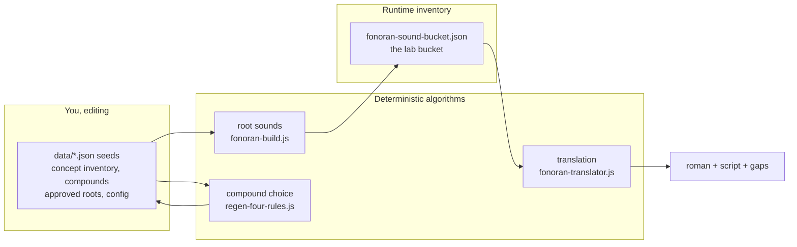
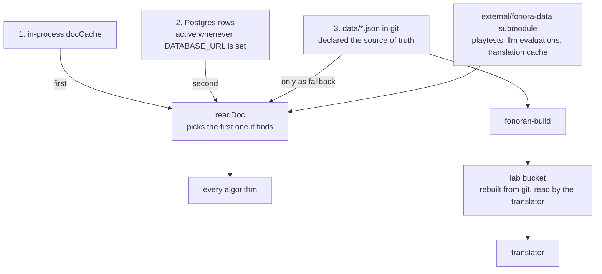
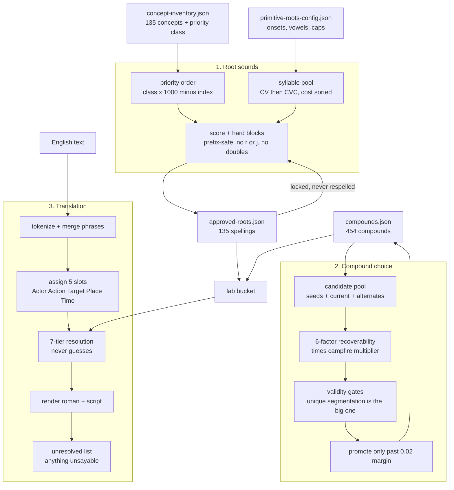

# Architecture: how it is all connected

> **One page. What reads what, where the truth lives, and where the fat is.**
> Everything below is measured from the real import graph, not remembered. Regenerate the counts with `node scripts/fonoran-verify-llm-quarantine.js --map`.
>
> **The five source-of-truth docs:** [rulebook](fonoran-rulebook.md), [roots](fonoran-algorithm-roots.md), [compounds](fonoran-algorithm-compounds.md), [translation](fonoran-algorithm-translation.md), and this page.

## The shape in one diagram



Read that middle path carefully, because it is the whole problem. Root generation writes the **lab bucket**, and translation reads the **lab bucket**, not the seeds. Editing a seed changes nothing a reader can see until the build runs.

## Where the truth lives, and why that broke

The same document can exist in four places at once.



`readDoc` returns the memory cache if warm, then Postgres if configured, and only falls back to the git seed file. So on any machine with `DATABASE_URL` set, **the file you just edited is the last place the code looks.**

That is the mechanism behind translations that looked finished while running on the wrong seeds. There is no bug to find. It is the design: eight documents are store-managed and can diverge from git, and a fifth copy of the vocabulary lives in the lab bucket that the translator actually reads.

| Store-managed doc | Seed path |
| --- | --- |
| concept_inventory | `data/fonoran-concept-inventory.json` |
| approved_roots | `data/fonoran-approved-roots.json` |
| compounds | `data/fonoran-compounds.json` |
| root_candidates | `data/fonoran-root-candidates.json` |
| phonetics_config | `data/fonoran-primitive-roots-config.json` |
| localization_en | `data/localizations/en.json` |
| playtests | external data dir when configured |
| llm_evaluations | external data dir when configured |

## The three pipelines, in detail



## How big it actually is

| Scope | JS modules |
| --- | --- |
| Root generation, everything it needs | 18 |
| Compound selection, everything it needs | 17 |
| Translation, everything it needs | 44 |
| **The language, all three combined** | **53** |
| Booting the web server | 90 |
| The whole repo | 329 |

Supporting cast: 120 browser files under `js/`, 101 under `tools/`, 59 under `scripts/`, 39 vendored text-to-speech files, 49 JSON files in `data/`, and 9 more in the external data repo.

**59 of the 101 `tools/` files are not part of the language at any point.**

## So could it be five files?

Not five, but 53 is not defensible either. The honest breakdown of what translation's 44 modules are doing: a large part is English-side machinery rather than Fonoran, namely the tokenizer, lemmatizer, irregular verb tables, phrase merging, interpretation rules, and concept bridges. Fonoran itself is small. Understanding English is what sprawled.

A realistic target is one module per stage, so roughly 10 to 15 for the language, with the English front end isolated in one place instead of threaded through everything.

## The fat, named

Measured, not guessed. Each is a candidate, not a decision.

**Not imported anywhere, not an npm script, not loaded by any page.** These are the safest deletions:

```text
js/platform-showcase.js
js/safe-html.js
load-env.js
scripts/fonoran-apply-experience-tiers.js
scripts/fonoran-migrate-compounds.js
scripts/fonoran-word-bank-propose.js
scripts/fonoran-word-ownership.js
scripts/inject-research-note-frontmatter.js
scripts/migrate-research-note-slugs.js
scripts/polish-research-notes-md.js
scripts/research-notes-sync-deploy.js
```

Four of those exist only to maintain research notes.

**Do not delete these, despite an import scan calling them orphans.** They are `<script>` entry points, so no JS file imports them and a graph walk cannot see them:

| File | Entry point |
| --- | --- |
| `language/fonoran-app.js` | `language/index.html`, the whole `/language` page |
| `js/research-app.js` | `research/index.html` |
| `showcase/showcase.js` | `showcase/index.html` |

Any future dead-code sweep has to check HTML script tags as well as imports, or it will propose deleting the main page.

**Structural fat, in the order that would help most:**

1. **Collapse the store to one source.** Delete the Postgres path and the lab bucket, read seeds directly. This removes the class of bug that cost you the most, and it is what the Cursor-based workflow needs: edit seed, regenerate, done.
2. **27 pending LLM cuts**, listed with individual fixes in `data/fonoran-llm-quarantine.json`. Start with `fonoran-translator.js`, which only needs three grammar helpers rehoused.
3. **The GUI.** If the workflow is you and me editing seeds directly, then Word Manager, the pipeline wizard, and the proposal review screens are surface area maintaining a second way to change the language.
4. **The research-note subsystem**: notes, a store, an API, verification scripts, and sync tooling.

## Where the truth lives

If this page and the code disagree, the code wins, and this page is the bug.

| Thing | Source |
| --- | --- |
| Store layering and doc keys | `tools/fonoran-store.js` |
| External data paths | `tools/fonoran-data-paths.js` |
| Import graph and LLM boundary | `scripts/fonoran-verify-llm-quarantine.js` |
| Build pipeline | `tools/fonoran-build.js` |
