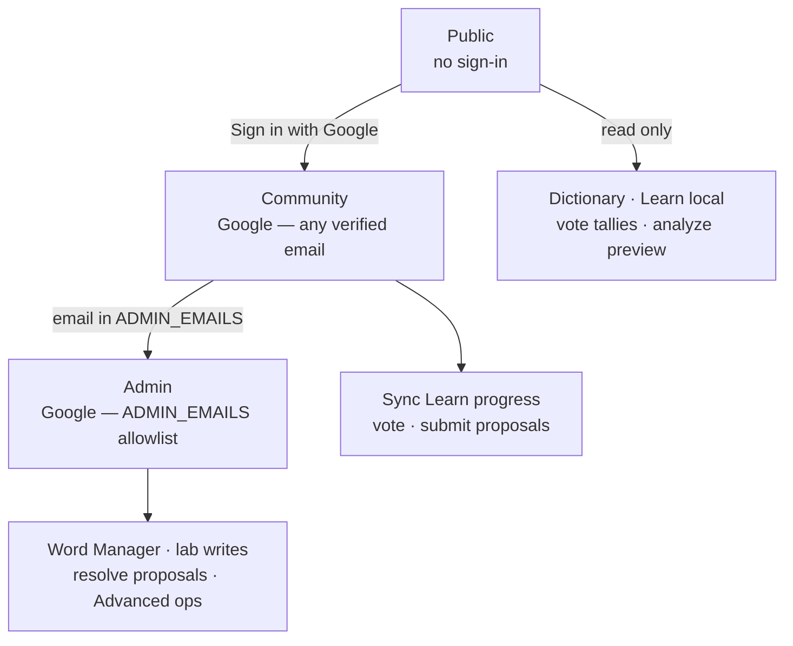

# Fonoran auth, contributions, and release plan

> **Status:** implemented — dual-tier OAuth (community + admin).

This document covers authentication, community features (progress sync, votes, proposals), and admin vocabulary editing.

---

## Auth tiers



| Tier | Sign-in | Capabilities |
| --- | --- | --- |
| **Public** | none | Read dictionary, learn (local progress), browse vote tallies |
| **Community** | Google (any verified email) | Sync Learn progress, vote on words, submit proposals |
| **Admin** | Google (`ADMIN_EMAILS`, default `info@fonora.org`) | Word Manager canon edits, approve/reject lab, promote proposals |

### Routes

| Access | Methods | Examples |
| --- | --- | --- |
| Public | GET | `/api/fonoran/words`, lab, dictionary, health |
| Public | POST | `/api/fonoran/analyze/word` (preview) |
| Community | POST (session) | vote, `/api/fonoran/me/progress`, proposals |
| Admin | POST/PATCH (session) | lab writes, concept edits, proposal resolve |

```
GET  /auth/session
GET  /auth/google → /auth/callback
POST /auth/logout

GET  /api/fonoran/words              public inventory
GET  /api/fonoran/words/:id          public detail + vote tallies
POST /api/fonoran/analyze/word       public analysis preview
POST /api/fonoran/words/:id/vote     community session
GET/PUT /api/fonoran/me/progress     community session
POST /api/fonoran/proposals          community session
POST /api/fonoran/proposals/:id/vote community session
POST /api/fonoran/proposals/:id/resolve  admin only

POST/PATCH lab + concepts routes     admin only
```

### Env vars

| Variable | Purpose |
| --- | --- |
| `GOOGLE_CLIENT_ID` / `GOOGLE_CLIENT_SECRET` | Google OAuth |
| `SESSION_SECRET` | Required to enable auth |
| `ADMIN_EMAILS` | Comma-separated admin allowlist (default `info@fonora.org`) |
| `DATABASE_URL` | Recommended for user/progress/vote persistence |
| `FONORAN_AUTH` | Opt-out only: set to `off` locally to disable auth when OAuth is configured |

Community data is stored in `fonoran_users`, `fonoran_learn_progress`, `fonoran_proposals`, `fonoran_votes` (Postgres) or `data/fonoran-community.json` (JSON mode).

Learn progress sync: see [fonoran-learn.md](fonoran-learn.md).

---

## Contributor intake (Google Form)

Use a **Google Form** in Workspace (linked from `/language/` lander and [CONTRIBUTING.md](../CONTRIBUTING.md)). Responses go to a Google Sheet; you review manually and enter approved items yourself in the builder.

### Suggested fields

| Field | Type | Required |
| --- | --- | --- |
| First name | Short text | Yes |
| Last name | Short text | Yes |
| Email address | Email | Yes |
| University / institution | Short text | Yes |
| `.edu` email address | Email | Yes (verify affiliation) |
| Role | Multiple choice: **Student (major)** / **Professor** / **Other** | Yes |
| If student: major / field of study | Short text | Conditional |
| If professor: department / title | Short text | Conditional |
| Why do you want to contribute to Fonoran? | Paragraph | Yes |
| What would you like to contribute? | Checkboxes: new roots, compound words, meanings, pronunciation review, documentation, other | Yes |
| Prior conlang or linguistics experience | Paragraph | No |
| Can we contact you at your `.edu` address? | Yes / No | Yes |
| Anything else we should know? | Paragraph | No |

Replace `FORM_URL_TBD` in docs/UI once the Form is created:

```
https://docs.google.com/forms/d/e/FORM_ID/viewform
```

---

## Open source and repo layout

**Same repo for Fonora + Fonoran is fine.**

| In git (public) | Out of git (private / production) |
| --- | --- |
| Builder UI, API handlers, auth middleware | `GOOGLE_CLIENT_SECRET`, `SESSION_SECRET`, `DATABASE_URL` |
| Reference JSON (`fonoran-gen3-*`, `fonoran-canonical-*`) | Live lab: `data/fonoran-sound-bucket.json` (gitignored) |
| Docs, tests, CLI tools | PostgreSQL rows for production vocabulary |
| Auto-built lexicon source logic | `data/fonoran-english-lexicon.json` (gitignored, built at runtime) |

**Fonora contributions:** GitHub issues / PRs (existing templates).

**Fonoran contributions:** Google Form → manual review → you add approved items while signed in.

---

## Release checklist

### Pre-production deploy

- [ ] Google Workspace live; admin 2FA enabled
- [ ] OAuth credentials created; redirect URIs configured
- [ ] Heroku config: `GOOGLE_*`, `SESSION_SECRET`, `ADMIN_EMAILS`, `DATABASE_URL`
- [ ] Smoke test: unsigned user can browse dictionary; cannot POST lab writes
- [ ] Signed-in admin can create and approve words
- [ ] Export backup: `npm run fonoran:snapshot:export` after deploy

### Post-deploy

- [ ] `/language/` lander links to Google Form
- [ ] `GET /health` monitored
- [ ] Document auth troubleshooting in [deploy.md](deploy.md)

---

## Related docs

- [platform-overview.md](platform-overview.md) — three-layer architecture
- [fonoran-learn.md](fonoran-learn.md) — Learn progress sync
- [fonoran.md](fonoran.md) — vocabulary model and API
- [deploy.md](deploy.md) — Heroku, PostgreSQL, production checklist
- [CONTRIBUTING.md](../CONTRIBUTING.md) — contribution paths

---

## Archive: pre-release planning notes

The sections below are **historical planning material** from before OAuth shipped. Current behavior is documented above.

<details>
<summary>Legacy goals, Phase 1 sketch, and branch review (click to expand)</summary>

### Goals (pre–Word Manager)

| Goal | Approach |
| --- | --- |
| **Fonora script** stays open | Public read + GitHub PRs for `language-rules.md` and encoder changes |
| **Fonoran language** edits are controlled | Google OAuth for builder write access; public read-only dictionary |
| **Contributor intake** | Google Form (Workspace), no in-app form, no admin panel |
| **Admin workflow** | Sign in with Google, use existing builder tabs |
| **Open source repo** | Auth middleware and docs in git; secrets and live vocabulary stay out of git |

### What we were *not* building

- In-app intake / submission queue
- Separate admin panel or inbox UI
- Custom TOTP / 2FA inside the app

### Authentication (Phase 1 sketch — now implemented)

1. Session middleware on `server.js` (httpOnly, Secure, SameSite=Lax cookie)
2. Routes: `GET /auth/google`, `GET /auth/callback`, `POST /auth/logout`, `GET /auth/session`
3. In `tools/fonoran-api.js`: allow all **GET**; require valid session for **POST** and **PATCH**
4. `ADMIN_EMAILS` allowlist for admin tier (replaces legacy `ALLOWED_DOMAIN` restriction on community sign-in)

### Branch review: `feature/fonoran-language-experiment` (historical)

Reviewed against `main`. **Nothing in the committed history should be removed** for open-source release. Blockers listed below were addressed when Phase 1 auth shipped.

- Unauthenticated write API — **fixed** (admin session required for mutating routes)
- Dangerous ops (`lab/seed`, `reset-review`, `undo`) — **fixed** (admin only)

</details>
