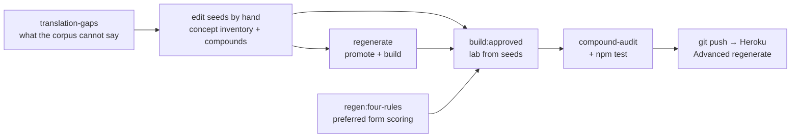

# Fonoran CLI tools

Command-line tools for building, reviewing, and maintaining the Fonoran vocabulary. Run all commands from the repo root after `npm install`.

Most npm scripts wrap modules in `tools/` or `scripts/`. The [Fonoran guide](fonoran.md) covers the language model and web UI; [compound workflow](fonoran-compound-workflow.md) covers local vs Heroku sequences. This page is the command reference.

Every command here is deterministic: same seeds in, same output out. No command in this document calls a language model. The model-driven proposal, playtest, and ranking loops were removed in July 2026, and vocabulary is now authored by hand in the seed files (see [compound workflow](fonoran-compound-workflow.md)).

## Pipeline overview



| Stage | Primary commands | Web UI |
| --- | --- | --- |
| Author vocabulary | edit `data/fonoran-concept-inventory.json`, `data/fonoran-compounds.json` | Words — `/tools#word-manager` |
| Accept & publish | `fonoran:regenerate` | Advanced — `/tools#advanced` |
| Rank preferred forms | `fonoran:regen:four-rules` | — |
| Build lab | `fonoran:build`, `fonoran:build:approved` | — |
| Measure | `fonoran:translation-gaps`, `npm test` | Translation Test |
| Ship | `git push heroku` + regenerate on dyno | Advanced regenerate |

---

| Goal | Command |
| --- | --- |
| Fresh lab + full build | `npm run fonoran:reset && npm run fonoran:build` |
| Edit roots & words in UI | Open **Words** at [`/tools#word-manager`](/tools#word-manager) |
| Review the proposal queue | Open **Review** at [`/tools#gap-workshop`](/tools#gap-workshop) |
| Publish after approvals | **Advanced** → regenerate dictionary, or `npm run fonoran:regenerate` |
| Find translation gaps | `npm run fonoran:translation-gaps` |

---

## Build pipeline

These commands assign root spellings, resolve compounds, and import into the lab (`data/fonoran-sound-bucket.json` or PostgreSQL when `DATABASE_URL` is set).

| Command | What it does |
| --- | --- |
| `npm run fonoran:build` | Full pipeline: assign CV/CVC roots from concept inventory, build curated compounds, validate unique segmentation, import lab. Approved spellings stay locked on re-run. |
| `npm run fonoran:build:approved` | Same as build but pre-approves everything (testing only). |
| `npm run fonoran:reset` | Blank lab, review queue, and canonical roots — destructive reset for a clean start. |
| `npm run fonoran:root-candidates` | Refresh root candidate spellings and scores without importing into the lab. |
| `npm run fonoran:regenerate` | Regenerate the live dictionary export after lab changes (used after accepting proposals in Review). |
| `npm run fonoran:regen-compounds` | Re-resolve compound compositions from current roots. |
| `npm run fonoran:regen:four-rules` | Re-rank preferred compound forms by the four word rules. Add `-- --apply` to write. |
| `npm run fonoran:build:policy` | Rebuild the generated language policy module from seeds. |
| `npm run fonoran:policy:check` | Fail if the generated policy is stale (wired into `npm test`). |

**Typical loop:**

```bash
npm run fonoran:reset && npm run fonoran:build
# → approve roots in Words (/tools#word-manager)
# → npm run fonoran:build again
# → npm run fonoran:regenerate
```

---

## Concept inventory & roots

| Command | What it does |
| --- | --- |
| `npm run fonoran:inventory-migrate` | Seed editorial metadata (`plain_description`, `priority_class`, etc.) on `data/fonoran-concept-inventory.json`. |
| `npm run fonoran:reconcile-inventory` | Reconcile concept inventory against lab state. |
| `npm run fonoran:root-capacity` | Report how many CV/CVC slots remain for new roots. |
| `npm run fonoran:root-capacity:tiers` | Capacity broken down by experience tier. |
| `npm run fonoran:root-rings:apply` | Apply ring assignments to the concept inventory. |
| `npm run fonoran:prefix-safe` | Regenerate algorithmically prefix-safe CV/CVC inventory ([`data/fonoran-prefix-safe-roots.json`](../data/fonoran-prefix-safe-roots.json)). |
| `npm run fonoran:prefix-safe -- --check` | Fail if the inventory is stale or any `prefix_overlap` pair exists (wired into `npm test`). |
| `npm run fonoran:cv-density:project` | Thought-experiment projections: CV/CVC density by ring/priority, exclusivity examples, counterfactuals. |

---

## Vocabulary review

New vocabulary is authored by a human, either in the **Words** tab or directly in the seed JSON. The **Review** tab (`/tools#gap-workshop`) shows translation gaps and any compound proposals still sitting in the queue.

Accepted compounds require dictionary regeneration (Advanced tab or `npm run fonoran:regenerate`).

The queue lives in `data/fonoran-compound-proposals.json` and is committed, so it is the same list on every machine. Generated artifacts (gap reports, test snapshots) live in the **fonora-data** submodule via `resolveDataPath()`.

---

## Translation gaps & probes

Live translator architecture: [fonoran-translator.md](fonoran-translator.md). Algorithm: [fonoran-algorithm-translation.md](fonoran-algorithm-translation.md).

| Command | What it does |
| --- | --- |
| `npm run fonoran:translation-gaps` | Full gap report: unknown words, coverage stats, quality findings. |
| `npm run test:translator` | Grammar spec, golden regression, and frame probes. Fails on unexpected translator drift. |
| `npm run test:translator:golden` | Golden regression only. |
| `npm run test:translator:update` | Accept current translator output as new golden baseline. |
| `npm run test:translator:probes` | Frame probes with full output. |

---

## Compound audit

| Command | What it does |
| --- | --- |
| `npm run fonoran:compound-audit` | Compound quality audit, written to `reports/` (not committed). |
| `npm run fonoran:compound-prune` | Remove compounds that no longer resolve. |
| `npm run fonoran:compound-confusability` | Report near-collisions between compound surfaces. |
| `npm run fonoran:concept-gap-audit` | Concepts with no root and no compound. |
| `npm run fonoran:seed-quality-audit` | Structural problems in the seed files. |

**Authority tiers for preferred forms:** `human` / `playtest` (locked) → `four_rules`. `playtest` is historical provenance from the retired guess-the-meaning game; those decisions were human and stay locked.

---

## English lexicon & roots

| Command | What it does |
| --- | --- |
| `npm run fonoran:roots` | Build English root mapping data. |
| `npm run fonoran:lexicon` | Write English lexicon file. |
| `npm run fonoran:lexicon:audit` | Audit lexicon coverage and consistency. |
| `npm run fonoran:lexicon:hygiene` | Apply lexicon hygiene fixes. |

---

## Learn course phrases

| Command | What it does |
| --- | --- |
| `npm run fonoran:course-phrases:build` | Rebuild the committed Learn phrase snapshot. |
| `npm run fonoran:course-phrases:build:cache` | Same, without new translation work. |

Learn compiles phrase roman at runtime, so a rebuild is only needed to refresh the offline snapshot and CI fixtures.

---

## Data management

External vocabulary data lives in the `fonora-data` submodule.

| Command | What it does |
| --- | --- |
| `npm run fonoran:data:init` | Initialize git submodules (`fonora-data`). |
| `npm run fonoran:data:fetch` | Fetch latest pinned data from remote. |
| `npm run fonoran:data:status` | Show submodule commit vs manifest pin. |

---

## Testing & diagnostics

| Command | What it does |
| --- | --- |
| `npm test` | Unit tests, seed invariants, LLM quarantine check, translator golden regression. |
| `npm run fonoran:verify-invariants` | Structural invariants across the seed files. |
| `npm run fonoran:verify-refs` | Fail on links to files that do not exist. |
| `npm run fonoran:verify-quarantine` | Fail if deterministic code gains a new dependency on model code or model output. |
| `npm run audit:collisions` | Surface collisions across the lexicon. |
| `npm run test:vowels` | Vowel readability report. |
| `npm run test:minimal-pairs` | Minimal-pair collision report. |
| `npm run test:pronunciation-validation` | Pronunciation validation report. |

---

## Web UI equivalents

| CLI workflow | Web UI |
| --- | --- |
| Approve roots & compounds | **Words** — [`/tools#word-manager`](/tools#word-manager) |
| Review the proposal queue | **Review** — [`/tools#gap-workshop`](/tools#gap-workshop) |
| Regenerate dictionary, lab reset | **Advanced** — [`/tools#advanced`](/tools#advanced) |
| Translation gap visualization | **Translation Test** — [`/tools#translation-test`](/tools#translation-test) |

---

## Environment

| Variable | Purpose |
| --- | --- |
| `DATABASE_URL` | PostgreSQL for user data (accounts, lesson progress, votes). The language reads from `data/`. |
| `PORT` | Dev server port (default `8000`) |

See also: [Rulebook](fonoran-rulebook.md) · [Architecture](fonoran-architecture.md) · [Compound workflow](fonoran-compound-workflow.md) · [Deploy](deploy.md)
