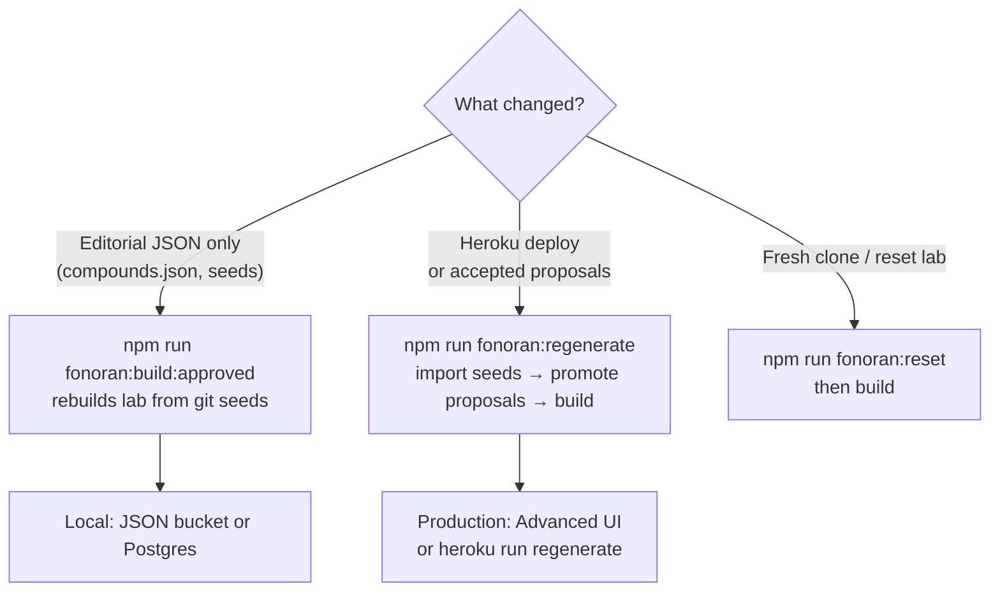
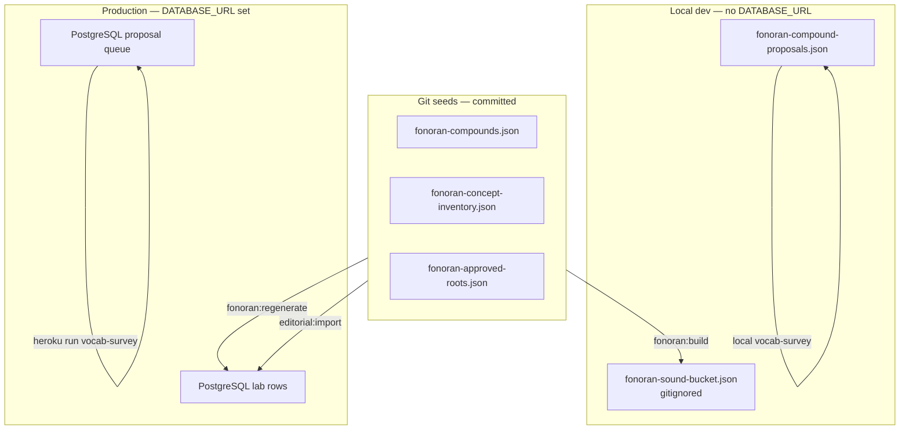
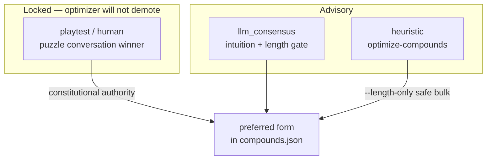

# Fonoran compound workflow (local + production)

> **Read first:** [fonoran-constitution.md](fonoran-constitution.md) (one page) · Agent rules: [CLAUDE.md](../CLAUDE.md)

> Sequential commands for producing and shipping vocabulary from editorial inputs through **deterministic four-rules regeneration**, build, audit, and deploy. LLM scripts are optional advisory tools — not validators.
>
> See also: [fonoran.md](fonoran.md) (pipeline overview), [deploy.md](deploy.md) (Heroku), [fonoran-constitution.md](fonoran-constitution.md) (success criteria).

## Build vs regenerate — which command?



| Situation | Command | Why |
| --- | --- | --- |
| Edited `compounds.json` locally | `fonoran:build:approved` | Rebuilds lab from editorial JSON |
| Merged to Heroku | **`fonoran:regenerate`** (not build alone) | Postgres still has old editorial state until import + full pipeline |
| Accepted proposals in Review | `fonoran:regenerate` | Promotes queue → compounds.json → build |
| Destructive fresh start | `fonoran:reset` then `build` | Wipes lab |

---

## Storage paths (local vs production)



---

## What gets committed vs what stays runtime-only

| In git (seed / editorial) | Runtime only (not in git) |
| --- | --- |
| `data/fonoran-compounds.json` — preferred forms + alternates | `data/fonoran-sound-bucket.json` — built lab (gitignored) |
| `data/fonoran-concept-inventory.json` | Live PostgreSQL lab rows on Heroku |
| `data/fonoran-approved-roots.json` | |
| `data/fonoran-root-candidates.json` | |
| `data/fonoran-llm-evaluations.json` — intuition rounds | |
| `data/fonoran-compound-proposals.json` — LLM gap proposals (JSON mirror; **Postgres on Heroku**) | |
| `tools/fonoran-expression-candidates.js` — `ASSOCIATION_SEEDS` | |

**Build** reads editorial JSON → writes the lab bucket. Production Postgres is seeded once from git; later updates require an explicit import + rebuild (below).

---

## Local: from scratch (full pipeline)

Use when resetting the lab or onboarding a fresh clone.

```bash
npm install
cp .env.example .env          # optional: ANTHROPIC_API_KEY, DATABASE_URL, OAuth

# 1. Blank lab + review queue (optional — destructive)
npm run fonoran:reset

# 2. Assign root spellings + build compounds → local lab
npm run fonoran:build
# or skip review gate for CI / milestone commits:
npm run fonoran:build:approved

# 3. Verify
npm run fonoran:compound-audit
npm test
npm start
# → http://localhost:8000/language#dictionary
```

---

## Local: compound efficiency pass (typical editorial loop)

Use after editing seeds or `compounds.json` — e.g. compressing `world`, fixing length violations.

```bash
# 0. Edit editorial inputs (pick one or more)
#    tools/fonoran-expression-candidates.js  → ASSOCIATION_SEEDS
#    data/fonoran-compounds.json             → preferred / alternates / gloss

# 1. Deterministic four-rules regeneration (default path — no LLM)
npm run fonoran:regen:four-rules -- --dry-run
npm run fonoran:regen:four-rules -- --apply
#    Skips playtest/human/locked rows; ranks by campfire + four rules.
#    Legacy: npm run fonoran:optimize-compounds -- --length-only

# 2. Rebuild lab from editorial JSON
npm run fonoran:build:approved

# 3. Audit + tests (free gates — no API spend)
npm run fonoran:seed-quality-audit
npm run fonoran:compound-confusability
npm run fonoran:compound-audit -- --out=docs/fonoran-compound-audit-latest.md
npm test

# 4. Optional advisory only (needs ANTHROPIC_API_KEY) — does NOT set preferred forms
#    npm run fonoran:llm-intuition -- world

# 5. Human playtest (constitutional authority)
npm start
# → /language#puzzle?concept=world
# Lock winner: set preferred_source to "playtest" in compounds.json

# 6. Commit seed files (see checklist below)
git add data/fonoran-compounds.json tools/fonoran-expression-candidates.js ...
git commit -m "..."
```

### Expected audit after four-rules pass

- **Flattened length warnings (>4 roots):** `0`
- **Seed-quality gate:** ≥92% pass, 0 hard failures
- Tree mismatches vs old semantic-demo trees are informational (preferred forms follow ASSOCIATION_SEEDS + four rules)

---

## Local: PostgreSQL mode (matches production storage)

When `DATABASE_URL` is set locally, `readDoc` / `writeDoc` use Postgres instead of JSON files.

```bash
# Bootstrap Postgres from git seeds (first time or full replace)
npm run fonoran:snapshot:import -- --from=data/

# Then run the compound loop above — build writes lab to Postgres

# Export Postgres → git seed paths (for commit)
npm run fonoran:snapshot:export -- --to=data/
```

Without `DATABASE_URL`, storage falls back to JSON under `data/` automatically.

---

## Production (Heroku): ship vocabulary changes

Deploy **does not** auto-run `fonoran:build`. Git seed files update on the dyno filesystem at deploy time, but **existing Postgres rows are not overwritten** on boot.

### Prerequisites (once)

```bash
heroku login
heroku git:remote -a fonora          # if not already linked
heroku config:set FONORAN_SKIP_JSON_MIRROR=1 -a fonora
# DATABASE_URL, OAuth vars — see deploy.md
```

### Sequence after merging to `staging` / `main`

**Step A — deploy code + seed JSON**

```bash
git checkout staging
git pull origin staging
# merge your branch, or commit directly on staging
git push heroku staging:main -a fonora
# or: git push heroku main:main -a fonora
```

Release phase runs `scripts/fonoran-data-fetch.js` (`Procfile` `release:`), which fetches the pinned external data submodule. Vocabulary is **not** rebuilt yet.

**Step B — reload editorial seeds + rebuild lab (GUI or CLI)**

After deploy, regenerate vocabulary from git seeds. **Do not run build alone** — it uses stale Postgres editorial state.

**Advanced UI (recommended on Heroku):**

1. Sign in as admin → `/tools#advanced`
2. Click **Regenerate dictionary from git seeds** → type `REGENERATE`
3. Click **Run translation tests** to verify

**CLI (local or one-off dyno):**

```bash
npm run fonoran:regenerate
# optional — re-promote from llm-evaluations.json (may change compounds.json):
npm run fonoran:regenerate -- --use-llm
```

Reference: [fonoran-llm-playtest-experiment.md](fonoran-llm-playtest-experiment.md)

**Step C — verify**

```bash
heroku open /language -a fonora
# or
curl -s https://fonora.org/health
# Dictionary: search "world" → should show fenmel (after world compression deploy)
```

**Step D — backup (recommended after milestone vocab changes)**

```bash
heroku run "npm run fonoran:snapshot:export" -a fonora
# download via Advanced → Backup, or periodic zip to backups/
```

### Alternative: zip snapshot from local

If you built and verified locally with Postgres pointing at a staging DB, or exported after local JSON build:

```bash
# Local: after build:approved
npm run fonoran:snapshot:export -- backups/fonoran-milestone.zip

# Upload + import on Heroku (Advanced UI → Import snapshot, type RESTORE)
# or CLI if zip is on dyno:
heroku run "npm run fonoran:snapshot:import -- backups/fonoran-milestone.zip" -a fonora
```

---

## Command reference (ordered)

| Step | Command | Local | Heroku one-off |
| --- | --- | --- | --- |
| Reset lab | `npm run fonoran:reset` | yes | rarely |
| Length-only optimize | `npm run fonoran:optimize-compounds -- --length-only` | yes | yes |
| Heuristic optimize | `npm run fonoran:optimize-compounds` | yes | yes |
| LLM optimize | `npm run fonoran:optimize-compounds -- --use-llm` | after v4 calibration | after v4 calibration |
| Build lab | `npm run fonoran:build:approved` | yes | yes |
| Audit | `npm run fonoran:compound-audit` | yes | optional |
| LLM intuition (one concept) | `npm run fonoran:llm-intuition -- world` | yes (API key) | yes (API key on dyno) |
| Tests | `npm test` | yes | CI / local before push |
| Import editorial seeds → Postgres | `npm run fonoran:editorial:import -- --from=data/` | yes | **required on prod** (or use Advanced GUI) |
| Full generator pipeline | `npm run fonoran:regenerate` | yes | **Advanced GUI on prod** |
| Export Postgres → seeds | `npm run fonoran:snapshot:export -- --to=data/` | yes | optional |
| Start app | `npm start` | yes | automatic (`web` dyno) |

---

## Commit checklist (before push to staging/main)

- [ ] `npm run fonoran:build:approved` — 0 dropped (run `npm run fonoran:compound-audit` for live compound count)
- [ ] `npm run fonoran:compound-audit` — 0 flattened-length warnings (or documented exceptions)
- [ ] `npm test` — unit + golden translator pass
- [ ] Commit: `data/fonoran-compounds.json`, `tools/fonoran-expression-candidates.js`, tool/script changes, audit markdown, LLM eval JSON if re-run
- [ ] Do **not** commit `data/fonoran-sound-bucket.json` (gitignored)
- [ ] After Heroku deploy: Advanced → **Regenerate dictionary from git seeds** → **Run translation tests**

---

## Authority tiers (reminder)



1. **`playtest` / `human`** — locked; optimizer will not demote
2. **Human puzzle conversation** — decides preferred form
3. **`llm_consensus`** — advisory; length gate overrides when flat > 4
4. **Heuristic** — `optimize-compounds`, `--length-only` for safe bulk compression

Preferred-form policy: [fonoran.md](fonoran.md) · LLM protocol: [fonoran-llm-playtest-experiment.md](fonoran-llm-playtest-experiment.md)

---

## LLM-assisted vocabulary growth loop

Two complementary paths share the same proposal store and the same accept → `fonoran:regenerate`
promotion step. See [RN-26 · LLM-assisted word generation](/research/notes/llm-assisted-word-generation)
for architecture; [RN-27 · Automated refine loop](/research/notes/automated-refine-loop) for the
corpus-driven auto-accept experiment.

### Path A — Bulk survey + human review (default editorial)

The **Vocabulary Survey** is the primary way to generate new compound proposals in bulk.
On **Heroku** (with `DATABASE_URL`), proposals persist in **PostgreSQL** and are visible
to the live Review UI on the same dyno. Locally they use `data/fonoran-compound-proposals.json`.

```bash
# Production (DATABASE_URL → shared Postgres; visible to live Review UI)
heroku run npm run fonoran:vocab-survey -a fonora

# Local (JSON file)
npm run fonoran:vocab-survey
npm run fonoran:vocab-survey:dry    # seeds only — no LLM writes
```

No second LLM call is needed on subsequent `fonoran:regenerate` runs.

Proposals land in the compound proposal store (Postgres or local JSON). Review them in the
**Review** tab at `/tools#gap-workshop`, or via the API
(`GET /api/fonoran/compound-proposals`).

For each proposal: **accept** (merges the composition into `fonoran-compounds.json` on the
next `fonoran:regenerate` run) or **reject** / **skip**.

`promoteAcceptedProposals` runs automatically as the first step of `fonoran:regenerate`,
so accepted proposals are baked into `fonoran-compounds.json` before the build begins.

```bash
# After accepting proposals, regenerate the full dictionary (promotes + rebuilds)
npm run fonoran:regenerate

# See playtest data suggesting preferred form promotions (no LLM needed)
curl http://localhost:8000/api/fonoran/playtests/promotions
```

For targeted gap words (not full survey), use `npm run fonoran:gap-analyze-batch`.

### Path B — Automated refine loop (corpus experiment)

Runs gap → propose → gate → auto-accept → build → measure on the 1,000-phrase stranger
corpus. Requires **`FONORAN_STORAGE=json`** locally so promote, build, and gap report share
one backend (see RN-27). Human playtests remain constitutional authority for preferred-form
promotion in production.

```bash
npm run fonoran:refine
npm run fonoran:refine:dry              # limited gaps, no writes
npm run fonoran:refine -- --skip-llm --max-iterations 1   # gates only, no LLM Task A
```

Auto-accepted compounds still flow through the same proposal store; review or revert via git
if an iteration regresses coverage or phonetic distribution.

### Storage reminder

| Environment | Editorial + proposal queue | Gap / refine artifacts |
|-------------|---------------------------|-------------------------|
| Local dev (default) | `FONORAN_STORAGE=json` — `data/fonoran-*.json` | `data/` + fonora-data submodule |
| Heroku production | `FONORAN_STORAGE=postgres` + `DATABASE_URL` | fonora-data submodule (not Postgres) |

Promote → build → gap report **must** use the same storage backend. Mixing JSON promote with
Postgres build silently drops coverage gains (RN-27 finding).

### Seed integrity

```bash
node --input-type=module -e "
import { validateSeedIntegrity } from './tools/fonoran-expression-candidates.js';
import { loadConceptInventory } from './tools/fonoran-concepts.js';
import { readDoc } from './tools/fonoran-store.js';
const inv = await loadConceptInventory();
const c = await readDoc('compounds');
const v = validateSeedIntegrity(inv.concepts.map(x => x.id), c?.compounds ?? []);
console.log(v.length ? v : '✓ No phantom IDs');
"
```

See also:

- [RN-26 · LLM-assisted word generation](/research/notes/llm-assisted-word-generation) — foundational pipeline (gap analyzer, proposal store, vocab survey, review UI)
- [RN-27 · Automated refine loop](/research/notes/automated-refine-loop) — corpus auto-accept experiment (`fonoran:refine`)
