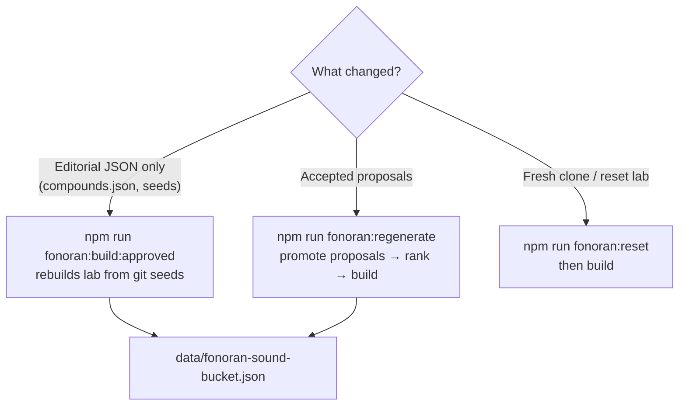
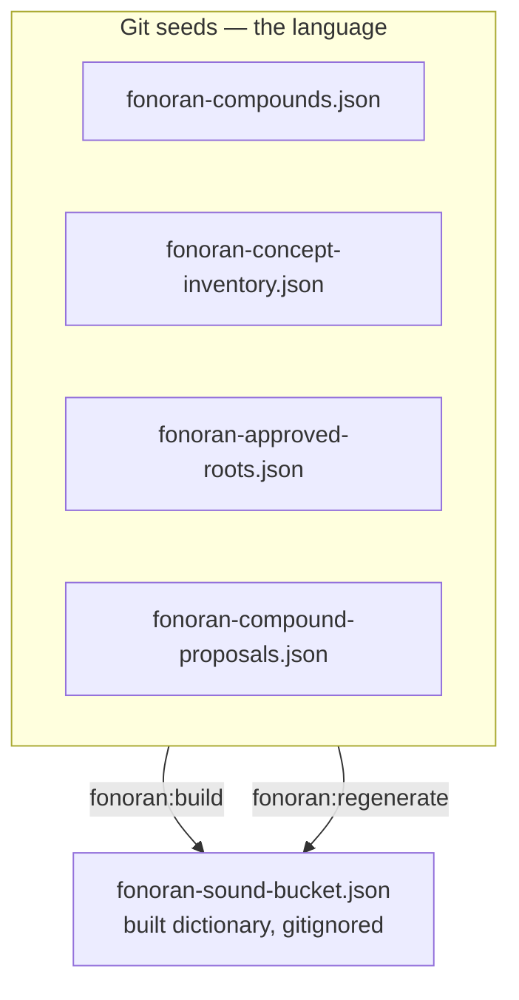
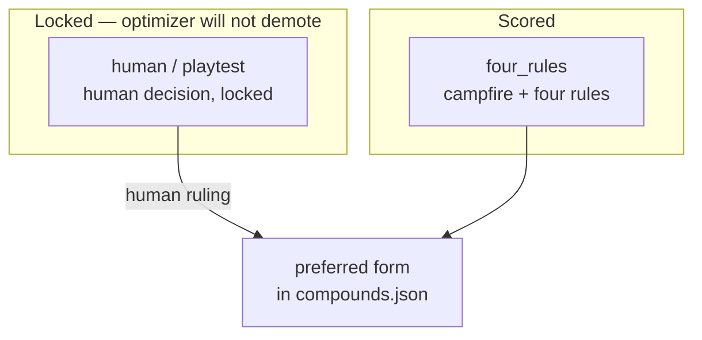

# Fonoran compound workflow (local + production)

> **Read first:** [fonoran-rulebook.md](fonoran-rulebook.md) (one page) · Agent rules: [CLAUDE.md](../CLAUDE.md)

> Sequential commands for producing and shipping vocabulary from editorial inputs through **deterministic four-rules regeneration**, build, audit, and deploy. Every command here is deterministic, and no step calls a model.
>
> See also: [fonoran.md](fonoran.md) (pipeline overview), [deploy.md](deploy.md) (Heroku), [fonoran-rulebook.md](fonoran-rulebook.md) (the rules a word must pass).

## Build vs regenerate — which command?


```mermaid
flowchart TD
  Q{"What changed?"}
  Q -->|"Editorial JSON only\n(compounds.json, seeds)"| Build["npm run fonoran:build:approved\nrebuilds lab from git seeds"]
  Q -->|"Accepted proposals"| Regen["npm run fonoran:regenerate\npromote proposals → rank → build"]
  Q -->|"Fresh clone / reset lab"| Reset["npm run fonoran:reset\nthen build"]
  Build --> Local["data/fonoran-sound-bucket.json"]
  Regen --> Local
```

| Situation | Command | Why |
| --- | --- | --- |
| Edited `compounds.json` locally | `fonoran:build:approved` | Rebuilds lab from editorial JSON |
| Accepted proposals in Review | `fonoran:regenerate` | Promotes queue → compounds.json → build |
| Destructive fresh start | `fonoran:reset` then `build` | Wipes lab |

---

## Storage paths


```mermaid
flowchart TB
  subgraph git [Git seeds — the language]
    Compounds["fonoran-compounds.json"]
    Inventory["fonoran-concept-inventory.json"]
    Roots["fonoran-approved-roots.json"]
    Props["fonoran-compound-proposals.json"]
  end
  Built["fonoran-sound-bucket.json\nbuilt dictionary, gitignored"]
  git -->|"fonoran:build"| Built
  git -->|"fonoran:regenerate"| Built
```

There is one path, and it is the same on every machine. The seeds were once mirrored into PostgreSQL on production and into a local JSON copy in development, which meant the answer to "what is in the lexicon" depended on where you asked. It does not any more.

---

## What gets committed vs what stays runtime-only

| In git (the language) | Runtime only (not in git) |
| --- | --- |
| `data/fonoran-compounds.json` — preferred forms + alternates | `data/fonoran-sound-bucket.json` — the built dictionary |
| `data/fonoran-concept-inventory.json` | |
| `data/fonoran-approved-roots.json` | |
| `data/fonoran-root-candidates.json` | |
| `data/fonoran-compound-proposals.json` — the review queue | |
| `tools/fonoran-expression-candidates.js` — `ASSOCIATION_SEEDS` | |

**Build** reads the editorial JSON and writes the lab bucket. The bucket is derived, so it is not committed and never needs to be reconciled with anything.

---

## Local: from scratch (full pipeline)

Use when resetting the lab or onboarding a fresh clone.

```bash
npm install
cp .env.example .env          # optional: DATABASE_URL, OAuth

# 1. Blank lab + review queue (optional — destructive)
npm run fonoran:reset

# 2. Assign root spellings + build compounds → local lab
npm run fonoran:build
# or skip review gate for CI / milestone commits:
npm run fonoran:build:approved

# 3. Verify
npm run fonoran:compound-audit
npm test
npm start
# → http://localhost:8000/language#dictionary
```

---

## Local: compound efficiency pass (typical editorial loop)

Use after editing seeds or `compounds.json` — e.g. compressing `world`, fixing length violations.

```bash
# 0. Edit editorial inputs (pick one or more)
#    tools/fonoran-expression-candidates.js  → ASSOCIATION_SEEDS
#    data/fonoran-compounds.json             → preferred / alternates / gloss

# 1. Deterministic four-rules regeneration (the only path)
npm run fonoran:regen:four-rules -- --dry-run
npm run fonoran:regen:four-rules -- --apply
#    Skips playtest/human/locked rows; ranks by campfire + four rules.

# 2. Rebuild lab from editorial JSON
npm run fonoran:build:approved

# 3. Audit + tests
npm run fonoran:seed-quality-audit
npm run fonoran:compound-confusability
npm run fonoran:compound-audit -- --out=reports/fonoran-compound-audit.md
npm test

# 4. Lock a human decision
# Set preferred_source to "human" in compounds.json so the scorer cannot demote it

# 5. Commit seed files (see checklist below)
git add data/fonoran-compounds.json tools/fonoran-expression-candidates.js ...
git commit -m "..."
```

### Expected audit after four-rules pass

- **Flattened length warnings (>4 roots):** `0`
- **Seed-quality gate:** ≥92% pass, 0 hard failures
- Tree mismatches vs old semantic-demo trees are informational (preferred forms follow ASSOCIATION_SEEDS + four rules)

---

## Production (Heroku): ship vocabulary changes

Edit locally, commit the seeds, deploy. The dyno reads the seed files out of the slug, so the deployed lexicon is exactly the one in the commit you pushed.

There is no post-deploy step and no admin editing on production. A dyno filesystem does not survive a restart, so an edit made there would be lost; the compensating machinery that used to exist for this (a Postgres mirror, a seed import step, a snapshot restore) is what made the lexicon ambiguous in the first place.

**Step A — commit the seeds**

```bash
npm run fonoran:build:approved
npm test
git add data/ && git commit
```

**Step B — deploy**

```bash
git push heroku staging:main -a fonora
# or: git push heroku main:main -a fonora
```

The release phase runs `scripts/fonoran-data-fetch.js` (`Procfile` `release:`), which fetches the pinned external data submodule.

**Step C — verify**

```bash
curl -s https://fonora.org/health
heroku open /language -a fonora
# Dictionary: search "world" → should show fenfo (earth + life)
```

Backups: the language is in git, so it is already backed up. Heroku Postgres backups cover user data.

---

## Command reference (ordered)

| Step | Command | Local | Heroku one-off |
| --- | --- | --- | --- |
| Reset lab | `npm run fonoran:reset` | yes | rarely |
| Rank preferred forms | `npm run fonoran:regen:four-rules -- --apply` | yes | yes |
| Build lab | `npm run fonoran:build:approved` | yes | yes |
| Audit | `npm run fonoran:compound-audit` | yes | optional |
| Tests | `npm test` | yes | CI / local before push |
| Full generator pipeline | `npm run fonoran:regenerate` | yes | not needed |
| Start app | `npm start` | yes | automatic (`web` dyno) |

---

## Commit checklist (before push to staging/main)

- [ ] `npm run fonoran:build:approved` — 0 dropped (run `npm run fonoran:compound-audit` for live compound count)
- [ ] `npm run fonoran:compound-audit` — 0 flattened-length warnings (or documented exceptions)
- [ ] `npm test` — unit + golden translator pass
- [ ] Commit: `data/fonoran-compounds.json`, `tools/fonoran-expression-candidates.js`, tool/script changes
- [ ] Do **not** commit `data/fonoran-sound-bucket.json` (gitignored)
- [ ] After Heroku deploy: Advanced → **Regenerate dictionary from git seeds** → **Run translation tests**

---

## Authority tiers (reminder)


```mermaid
flowchart TB
  subgraph locked [Locked — optimizer will not demote]
    Playtest["human / playtest\nhuman decision, locked"]
  end
  subgraph scored [Scored]
    Rules["four_rules\ncampfire + four rules"]
  end
  Playtest -->|"human ruling"| Preferred["preferred form\nin compounds.json"]
  Rules --> Preferred
```

1. **`human`** — a person chose this form; locked, the scorer will not demote it
2. **`playtest`** — historical provenance from the retired guess-the-meaning game; also human, also locked
3. **`four_rules`** — deterministic scoring for everything not locked, with the length gate overriding when flat > 4

Preferred-form policy: [fonoran.md](fonoran.md)

---

## Vocabulary growth (model paths deleted)

Vocabulary is no longer generated or judged by models. New words are added by editing the
seeds (`data/fonoran-concept-inventory.json`, `data/fonoran-compounds.json`) and rerunning
the deterministic pipeline described in
[fonoran-algorithm-roots.md](fonoran-algorithm-roots.md) and
[fonoran-algorithm-compounds.md](fonoran-algorithm-compounds.md).

The survey, refine loop, model playtest, and intuition scripts were **deleted** in July 2026.
`data/fonoran-llm-quarantine.json` lists what remains reachable, and
`npm run fonoran:verify-quarantine` fails the build if deterministic code gains a new
dependency on model code or model output. The proposal store and Review UI remain usable for
human-authored proposals.

### Storage reminder

The editorial seeds and the proposal queue are committed files under `data/`, everywhere. Gap
artifacts come from the fonora-data submodule.

Promote, build, and gap report therefore always read the same copy. They did not always: a
promote that wrote JSON while the build read Postgres reported success and produced no coverage
gain at all, which is the failure that ended the dual store.

### Seed integrity

```bash
node --input-type=module -e "
import { validateSeedIntegrity } from './tools/fonoran-expression-candidates.js';
import { loadConceptInventory } from './tools/fonoran-concepts.js';
import { readDoc } from './tools/fonoran-store.js';
const inv = await loadConceptInventory();
const c = await readDoc('compounds');
const v = validateSeedIntegrity(inv.concepts.map(x => x.id), c?.compounds ?? []);
console.log(v.length ? v : '✓ No phantom IDs');
"
```

See also:

- [fonoran-algorithm-compounds.md](fonoran-algorithm-compounds.md) — how a preferred compound is chosen
- [fonoran-architecture.md](fonoran-architecture.md) — what reads what
