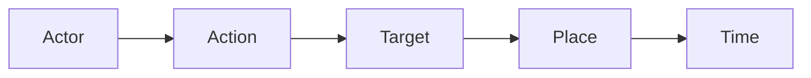

# Fonoran grammar redesign proposal — optimizing for stranger-to-stranger communication

> Forward-looking design proposal feeding [RN-24 · Grammar under the Constitution](research-notes/RN-24-grammar-under-the-constitution.md). Companion to the conservative [constitutional audit](fonoran-grammar-constitutional-audit.md): where the audit reviewed the *existing* 17-particle inventory and recommended "keep for now, test," this document steps back and asks what the grammar should look like if it is optimized purely for the Constitution's core question. **Status:** Implemented as v1 (Jul 2026). This document is retained as the design rationale; the shipped grammar is specified in [fonoran-grammar.md](fonoran-grammar.md) and tracked in [RN-24](research-notes/RN-24-grammar-under-the-constitution.md). v1 deviates from this proposal in two ways: (1) content questions are more minimal than proposed — no dedicated pro-form or polar marker, just compositional wh-forms plus a written `?`; and (2) why/how are deferred until concepts for reason/method exist. R3 shipped as deterministic ordering only (no forced fusion).

## 0. The objective this grammar serves

Fonoran's grammar is no longer optimized to imitate traditional languages or to maximize machine parsing. It is optimized for a single measurable outcome:

> **Can two strangers with different native languages learn a small set of invariant semantic roots and communicate practical ideas after only a short period of study?**

Every recommendation below is judged by the Constitution's one question — *"if someone only knew the roots, would this probably help them recover the intended meaning?"* ([fonoran-constitution.md](fonoran-constitution.md)) — and scored against the design principles restated here as a rubric:

| Principle | What it demands of grammar |
| --- | --- |
| Concepts carry all meaning | Grammar only relates concepts; it never adds semantic content of its own |
| Words never inflect | No conjugation, declension, agreement, or spelling change — ever |
| Transparent compounds | A compound's parts remain visible and recoverable |
| Writing is optional | Rules must work spoken-first; the Fonora script is a convenience, not a crutch |
| Minimize memorization | Every particle must earn its slot against structural or lexical alternatives |
| Minimize accidental misunderstanding | Avoid confusable forms and parses with multiple plausible readings |
| Prefer recoverable over precise | Accept "good enough" meaning that repair can refine |
| Reduce ambiguity without ballooning complexity | Add machinery only when it removes more ambiguity than it introduces |

This is not a proposal to preserve existing grammar because it exists. It keeps what serves the objective, and cuts or reworks what does not.

## 1. Diagnosis — what fights the objective today

The current grammar ([fonoran-grammar.md](fonoran-grammar.md) Rules 1–7; inventory in [`data/fonoran-grammar-particles.json`](../data/fonoran-grammar-particles.json) v2.1) is close in spirit but has five concrete obstacles to stranger recovery.

### 1.1 Position does two jobs at once

The skeleton `Subject · Time · Event · Object · Modifiers` uses word order as the **only** marker of who-did-what-to-whom (Fonoran has no case markers), **and** the same order groups modifiers. A bare string of invariant concepts is therefore ambiguous about where one role ends and the next begins:

```text
bem ba
  reading A:  "loving person"      (bem modifies ba — one role)
  reading B:  "love, [a] person"   (bem = Action, ba = Target — two roles)
```

The grammar doc itself resolves this only "by order and context," which is exactly the non-determinism the objective wants to remove.

### 1.2 Six near-homophone question particles

`vus / zas / zes / zis / zos / zus` (what / who / when / where / why / how) differ by a single vowel and all end in `-s`. For a listener whose native phonology does not cut those vowels the same way, this is a high-collision cluster — it manufactures the precise "accidental misunderstanding" the objective forbids, at the exact moment (asking a question) when a stranger most needs to be understood.

### 1.3 A redundant question marker

`wo` is emitted even when a wh-word already flags the clause as a question (documented in [RN-14](research-notes/RN-14-grammar-as-particles-not-words.md)). Redundant machinery costs memorization for no recovery gain.

### 1.4 A second confusable cluster

Focus particles `vat / vet / vit` (only / also / even) repeat the one-vowel-apart problem, and — as the [audit](fonoran-grammar-constitutional-audit.md) already flagged — score lowest on week-one need.

### 1.5 Non-deterministic modifier attachment

"Modifiers attach to the nearest eligible slot unless a future particle specifies otherwise" leaves grouping to interpretation. Determinism is a stated goal; the current rule is not deterministic.

## 2. Recommendations

Each recommendation gives the reasoning and the tradeoff. They are ordered so that the cheap, high-value simplifications come first.

### R1 — Rename slots to intuitive semantic roles

Teach the skeleton as **Actor → Action → Target → Place → Time** instead of Subject / Time / Event / Object / Modifiers.



- **Reasoning:** strangers reason about "who does what to what, where, and when," not about grammatical categories. This directly serves *grammar only describes relationships between concepts.*
- **Change from today:** Time moves from slot 2 to the periphery, which is more cross-linguistically intuitive (time as scene-setting rather than wedged between actor and action).
- **Tradeoff:** relabeling ripples into translator slot names and docs, but the underlying skeleton is unchanged — low risk, mostly pedagogical.

### R2 — Keep strict order only where it is load-bearing; allow flexibility only where recovery is guaranteed

Answering *"is strict word order actually necessary?"* — **partly, and we can say exactly where.**

- **Strict** for **Actor → Action → Target.** These roles are semantically interchangeable (a person can love or be loved), so with no case markers, position is the sole disambiguator. Relaxing here would *require* adding role/case particles, which fails the minimal-complexity principle.
- **Free / floating** for **Place** and **Time.** A time concept (*now / before / after*) or a place concept can only be read as time or place, so fronting them as a scene-setter cannot create role confusion — and fronting time is what many languages do naturally.

- **Reasoning:** preserves one-template predictability for the ambiguous core while granting the naturalness strangers expect for peripheral framing. Word order stays load-bearing exactly where meaning depends on it and nowhere else.
- **Tradeoff:** two rules ("core is fixed; periphery may float") instead of one. Mitigated by teaching the fixed core first and floating as an optional convenience.

### R3 — Make modifier attachment fully deterministic

Adopt one absolute law:

> **Within a phrase, each concept modifies the concept to its right; the rightmost concept is the head. A meaning that needs modifiers and fills a single role binds into one unit — a compound word — so that each role slot contains exactly one lexical unit (root or compound).**

Result: the parse is deterministic — **count the units, count the roles.** This reuses Fonoran's existing compounding machinery and the transparent semantic tree of [Rule 5](fonoran-grammar.md); `ben ba → benba` is already this pattern.

- **Reasoning:** removes "nearest eligible slot… and context," and makes grouping mechanical rather than interpretive.
- **Tradeoffs (stated honestly, not hidden):**
  1. Heavy modification produces long compounds.
  2. The **spoken** boundary problem: `ben ba` and `benba` sound alike, so speech leans on prosody while writing leans on spacing/joining. This is a real spoken-first cost.
  3. The [compound boundary constraint](fonoran-grammar.md#compound-boundary-constraint) (no identical adjacent consonants) can block some joins.

  These are items to validate in puzzle playtests, not to paper over.

### R4 — Collapse the six wh-particles into ONE question pro-concept, placed in the questioned slot

Replace `vus / zas / zes / zis / zos / zus` with a **single interrogative pro-form** dropped into the role slot whose value is unknown:

| English | Fonoran strategy |
| --- | --- |
| who | question pro-form in the **Actor** slot |
| what | question pro-form in the **Target** slot |
| where | question pro-form in the **Place** slot |
| when | question pro-form in the **Time** slot |
| why | transparent compound: question + reason |
| how | transparent compound: question + manner |

- **Reasoning:** this is the single largest misunderstanding-reduction available — it removes five confusable near-homophones and reuses the role positions Fonoran already has, so the *position* tells the listener what kind of answer is wanted. It is directly modeled on Toki Pona's single `seme` (see §4).
- **Tradeoff:** depends on R1–R3 keeping role slots clear; *why* and *how* become two-root compounds rather than atomic words — acceptable under semantic economy, and arguably more transparent.

### R5 — Remove the redundant question marker `wo`; keep at most one polar-question marker

- Content (wh) questions are already flagged by the pro-form from R4 — no separate marker needed.
- Yes/no questions rely on **intonation in speech** (Fonoran is spoken-first) and **one clause-final question particle in writing**.

- **Reasoning:** cuts a particle that carries no recovery value once R4 lands, and honors *writing is optional.*
- **Tradeoff:** written polar questions still need that one marker, so a reader without it could misread a statement as a question — hence keep exactly one; do not drop to zero.

### R6 — Demote focus particles (`vat / vet / vit` = only / also / even) out of the core

- **Reasoning:** another one-vowel-apart confusable cluster, and *only / also / even* are refinements, not first-week survival needs — they fail the campfire test for the core (already flagged "Review" in the [audit](fonoran-grammar-constitutional-audit.md)).
- **Proposal:** express as lexical concepts or compounds in the extended tier, not core particles.
- **Tradeoff:** slightly longer expressions for emphasis; acceptable given the recoverability-over-precision priority.

### R7 — Keep what already serves the objective (affirm, don't churn)

Not everything should change. These already fit and should be explicitly preserved:

- **Compositional polarity and quantifiers** — `no + true = false`, `no + person = nobody`. Transparent and memorization-light.
- **Unmarked present; `ta` past / `sa` future** — the minimal tense system stays. Open sub-question for playtest: whether first-week strangers need tense *particles* at all versus lexical time concepts (*before / now / after*). Recommendation: keep `ta / sa`, but teach lexical time first.
- **Spatial and relational meaning stays lexical** (*inside / here / there / near / far / up / down*) — already decided in RN-14 and correct for this objective.

### R8 — The one particle worth *considering* adding (recommendation: hold)

Answering *"should additional particles exist only when they eliminate more ambiguity than complexity?"* — the single candidate justified by R2 is a **boundary marker between Actor and Action** (a Toki Pona `li`-style separator) to make the core parse deterministic without compounding everything.

- **Recommendation: do not add it yet.** First rely on strict core order (R2) plus one-unit-per-slot (R3), and let puzzle-conversation playtests ([RN-17](research-notes/RN-17-can-strangers-recover-meaning.md)) reveal whether Actor/Action confusion actually occurs. Add the marker only if data shows recurring confusion — i.e., only when it demonstrably removes more ambiguity than it adds. This is the principle applied to itself.

## 3. Before / after summary

| Dimension | Today | After proposal |
| --- | --- | --- |
| Particle count | 17 wired forms | ~7 (mi; ta; sa; no; ya; one question pro-form; one polar-question marker) + conditional handling |
| Question words | 6 near-homophones + marker `wo` | 1 pro-form placed by slot; *why/how* as compounds |
| Focus cluster | vat / vet / vit in core | demoted to extended (lexical/compound) |
| Modifier attachment | "nearest eligible slot… and context" | deterministic: modifier-before-head, one unit per slot |
| Word order | fully strict | strict core (Actor/Action/Target); floating Place/Time |
| Slot names | Subject/Time/Event/Object/Modifiers | Actor → Action → Target → Place → Time |

**Ambiguity sources removed:** the wh-homophone cluster, the focus cluster, the redundant question marker, and non-deterministic modifier attachment.

**Ambiguity sources consciously retained (with mitigation):** the spoken compound-vs-phrase boundary (prosody + optional written joining); core roles still position-only (mitigated by strict order now, and the evidence-gated `li`-style marker of R8 later).

## 4. Comparison with Toki Pona

Toki Pona is the closest well-known reference point, so the comparison is worth making precise.

| | Toki Pona | Fonoran (proposed) |
| --- | --- | --- |
| Root count | ~120–137 fixed words | small tiered core (~50) → extended → unlimited, grown from evidence |
| Word sources | eclectic (borrowed, evocative) | engineered for transparent composition and spelling stability |
| Meaning model | maximally context- and intent-dependent | recoverable-by-strangers, measured via puzzle playtests |
| Grammar particles | several bounding particles: `li`, `e`, `pi`, `la`, `en`, `o` | position-first, minimal particle set (~7) |
| Question strategy | single pro-word `seme` in the slot | single pro-form in the slot (R4 borrows this) |
| Script | Latin (sitelen sitelen/pona are art) | optional universal phonetic script (Fonora), spoken-first |
| Design intent | minimalist / philosophical / artistic | applied cross-lingual communication experiment |

- **Similarities:** tiny root set; invariant words; grammar via particles plus word order; tolerance of ambiguity; "good enough / recoverable" meaning over precision; a single interrogative pro-form.
- **Differences:** Toki Pona deliberately maximizes context dependence and speaker intent, and is not engineered for reproducible cross-native-language recovery. It also leans on more bounding particles than Fonoran wants.
- **Fonoran's distinct research direction:** rather than Toki Pona's context-maximal minimalism, Fonoran optimizes for **deterministic recoverability by strangers**, measured empirically. The differentiator is not "fewest words" but **"highest first-week recovery rate between strangers with no shared language"** — backed by transparent semantic trees, spelling stability, an optional universal phonetic script, and an explicit meaning-attempt + repair protocol. That is a niche Toki Pona does not occupy.

## 5. Consolidated tradeoffs and risks

- **Migration cost.** Slot renames and particle cuts touch the translator ([`tools/fonoran-translator.js`](../tools/fonoran-translator.js), [`tools/fonoran-particles.js`](../tools/fonoran-particles.js)), the inventory ([`data/fonoran-grammar-particles.json`](../data/fonoran-grammar-particles.json)), the grammar doc, the golden corpus, and the learn/practice modules.
- **Spoken/written boundary.** R3's one-unit-per-slot rule needs prosody guidance for speech, since joined compounds and spaced phrases can sound alike.
- **Precision loss.** Demoting focus and collapsing wh-words trades some expressive precision for lower misunderstanding — which is explicitly the objective's stated preference, but should be confirmed by playtest rather than assumed.
- **Conflict with the conservative audit.** The [audit](fonoran-grammar-constitutional-audit.md) recommended "keep 17 for the initial pass." This proposal is the more aggressive next step; both agree that **no change ships before human repair playtests**.

## 6. Open questions to validate in playtest (post-v1)

- Does strict-core order plus one-unit-per-slot avoid Actor/Action confusion **without** the R8 `li`-style marker?
- Do strangers recover the single question pro-form from slot position alone, without per-wh words?
- Are `ta / sa` pulling weight in week one, or is unmarked present plus lexical time enough?
- Does demoting focus and collapsing wh-words measurably reduce misunderstanding, or does it just move the problem into longer compounds?

## 7. References

**Documentation:** [fonoran-constitution.md](fonoran-constitution.md), [fonoran-grammar.md](fonoran-grammar.md), [fonoran-grammar-constitutional-audit.md](fonoran-grammar-constitutional-audit.md)

**Research notes:** [RN-14 · Grammar as particles](research-notes/RN-14-grammar-as-particles-not-words.md), [RN-17 · Can strangers recover meaning?](research-notes/RN-17-can-strangers-recover-meaning.md), [RN-21 · Beginner core remediation](research-notes/RN-21-beginner-core-remediation.md), [RN-24 · Grammar under the Constitution](research-notes/RN-24-grammar-under-the-constitution.md)

**Source:** [`data/fonoran-grammar-particles.json`](../data/fonoran-grammar-particles.json), [`tools/fonoran-particles.js`](../tools/fonoran-particles.js), [`tools/fonoran-translator.js`](../tools/fonoran-translator.js)
