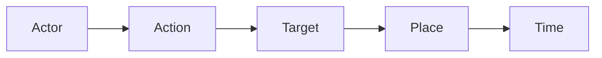
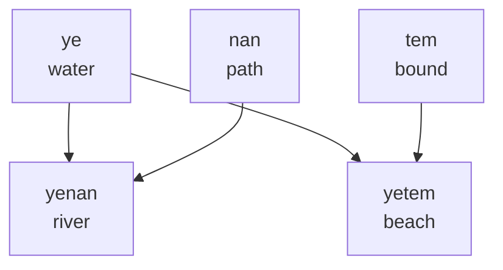
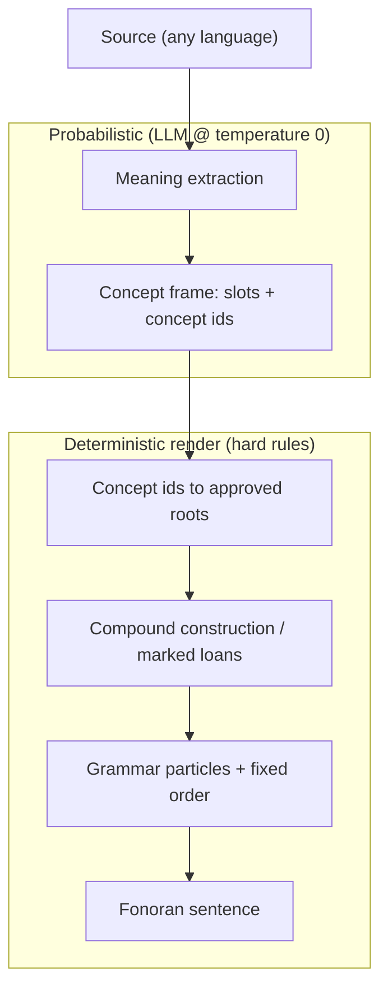

# Grammar

> **Read [the Fonoran Constitution](fonoran-constitution.md) first** — hypothesis, four rules, vocabulary tiers, and grammar skeleton. For extended rationale see [fonoran-philosophy.md](fonoran-philosophy.md). Why grammar lives in closed-class particles: [RN-14 · Grammar as particles, not words](/research/notes/grammar-as-particles-not-words).

> **Status**: Living specification. Authoritative syntax reference for humans and the Fonoran Translator. Sections marked *Under Development* are intentional placeholders.

Fonoran is a language of **concepts**. Every lexical item represents a semantic concept. Grammar describes **relationships between concepts** only.

## Design Rule 0: Grammar is the last resort

> **If a distinction can be expressed through ordinary concepts, it should not become grammar. Grammar exists only to express relationships that cannot be naturally represented as concepts.**

This is the filter every other rule answers to. Before adding any particle, marker, or grammatical mechanism, ask whether the same meaning can be expressed compositionally using existing concepts. If the answer is yes, grammar stays out of it. This single principle explains why Fonoran has:

- no dedicated *who / what / where / when / why / how* particles (questions are compositional — see [Rule 3](#rule-3-grammar-uses-particles));
- no *only / also / even* focus particles (these are refinements, expressed lexically if and when usage demands them);
- an intentionally tiny particle inventory (`mi`, `ta`, `sa`, `no`, `ya`, `von`);
- a strong preference for transparent compounds over new grammatical machinery.

A distinction earns a particle only once real usage shows it *cannot* be carried by concepts and word order alone.

Roots are organized by **human experience** (survival/body, space/motion, social, emotion,
time, thinking, abstract) and gated by the **campfire test**: *could two strangers stranded
with no common language plausibly need this root in their first week?* If yes, it belongs in
the communicative core; if no, it belongs in the extended or complete vocabulary. See the
[constitution](fonoran-constitution.md) for the tiered language model (~50 core → ~100
extended → unlimited).

### The fundamental experience test

> **A primitive concept should represent a fundamental human experience that cannot be naturally expressed using simpler Fonoran concepts.**

This is inspired by how toddlers learn language, but it is **not** a literal toddler vocabulary test. A two-year-old may not yet grasp **equal**, **before**, or **remember**, yet every language needs them. The test is whether *any* speaker could naturally understand the concept only after knowing simpler Fonoran roots, not whether a child already has the English word.

| Question | If yes → | If no → |
| --- | --- | --- |
| Can this be naturally expressed using simpler Fonoran concepts? | **Compound** or **grammar particle** | Candidate primitive |
| Is this a dimension of reality (not a word slot)? | Strong primitive signal | Reconsider |
| Is this causal linking (because / therefore)? | **Grammar particle** | n/a |

```example
ye + nan

water + path

↓

yenan (river)
```

```example
ye + tem

water + bound

↓

yetem (beach)
```

```example
san + ba

love + person

↓

sanba (family)
```

```example
ye (water)

(no simpler Fonoran explanation)

↓

primitive
```

The full proposed primitive inventory lives in [fonoran-semantic-foundation.md](archive/fonoran-semantic-foundation.md).

Read the examples first. You can already start understanding this language.

## At a glance

Fonoran grammar **minimizes lexical categories**. Every lexical item is an **invariant concept**; its role comes from **grammar particles** and **sentence position**, not from noun, verb, or adjective labels.

For the *why* — the communication experiment, campfire test, meaning-attempts, and tiered vocabulary — read **[the Fonoran Constitution](fonoran-constitution.md)**. The **Rules** below are the authoritative syntax reference.

| Idea | Rule |
| --- | --- |
| Grammar is the last resort | [Design Rule 0](#design-rule-0-grammar-is-the-last-resort) |
| Concepts, not parts of speech | [Rule 1](#rule-1-concepts-are-universal) |
| Words never inflect | [Rule 2](#rule-2-words-never-change) |
| Grammar uses particles | [Rule 3](#rule-3-grammar-uses-particles) |
| Preferred order, drop what’s obvious | [Rule 4](#rule-4-preferred-order-drop-whats-obvious) |
| Meaning through composition | [Rule 5](#rule-5-semantic-compounding) |
| English → Fonoran compiler | [Rule 7](#rule-7-translator-architecture) |

**Present has no time particle.** Past uses **ta**, future **sa**. The event concept stays identical across tenses: `mi san` / `mi ta san` / `mi sa san` → I love / loved / will love.

Modifier chains use the same invariant spellings — **san ba** (loving person), **san dan** (loving community) — with the modifier placed **before its head** ([Rule 4](#rule-4-preferred-order-drop-whats-obvious)). Compounds like **yenan** (water + path) and **sanba** (love + person) preserve their ancestry in the spelling; see [Rule 5](#rule-5-semantic-compounding).

## Rule 1: Concepts Are Universal

Every word is simply a **concept**.

| Concept | Meaning |
| --- | --- |
| **ba** | person |
| **pa** | conflict |
| **dan** | collective |
| **san** | love |
| **ye** | water |
| **nan** | path |
| **yenan** | river (water + path) |
| **danbakam** | tribe |
| **danpaba** | war |

These are not permanently nouns or verbs. Their role depends on **sentence position** and **surrounding particles**.

```example
ba pa

person conflict

↓

a person's conflict
```

```example
pa ba

conflict person

↓

conflict involving a person
```

Same concepts. Different order. Different relationship.

## Rule 2: Words Never Change

Fonoran has no conjugation, declension, grammatical gender, plural endings, or case endings.

A word is always written the same way.

**danpaba** always remains **danpaba**.

```example
mi ta danpaba
mi danpaba
danbakam danpaba

↓

I fought.
There is war.
The tribe is at war.
```

Present sentences omit the time particle. **danpaba** never changes.

Time, plurality, and relationships are expressed through **particles** and **word order**, not through mutating the concept itself.

## Rule 3: Grammar Uses Particles

Instead of modifying words, Fonoran uses small **invariant particles** to mark grammatical relationships.

The v1 inventory is intentionally tiny (Design Rule 0): six forms, listed below. It grows only when usage proves a distinction cannot be carried by concepts and word order.

### Tense

Present is **not** a particle. It is the default when no time marker appears.

| Tense | Particle | Status |
| --- | --- | --- |
| Past | ta | Active |
| Future | sa | Active |

**Numeral overlap.** The syllables **ta** (digit 2) and **sa** (digit 10) also serve as cardinal numerals in counting compounds (`sa-pa` = 11, `sasa-pa` = 21). In numeral context they parse as digits, not tense markers. See [fonoran-numerals.md](fonoran-numerals.md).

### The v1 particle inventory

The full inventory (forms, roles, English triggers) lives in [../data/fonoran-grammar-particles.json](../data/fonoran-grammar-particles.json). The particle class is **closed and minimal** (Design Rule 0): a word is a particle only if it is genuinely grammatical — it cannot be a lexical concept — *and* it is sanctioned here or wired in the translator. The complete v1 set is:

| Role | Particle | Status |
| --- | --- | --- |
| Pronoun (I) | mi | Active |
| Past | ta | Active |
| Future | sa | Active |
| Negation | no | Active |
| Affirmation | ya | Active |
| Conditional (if) | von | Active |

That is the entire grammatical inventory. Everything else — questions, focus, possession, comparison — is expressed with **concepts and word order**, not particles, until usage proves a distinction genuinely needs one.

**Questions carry no particle.** There is no question marker and no interrogative pro-form. Content (*wh*) questions are formed **compositionally from ordinary concepts** (e.g. an "unknown person / thing / place / time" placed in the relevant role), and written questions are marked with **`?`**; spoken questions rely on **intonation**. How a given question is composed is a matter of the lexicon and the translator, not grammar — so the grammar never fixes a particular form. The current lexical form is **`nohu`** "unknown" — a *lexicalized word* built from the negation form + `hu` (know), written and taught as one unit (`nohu ba` = who, `nohu to` = what, `nohu che` = where, `nohu kan` = when). Playtesting showed the separated `no hu …` read as clause negation ("not know…") rather than as a question word; lexicalizing it is a deliberate vocabulary decision, not productive particle fusion — the `no` particle itself still never fuses in grammar. *Why* and *how* are deliberately **not yet expressible** in v1: Fonoran has no robust *reason* or *method* concept, and the language admits that rather than approximating it. (Removed in v1: the former question marker `wo`, the interrogatives `vus/zas/zes/zis/zos/zus`, and the focus particles `vat/vet/vit`.)

Particles are **reserved**: the root generator never assigns particle forms to a lexical concept. The reserved set is enumerated in [../data/fonoran-primitive-roots-config.json](../data/fonoran-primitive-roots-config.json) (`reserved_particles.forms`) — it includes the active v1 forms plus the forms freed by v1 removals, which stay blocked from lexical reuse for spelling stability pending a future decision.

**Grammar vs. lexicon.** Spatial and relational meaning is *lexical*, not grammatical: "in/inside", "here/there", and the three sense of "toward" (`up`/`dal`, `down`/`nat`, `reach`/`ni`), plus `near`/`far`, are **concepts/roots**, never particles. Likewise, personal pronouns other than `mi` (you/we/they/he/she/it) resolve lexically, and conjunctions (`and`/`or`/`but`/`because`) are handled structurally as clause connectives rather than as emitted particles. This keeps the particle class small and prevents it from shadowing the lexicon.

Polarity is grammar, not vocabulary — **false** is `no` + **true**, **different** is `no` + **same**. Such antonyms are *not* roots and *not* compounds; they are produced at the particle layer.

### Particle placement and quantifiers

Particles occupy fixed positions within the sentence skeleton; they never fuse into adjacent spellings.

- **Negation** attaches near the action, before the Action concept (e.g. *I never said that* -> `mi no` + action). It is clause-scoped.
- **Quantifier pronouns compose** rather than taking their own root: *nobody* = `no` + **person**, *nothing* = `no` + **thing**, *everyone* = **all** + **person**, *everything* = **all** + **thing**, *someone* = **some** + **person**.
- **Questions** add no particle: content questions compose from concepts and are written with `?` (see above).

Even before the full inventory exists, you can already read sentences by treating each slot as a labeled relationship:

```example
mi san ba

↓

I love someone.
```

Particles are separate from concepts. They never fuse into word spellings.

## Rule 4: Preferred Order, Drop What’s Obvious

Fonoran's sentence structure follows how people naturally think about an event — **who did what to what, where, and when**:

```text
Actor · Action · Target · Place · Time
```



Fonoran has no case markers, so a **preferred order** keeps who-did-what-to-whom clear. The language is campfire-simple: stack actions, name the place, drop what the listener already knows. Core roles do **not** freely scramble.

### Preferred order

**Actor → Action → Target → Place → Time** is the teaching template and the translator’s default render. Actor and Target stay in that order because either role can be a person (`mi san be` vs `be san mi`).

### Serial Action

Stacked predicates stay in the **Action** chain — no infinitive particle:

```text
be sak gi yetem ?     (do you want to go to the beach?)
mi no sak gi lu de    (I do not want to go alone)
```

`want` + `move` → `sak gi`. Do **not** park the second verb in Target.

### Bare destination

A plain “go to X” puts the landmark in **Place** after the motion concept. Do **not** insert `nan` (path/toward) for English *to* alone:

```text
mi gi ye              (I go to the water)
be sak gi yetem ?     (do you want to go to the beach?)
```

Use direction concepts (`nan`, `lo`, `fet`, …) only when the source contrasts direction — *toward*, *from*, *away*:

```text
mi sak gi nan ye      (I want to go toward the water)
gi fet ki lekche      (go away from the city)
```

### Drop what’s obvious

Recoverable **Actor** may be omitted — same meaning, shorter surface:

| Register | Surface | When |
| --- | --- | --- |
| Full / clear | `be sak gi yetem ?` | Default teaching & translator primary |
| Casual | `sak gi yetem ?` | Yes/no to the addressee; Actor is obvious |

**Do not drop Actor** when dropping would create a vague reference — multi-clause discourse, contrasting actors, or when the Actor is not the addressee. Weather and imperatives already allow empty Actor (`[rain]`, `gi …`).

Time and Place may front as scene-setting (they cannot be mistaken for core roles):

```text
mi tel lo gem         (I eat food now)
gem mi tel lo         (now, I eat food)
mi tel lo nalche      (I eat food at-home)
mi gi ye              (I go to the water — bare destination)
```

> Note: `ta`/`sa` (tense) and `no` (negation) stay next to the action; they are not the floating **Time** periphery (time *concepts*: before / now / after, calendar words).

```example
danbakam danpaba

↓

The tribe is at war.
```

```example
mi san danbakam

↓

I love the tribe.
```

```example
mi sa san danbakam

↓

I will love the tribe.
```

```example
be sak gi yetem ?

↓

Do you want to go to the beach?
```

**Modifier attachment is deterministic:** within a phrase, each concept modifies the concept to its **right**; the rightmost concept is the head (`san ba` = loving person; `datwi samkal` = red bird). This makes grouping mechanical rather than interpretive.

> **Long-term design goal:** a meaning that needs modifiers and fills a single role should eventually resolve to *one lexical unit per role* — a root or an approved compound. In v1 we do **not** force adjacent concepts to fuse into a single written word: compounds become canonical because they are useful, reusable concepts (Rule 5), not merely because two words appeared next to each other. Preferred ordering now; earned compounds over time.

## Rule 5: Semantic Compounding

Almost every complex concept should be expressed through **composition**.

**Step 1: combine primitives**

| | |
| --- | --- |
| **ye** | water |
| **nan** | path |

↓

| | |
| --- | --- |
| **yenan** | river |

**Step 2: extend the tree**

| | |
| --- | --- |
| **ye** | water |
| **tem** | bound |

↓

| | |
| --- | --- |
| **yetem** | beach |

Every derived word **preserves its ancestry**. Words form a semantic tree rather than existing independently. Larger social compounds follow the same idea — **danbakam** (tribe), **danpaba** (war) — built from approved roots without inventing opaque spellings.



Compounding rules for the translator: prefer the **shortest transparent path** through approved concepts; omit concepts implied by human experience unless emphasis or disambiguation is needed (**semantic economy**); reject opaque shortcuts that break the tree (*implementation Under Development*).

### Compound Boundary Constraint

> **A valid compound may not join two morphemes when the final consonant of the left morpheme is identical to the initial consonant of the right morpheme. Fonoran does not collapse, lengthen, or silently alter boundary sounds. If such a boundary would occur, the compound candidate is invalid and must be regenerated or assigned different roots.**

This rule preserves Fonoran's core promise: **what you hear = what you write = what you look up**. If a spoken compound sounded like "sannan" a listener would naturally write "sannan", but the dictionary would store "sannnan". That gap violates spelling stability.

| Left | Right | Boundary | Valid? | Reason |
| --- | --- | --- | --- | --- |
| san | nan | n + n | **No** | identical consonants |
| kal | lem | l + l | **No** | identical consonants |
| ye | nan | e + n | Yes | vowel–consonant (no double consonant) |
| san | ba | n + b | Yes | different consonants |
| ba | so | a + s | Yes | vowel–consonant boundary |
| so | a | o + a | Yes | vowel–vowel boundary |

**This is a generation constraint, not a pronunciation rule.** Fonoran never collapses, lengthens, or silently alters boundary sounds. The constraint prevents generating compounds that would require hidden spelling or pronunciation exceptions.

Multi-part compounds must satisfy the constraint at **every boundary**, not just the first one.

The constraint is enforced at:
- **Root generation** (`fonoran-root-boundary-score.js`) — when a root is assigned a spelling, candidate forms are scored against the root's likely compound partners; forms that would create boundary collisions are penalized and any remaining risk is surfaced as a warning in Review (`compound_flow_score` + `boundary_warnings`).
- **Build time** (`npm run fonoran:build`) — curated compounds that violate it are dropped with a clear reason.
- **Word composer UI** — saving is blocked and the violation is shown inline.
- **API** (`POST /api/fonoran/lab/compounds`) — the server rejects the request with a descriptive error.

### Semantic economy

Fonoran compounds should contain only the concepts necessary to distinguish their intended meaning. Concepts that are naturally implied by human experience should be omitted unless the speaker wishes to emphasize or disambiguate them.

The goal is not to create exhaustive definitions, but to represent the **minimum semantic ingredients** required to identify a concept.

```example
against + air

↓

air resistance, wind resistance, drag

(motion is implied — move is unnecessary)
```

```example
against + move + water

↓

resistance encountered while moving through water (hydrodynamic drag)

(move intentionally narrows the meaning)
```

This gives the language a natural property:

- **Fewer roots** → broader, more general concepts
- **More roots** → narrower, more precise concepts

This principle should guide both manual word creation and future automated compound generation.

## Rule 6: Meaning Is Visible

When someone learns **ye** (water) and **nan** (path), they should naturally understand **yenan** (river) without memorization.

```example
ye nan

water path

↓

yenan (river)
```

```example
ye tem

water bound

↓

yetem (beach)
```

As vocabulary grows, **understanding accelerates**. Each new root unlocks many compounds, and each compound reinforces the roots below it.

Teaching order should follow the semantic tree (roots, then compounds, then sentences), not frequency lists copied from English.

## Rule 7: Translator Architecture

The Fonoran Translator must **not** perform literal word substitution.

English surface forms diverge. Meaning converges. The translator **compiles meaning into Fonoran**.



The LLM only chooses **meaning** (concept ids + slot roles); everything from concept ids onward is **deterministic** and never invents a spelling.

**Current implementation (July 2026).** The live translator is a **multilingual LLM semantic compiler** plus deterministic render. See **[fonoran-translator.md](fonoran-translator.md)** for architecture diagrams, UI behavior, API fields, and module map.

At a high level:

1. **Any language** → LLM emits a language-neutral **concept frame** (`{ slots, is_question, unresolved, reasoning }`).
2. **Repair** — grammar brief validates the frame; rule-based fallback fixes WH misuse on yes/no questions and removed v1 particles.
3. **Render** — `translateFromFrame()` maps concept ids to approved spellings via `slotsToTokens()` + `buildSurface()`. No invented roots.
4. **Playback** — `attachTranslatorPlayback()` builds Fonora script + TTS segments (same pipeline as Samples).
5. **Alternates** — optional rule-based readings (e.g. collective vs dyadic *we*) without a second LLM call.

The legacy English slot-filling compiler in `tools/fonoran-translator.js` (`translateEnglishLegacy`, `engine=legacy`) remains for golden regression. It uses programmatic motion matching (`matchMotionPhrase` in `tools/fonoran-interpretation.js`) from `data/fonoran-interpretation-rules.json`. The per-sentence **semantic frame** below is still the pivot object — now produced by the LLM path as well as the legacy parser.

**The semantic frame is a real pivot object.** Between the parse and the surface,
`translateEnglish` builds an explicit, language-neutral frame:

```json
{
  "actor":  [{ "concept_id": "person", "english": "man", "fonoran": "ba",
               "resolution_kind": "direct", "confidence": "high" }],
  "action": [{ "concept_id": "move",   "english": "jumped", "fonoran": "gi",
               "resolution_kind": "interpreted", "confidence": "medium" }],
  "target": [], "place": [], "time": [], "modifiers": [],
  "particles": [{ "role": "time", "english": "past", "form": "ta" }],
  "gaps": []
}
```

Every filled role references a **`concept_id` + provenance** (never a raw English
token). Every unresolved element is a first-class **gap** `{ role, english,
reason }` that renders as `[english]` in the surface and flows to the gap report.
The Fonoran surface is generated purely from the resolved tokens, so the frame is
a faithful description of what the surface actually says — it never fabricates.

**Motion & want+go** (Rule 4):

```example
Do you want to go to the beach?

↓ slots

addressee · want · move · beach

↓ surface (full)

be sak gi yetem ?

↓ casual (Actor dropped)

sak gi yetem ?
```

```example
go away from the city

↓ slots

move · far · source · city

↓ surface

gi fet ki lekche
```

```example
I want to go toward the water

↓ slots

mi · want · move · path · water

↓ surface

mi sak gi nan ye
```

Plain destinations are bare Place landmarks. `nan` / `lo` / `fet` appear only for real direction contrast. Serial predicates stay in Action (`want`+`move` → `sak gi`), never Target.

**Pipeline stages:**

1. **English**: arbitrary phrasing, idioms, reorderings
2. **Meaning extraction**: normalize to language-neutral propositions
3. **Semantic graph**: entities, events, relations, time, negation
4. **Primitive concepts**: map graph nodes to approved Fonoran roots
5. **Compound construction**: build or select transparent compounds for complex nodes
6. **Grammar particles**: attach past (**ta**), future (**sa**), negation (**no**), conditional (**von**). **Omit time particles for present.** Questions add no particle — content questions compose from concepts and are written with `?`.
7. **Fonoran sentence**: emit preferred-order surface string; mark recoverable addressee as droppable in the UI when safe

Full implementation spec: [fonoran-translator.md](fonoran-translator.md) (live path) · [fonoran-interpretive-translator.md](fonoran-interpretive-translator.md) (legacy English compiler).

**Default tense rule:** if the semantic frame has no time particle, the translator treats the sentence as **present** (or contextually current). Only **ta** (past) and **sa** (future) appear on the surface.

Whenever a concept cannot yet be expressed in Fonoran, the translator must show it in **red**. Never silently omit it. Never substitute English without marking it as unresolved.

> Red words indicate concepts that do not yet exist in the Fonoran lexicon.

Unknown concepts are valuable. They reveal where the language needs to grow. As the language grows, fewer words will appear in red.

The translator should function as a **language development tool**, not just a translation tool.

### Resolution cascade & honest gaps

Each English token is resolved through an **ordered, scored cascade with a hard
confidence floor**. The first legitimate match at or above the floor wins; below
the floor the token is an **honest gap** (red) — the translator never fabricates
a spelling and **never consults WordNet at runtime**.

| Tier | Confidence | `resolution_kind` | Quality | Notes |
| --- | --- | --- | --- | --- |
| Curated strong alias / concept id / lemma / phrase | high | `direct` | pass | Concept id, localized alias, or lab meaning/curated alias. |
| Curated interpretation | medium | `interpreted` | pass | Tense lemmas, idioms, spatial/relational rules, concept hints/bridges, head-noun of a phrase, transparent compound assembly (over strong aliases only). |
| Runtime compound from a bridge | medium | `composed` | pass | Transparent multi-root path assembled from approved roots (e.g. `sentience → think+self`); fuses to one word when the Compound Boundary Constraint passes, else a space-separated phrase. |
| Marked phonetic loan | low | `loan` | pass (marked) | Proper noun / unmappable term phonetically borrowed and visibly wrapped `«…»` (the "iPhone stays iPhone" rule). Never composed from roots. |
| **Below floor** | low | `unknown` | gap | No confident concept — surfaces in red for the designer to grow a root. A demoted weak (gloss) alias is carried as a non-authoritative `suggestion` for the curation queue but is **never emitted**. |

**Strong vs weak aliases.** An alias is **strong** when it comes from a curated
source: the concept id, its localized aliases, or a lab sound's meaning/curated
aliases. An alias is **weak** when it is merely a token from a concept's
*description gloss* (e.g. `dark`'s gloss "no light" leaks the token `light`).
Weak aliases can **never shadow** a strong root, and — unlike earlier versions —
they **no longer surface as output**: a weak-only match is an honest gap that
carries the weak alias as a review `suggestion`. This kills silent mismatches
like the old `travel → path`, `light → dark`, and `high → fast` errors.

**No runtime guessing (Design Rule 0).** The translator does not invent
multi-root compounds, and it does not run WordNet synonym/hypernym lookups or a
"nearest concept" guess. This eliminates the fabrication class that produced
`behind → ja` (WordNet flattened `behind`'s noun sense *buttocks* → `can` →
`metal` → `ja`). Unknown words are honest gaps so the language can be grown
deliberately.

**WordNet is an offline curation assistant.** `tools/fonoran-semantic-lookup.js`
still uses WordNet, but only offline: it proposes ranked alias/concept
candidates — disambiguated by the slot's part of speech (WSD) and ranked by
sense frequency — for a **human** to approve into
[../data/localizations/en.json](../data/localizations/en.json). Suggestions
appear in the gap report (`suggestGapConcepts`) and the concept editor; they are
never authoritative runtime output.

**Curated relational vocabulary.** Spatial/relational words are added
deliberately, not guessed. `beside → near` is a curated interpretation rule;
`behind`, `front`, and `between` have no Fonoran root yet and remain **tracked
honest gaps** until one is grown through the normal root pipeline.

**Locative predicates keep the relation.** In a static locative predicate
(`the cat is behind the tree`) the parser routes the leading spatial preposition
into the **Place** slot instead of collapsing the predicate to its head noun. A
relation that has a concept resolves there (`above → up`, `under → down`,
`beside → near`, so `the bird is above the tree → kal ra tet`); a concept-less
relation surfaces as an honest Place gap (`the cat is behind the tree →
kal [behind] tet`, gap `{role: 'path', english: 'behind'}`). The old parser
silently dropped the preposition and produced just "cat tree" — the exact
failure this construction fixes. Concept-less relational preps are enumerated in
`LOCATIVE_GAP_PREPS` (`behind`, `between`, `among`, `beyond`, `around`);
contentless containment preps (`in`/`at`/`on`) stay skipped.

**Meaningful function words.** Relational words that carry meaning are not
blanket-skipped: e.g. `from` resolves to the `source` root rather than being
dropped. Only truly contentless articles/possessives/conjunctions are skipped.
Second-person **`you`** resolves lexically to the **`addressee`** root (**`be`**), symmetric to **`self`** (**`de`**) for the speaker.

### Probe corpus (complex English, non-blocking)

[../data/fonoran-translation-probes.json](../data/fonoran-translation-probes.json) holds
**soft probes**: English phrases with a `target_frame` of required slot heads. The
probe runner checks structure, not exact roman — it does **not** fail CI.

```bash
npm run test:translator:probes
```

Promote a probe to the golden corpus once its output is committed.

### Golden regression suite

[../data/fonoran-translation-tests.json](../data/fonoran-translation-tests.json)
is a **golden corpus**: canonical English sentences across leveled tiers, each with
the exact `fon` (roman) output the project commits to, plus a `note` recording
known gaps/decisions. It is the permanent regression snapshot — run it on every
grammar, root, or rule change:

```bash
npm run test:translator            # assert: FAIL on any golden drift OR new gap
npm run test:translator:update     # accept current output as the new golden + gap baseline
node scripts/fonoran-translation-gaps.js                    # full human report (coverage, gaps + suggestions, collapses)
node scripts/fonoran-translation-gaps.js --update-gap-baseline  # accept current honest gaps as the new baseline
```

**Gap baseline — the growth backbone.**
[../data/fonoran-translation-gap-baseline.json](../data/fonoran-translation-gap-baseline.json)
tracks the set of English words the language does not yet express (honest gaps).
`--assert` fails on any **new** gap beyond the baseline, so curation is
measurable and regressions are caught while the baseline can only shrink as roots
are grown. `--update-golden` refreshes it automatically; the human report annotates
each gap with WordNet curation **suggestions**.

The runner also grades resolution quality (pass / review / gap) and reports
**concept collapses** — distinct English words sharing one root (e.g.
`man`, `woman`, `baby → ba`) — so the designer can decide whether a concept
needs its own root. `npm test` runs this suite automatically.

### Example: love and family

```pipeline
English:
I love my family.

Semantic:
I
love
family

Fonoran:
mi
san
sanba
```

**family** compiles to **sanba** (love + person). No time particle: present by default. Every slot resolves through known concepts or transparent compounding.

```example
san ba

love person

↓

sanba (family)
```

### Example: full compile

```pipeline
English:
The tribe is at war.

Semantic:
tribe
war

Fonoran:
danbakam
danpaba
```

Every known concept compiles into Fonoran. **danbakam** (tribe), **danpaba** (war). No time particle: the tribe **is at war now**. Nothing hidden. Nothing borrowed from English without marking it.

### Example: want + go (simplified grammar)

```pipeline
English:
Do you want to go to the beach?

Semantic:
addressee
want
move
beach

Fonoran:
be sak gi yetem ?
```

Serial Action (`sak gi`), bare Place (`yetem`), no path particle. Casual speech may drop Actor: `sak gi yetem ?`.

This architecture allows multiple English expressions to converge into the **same underlying semantic representation**, then diverge again only at the particle layer when needed.

**Non-goals for v1:**

- word-for-word English order preservation
- inflection mimicry
- opaque lexical lookup when a compound path exists

## Semantic coordinates (archive / DDA)

> **Constitution demoted the DDA coordinate track** as production design. Roots are organized by human experience and the campfire test; compounds are judged by recoverable meaning, not coordinate correctness. This section documents the **legacy internal mapping** still used by the lab's DDA inference (Advanced tab).

Each word may carry internal **depth**, **mode**, and **aspect** coordinates — a compact address in semantic space. They are assigned automatically (**DDA inference**) from sound shape and English gloss match, blended for compounds, with status `pending | inferred | confirmed | stale`. You do not edit them in normal workflow; re-run DDA from the Advanced tab when coordinates go stale after a meaning or recipe change. The word detail view shows the three values plus how they were inferred.

Experiment history: [RN-08 · Meaning from coordinates](/research/notes/meaning-from-coordinates-the-gen-3-dda-experiment) · [fonoran-gen3.md](archive/fonoran-gen3.md).

## Future Work

The following topics extend this specification without breaking Rules 1 through 7.
**Status** reflects the live translator (not the full Rule 7 semantic-graph target).

| Topic | Status |
| --- | --- |
| Pronouns | **Partial** — `mi` particle; `you`/`we`/`he`/`she` resolve to roots |
| Negation | **Partial** — `no` particle in Time slot |
| Questions | **v1** — no particle; content questions use the lexicalized word *nohu* "unknown" + person/thing/place/time, written with `?`, spoken via intonation. *why/how* deferred (no *reason*/*method* concept yet) |
| Comparisons | Open |
| Numbers | Open |
| Quantifiers | **Partial** — `nobody`, `everyone`, etc. expand to particles + roots |
| Time expressions | **Partial** — `yesterday`/`tomorrow`, `every morning` |
| Locations / motion | **Partial** — Path slot: `path`, `source`, `far`, `inside`, `up`, `near` |
| Conditionals | **Partial** — `if` / `von` in golden torture tests |
| Relative clauses | Open |
| Aspect / progressive | Open — English progressive collapses to `move` (`gi`) for now |
| Subordinate clauses | **Partial** — `and`/`but` coordination; pure temporal scene-setting fronts via Time periphery; `when` with its own actor+action splits frames (still maturing) |

Contributions should preserve: invariant words, particle-based grammar, fixed default order, visible semantic compounding, and semantic economy in compounds.

*Related: [Fonoran language lab](fonoran.md) · [Semantic foundation](archive/fonoran-semantic-foundation.md) · [Dictionary](/language#dictionary) · [Learn Fonoran](/language)*
