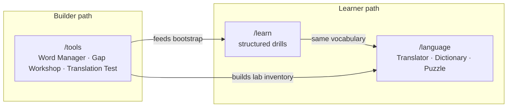
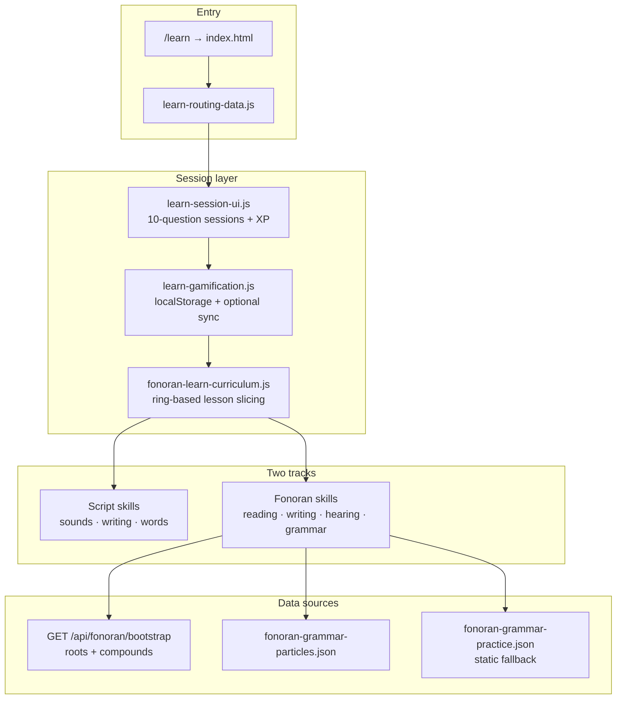
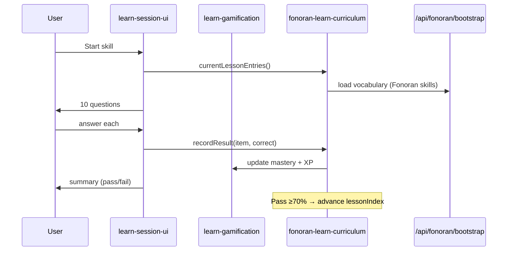

# Fonoran Learn

> **Status**: Active. Live at [`/learn`](/learn) — public, no sign-in required (optional progress sync when signed in).

Learn is the **structured drill layer** for Fonora Script and Fonoran language skills. It runs 10-question sessions with XP, streaks, and ring-based lesson progression. It is separate from the exploration tools on [`/language`](/language) (Translator, Dictionary, Puzzle).

See also: [platform-overview.md](platform-overview.md) · [fonoran-grammar.md](fonoran-grammar.md) · [fonoran-auth-and-release.md](fonoran-auth-and-release.md) (progress sync).

---

## Learner path vs builder path

| Route | Purpose | Progress |
| --- | --- | --- |
| [`/learn`](/learn) | Fixed exercises, lesson slicing, mastery | localStorage (+ optional cloud sync) |
| [`/language`](/language) | Open-ended translation, dictionary browse, puzzle playtests | Session logs, not Learn XP |
| [`/tools`](/tools) | Build and test vocabulary | Admin/community workflows |

---

## Architecture

`/learn` is served by the same SPA bundle as `/script` and `/tools` ([`index.html`](../index.html)). Hash routes select skill panels via [`js/learn-routing-data.js`](../js/learn-routing-data.js).

---

## Two tracks

### Fonora Script

Teaches the phonetic writing system with **structured lesson progression** and inline **Listen** buttons on prompts (except pure listening exercises).

| Skill | Route | Exercise | Curriculum |
| --- | --- | --- | --- |
| Sounds | `#script-sounds` | Match symbol ↔ sound (decode + construct) | Ordered symbol modules: places → modifiers → grid → vowels ([`js/fonora-script-curriculum.js`](../js/fonora-script-curriculum.js)) |
| Writing | `#script-writing` | English meaning → type Fonora script | Domain curriculum from [`data/fonoran-course-phrases.json`](../data/fonoran-course-phrases.json): words then phrases per module |
| Words | `#script-words` | Fonora script → type English meaning | Same domain curriculum as Writing |

Script Writing and Read Words reuse the Fonoran phrase corpus: English `sourceText` prompts and precomputed `script` glyphs from translated course entries. Pass ≥70% to advance; skill cards show module labels and lesson progress ([`js/learn-home-progress.js`](../js/learn-home-progress.js)).

**Playback:** Inline hear buttons use [`js/learn-hear-ui.js`](../js/learn-hear-ui.js) + [`js/fonora-tts.js`](../js/fonora-tts.js). Piper voice models are cached in the browser Cache API ([`js/piper-audio.js`](../js/piper-audio.js)) and warmed on app load so Listen is fast after the first visit.

### Fonoran language

Teaches roots and compounds from the live lab, ordered by **language rings** (campfire tiers):

1. **Communicative core** — survival dialogue vocabulary
2. **Extended core** — broader everyday concepts
3. **Complete** — full inventory

| Skill | Route | Exercise |
| --- | --- | --- |
| Reading | `#fonoran-reading` | Fonoran script/roman → English meaning (MCQ) · **Listen** on prompt |
| Writing | `#fonoran-writing` | English meaning → type Fonoran roman · **Listen** for target word |
| Hearing | `#fonoran-hearing` | TTS of Fonoran → English meaning (MCQ) — no inline hear (exercise is listening) |
| Grammar | `#fonoran-grammar` | Sentence translation drills · **Listen** for Fonoran phrase |
| Speaking | `#fonoran-speaking` | Stub — not yet on Learn home |

Ring labels and tier assignment come from [`tools/fonoran-experience-tiers.js`](../tools/fonoran-experience-tiers.js). Curriculum ordering is implemented in [`js/fonoran-learn-curriculum.js`](../js/fonoran-learn-curriculum.js): tier rank → root before compound → alphabetical.

---

## Session flow

**Fraction of a 10-question lesson you must get right to advance:** 70% (7/10 correct) — see `LESSON_PASS_RATIO` in [`js/fonoran-learn-curriculum.js`](../js/fonoran-learn-curriculum.js).
- **After all lessons:** Review mode shuffles the full item pool.
- **XP:** MCQ = 10, typing = 15, session bonus = 25 ([`learn-gamification.js`](../js/learn-gamification.js)).

---

## Progress storage

| Storage | Key / field | Contents |
| --- | --- | --- |
| Browser | `fonora-learn-progress-v2` (localStorage) | XP, streak, per-skill `lessonIndex`, item mastery |
| Server (signed in) | `fonoran_learn_progress` via `PUT /api/fonoran/me/progress` | Same payload synced from browser |

Details: [fonoran-auth-and-release.md](fonoran-auth-and-release.md). Fonoran skills require a running server with `/api/fonoran/bootstrap`; static hosting shows empty states for vocabulary drills.

---

## Relationship to Translator

Learn and the Translator share **vocabulary** but not the **exercise engine**:

| | Learn | Translator |
| --- | --- | --- |
| Vocabulary | `GET /api/fonoran/bootstrap` | Same lab inventory |
| Grammar sentences | Template compiler in `fonoran-grammar-generate.js` | `POST /api/fonoran/translate` (LLM semantic compiler) |
| Grading | Exact match on expected roman / English gloss | N/A (exploration) |
| Particles | `fonoran-grammar-particles.json` | Same inventory |

Grammar Learn drills teach a **small, hand-authored pattern set** aligned with [fonoran-grammar.md](fonoran-grammar.md). They do not exercise open-ended phrase compilation like the Translator. For production-style translation practice, use [`/language#translator`](/language#translator).

Translator architecture: [fonoran-translator.md](fonoran-translator.md).

---

## Key source files

| File | Role |
| --- | --- |
| [`js/learn-session-ui.js`](../js/learn-session-ui.js) | Shared 10-question session UI |
| [`js/learn-gamification.js`](../js/learn-gamification.js) | Progress model, XP, streaks, sync |
| [`js/fonoran-learn-curriculum.js`](../js/fonoran-learn-curriculum.js) | Ring ordering, lesson slicing |
| [`js/fonoran-practice-words.js`](../js/fonoran-practice-words.js) | Builds practice entries from bootstrap |
| [`js/fonoran-*-practice.js`](../js/) | Per-skill exercise modules |
| [`js/learn-home-progress.js`](../js/learn-home-progress.js) | Learn home streak / daily goal / skill bars |
| [`tools/fonoran-api.js`](../tools/fonoran-api.js) | Bootstrap + progress API routes |

---

## Future direction

A planned pivot aligns courses with the **1,000-phrase stranger corpus** (20 communicative domains, simple → hard within each category) and the LLM translator cache. That work replaces ring-based vocabulary ordering with phrase-based exercises; it is **not yet implemented**.

Current Learn behavior documented above remains authoritative until that ships.

---

## Related

- Platform overview: [platform-overview.md](platform-overview.md)
- Fonoran philosophy (campfire tiers): [fonoran-constitution.md](fonoran-constitution.md)
- Grammar rules for drills: [fonoran-grammar.md](fonoran-grammar.md)
- Learning experiment log: [fonoran-learning-sessions-log.md](fonoran-learning-sessions-log.md)
