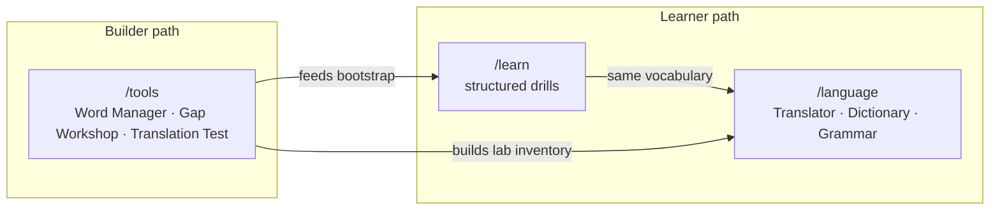
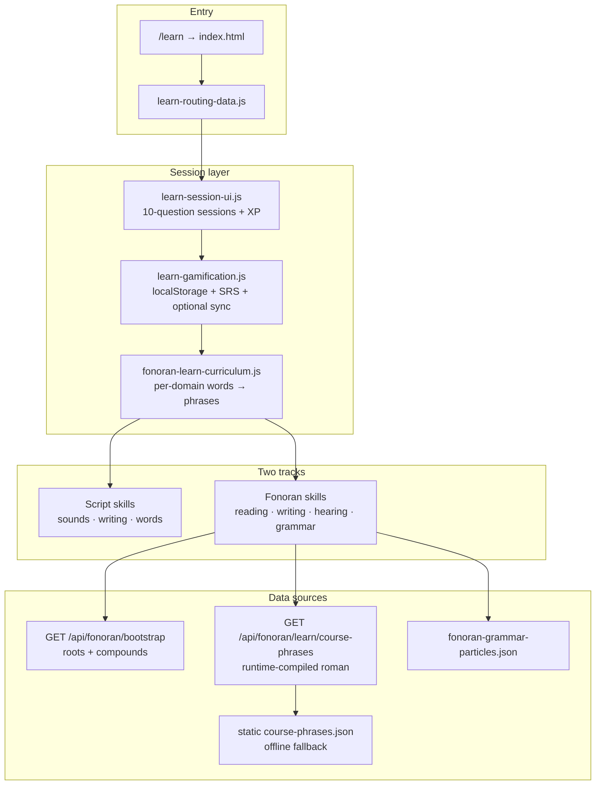
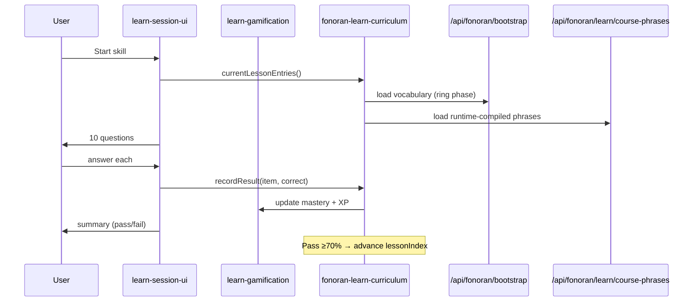

# Fonoran Learn

> **Status**: Active. Live at [`/learn`](/learn) — public, no sign-in required (optional progress sync when signed in).

Learn is the **structured drill layer** for Fonora Script and Fonoran language skills. It runs 10-question sessions with XP, streaks, and ring-based lesson progression. It is separate from the exploration tools on [`/language`](/language) (Translator, Dictionary, Grammar).

See also: [platform-overview.md](platform-overview.md) · [fonoran-grammar.md](fonoran-grammar.md) · [fonoran-auth-and-release.md](fonoran-auth-and-release.md) (progress sync).

---

## Learner path vs builder path

```mermaid
flowchart LR
  subgraph learner [Learner path]
    Learn["/learn\nstructured drills"]
    Lang["/language\nTranslator · Dictionary · Grammar"]
  end
  subgraph builder [Builder path]
    Tools["/tools\nWord Manager · Gap Workshop · Translation Test"]
  end
  Learn -->|"same vocabulary"| Lang
  Tools -->|"builds lab inventory"| Lang
  Tools -->|"feeds bootstrap"| Learn
```

| Route | Purpose | Progress |
| --- | --- | --- |
| [`/learn`](/learn) | Fixed exercises, lesson slicing, mastery | localStorage (+ optional cloud sync) |
| [`/language`](/language) | Open-ended translation, dictionary browse, grammar reference | Not Learn XP |
| [`/tools`](/tools) | Build and test vocabulary | Admin/community workflows |

---

## Architecture

```mermaid
flowchart TB
  subgraph entry [Entry]
    Learn["/learn → index.html"]
    Route["learn-routing-data.js"]
  end
  subgraph session [Session layer]
    UI["learn-session-ui.js\n10-question sessions + XP"]
    Gamify["learn-gamification.js\nlocalStorage + SRS + optional sync"]
    Curr["fonoran-learn-curriculum.js\nper-domain words → phrases"]
  end
  subgraph tracks [Two tracks]
    Script["Script skills\nsounds · writing · words"]
    Fonoran["Fonoran skills\nreading · writing · hearing · grammar"]
  end
  subgraph data [Data sources]
    Bootstrap["GET /api/fonoran/bootstrap\nroots + compounds"]
    Phrases["GET /api/fonoran/learn/course-phrases\nruntime-compiled roman"]
    Particles["fonoran-grammar-particles.json"]
    Fallback["static course-phrases.json\noffline fallback"]
  end
  Learn --> Route --> UI
  UI --> Gamify --> Curr
  Curr --> Script
  Curr --> Fonoran
  Fonoran --> Bootstrap
  Fonoran --> Phrases
  Phrases --> Fallback
  Fonoran --> Particles
```

`/learn` is served by the same SPA bundle as `/script` and `/tools` ([`index.html`](../index.html)). Hash routes select skill panels via [`js/learn-routing-data.js`](../js/learn-routing-data.js).

---

## Two tracks

### Fonora Script

Teaches the phonetic writing system with **structured lesson progression** and inline **Listen** buttons on prompts (except pure listening exercises).

| Skill | Route | Exercise | Curriculum |
| --- | --- | --- | --- |
| Sounds | `#script-sounds` | Match symbol ↔ sound (decode + construct) | Ordered symbol modules: places → modifiers → grid → vowels ([`js/fonora-script-curriculum.js`](../js/fonora-script-curriculum.js)) |
| Writing | `#script-writing` | English meaning → type Fonora script | Per-subject domain curriculum (words → phrases per domain) |
| Words | `#script-words` | Fonora script → type English meaning | Same domain curriculum as Writing |

Script Writing and Read Words share the domain curriculum with Fonoran language skills. Pass ≥70% to advance; skill cards show module labels and lesson progress ([`js/learn-home-progress.js`](../js/learn-home-progress.js)).

**Playback:** Inline hear buttons use [`js/learn-hear-ui.js`](../js/learn-hear-ui.js) + [`js/fonora-tts.js`](../js/fonora-tts.js). Piper voice models are cached in the browser Cache API ([`js/piper-audio.js`](../js/piper-audio.js)) and warmed on app load so Listen is fast after the first visit.

### Fonoran language

Every phrase-capable skill (Reading, Writing, Hearing, Speaking, Script Writing, Read Words) uses the **per-subject domain curriculum**: each of the 20 stranger-corpus domains first teaches the words its translated phrases need, then the phrases themselves.

1. **Word lessons** — `ceil(newWords / 10)` per domain, where new words are tokens of the domain's translated phrases (lab vocabulary + grammar particles) not taught by any earlier domain. First appearance wins; later domains meet a word again only through spaced-repetition review. Ordered by frequency in the domain's phrases, then ring, then part count.
2. **Phrase lessons** — `ceil(translatedPhrases / 10)` per domain, phrases ordered complexity 1 → 3, so every translated phrase gets a lesson slot.

The layout is computed from the content by `computeDomainLayout` in [`js/fonoran-learn-curriculum.js`](../js/fonoran-learn-curriculum.js) and shared with the Progress path ([`js/learn-module-path.js`](../js/learn-module-path.js)), so the "you are here" marker always matches the lessons actually served. Stored lesson indexes from retired layouts migrate automatically (completed domains carry over; position within the current domain restarts) — gated by a `layout` version in the skill's curriculum meta.

Grammar keeps a separate flow: the compiled Rule 4 basics lesson, then domain phrase drills.

| Skill | Route | Exercise |
| --- | --- | --- |
| Reading | `#fonoran-reading` | Fonoran script/roman → English meaning (MCQ) · **Listen** on prompt |
| Writing | `#fonoran-writing` | English meaning → type Fonoran roman · **Listen** for target word |
| Hearing | `#fonoran-hearing` | TTS of Fonoran → English meaning (MCQ) — no inline hear (exercise is listening) |
| Grammar | `#fonoran-grammar` | Rule 4 basics (order, particles, negation, serial want+go, questions, Actor spoken) then phrase drills · **Listen** for Fonoran |
| Speaking | `#fonoran-speaking` | English prompt → type Fonoran roman, then hear the target phrase |

Ring labels and tier assignment come from [`tools/fonoran-experience-tiers.js`](../tools/fonoran-experience-tiers.js).

### Spaced repetition

Item mastery uses Leitner boxes ([`js/learn-gamification.js`](../js/learn-gamification.js)): a correct answer promotes an item one box (1 → 5, review intervals 0/1/3/7/21 days), a wrong answer demotes it to box 1. Each 10-question session mixes up to 3 due review items from previously taught material in with the current lesson's new items; after the course, Review mode is a due-driven queue (earliest due first, then weakest boxes). "Mastered" on progress surfaces means box ≥ 3.

### Phrase roman freshness

English prompts are static (stranger corpus / baked domain structure / grammar lesson seed). Fonoran roman is **compiled at Learn load** by the deterministic translator via `GET /api/fonoran/learn/course-phrases`, keyed on lab `updated_at` — this includes the grammar basics lesson, whose seed ([`data/fonoran-grammar-lessons.json`](../data/fonoran-grammar-lessons.json)) stores only English sentences, exercise kinds, and tip templates. Lexicon respells therefore show up in Learn without rebuilding `data/fonoran-course-phrases.json`. That baked file (phrases + compiled grammar) remains the offline fallback and CI fixture; rebuild with `npm run fonoran:course-phrases:build` when you need to refresh the committed snapshot — `npm run fonoran:course-phrases:check` in `npm test` fails when it drifts.

Because lessons and the golden translation tests now run the same engine over the same corpus, a phrase a lesson teaches is exactly a phrase the tests prove the language can say. A corpus phrase (or grammar lesson sentence) that names a missing concept is an honest gap: it is held back from lessons until the lexicon covers it, never shown with stale roman.

The compile walks the whole corpus (~seconds), so it never runs on a visitor's request path: the server warms the cache at startup (`server.js`) and dedupes concurrent misses behind one in-flight compile ([`tools/fonoran-learn-course-phrases.js`](../tools/fonoran-learn-course-phrases.js)). On the client, `loadDomainCurriculum` caches the built curriculum per rules object, so the skill panels requesting during page setup share one fetch and one `buildCourseItems` pass.

---

## Session flow

```mermaid
sequenceDiagram
  participant User
  participant Session as learn-session-ui
  participant Gamify as learn-gamification
  participant Curr as fonoran-learn-curriculum
  participant API as /api/fonoran/bootstrap
  participant Phrases as /api/fonoran/learn/course-phrases

  User->>Session: Start skill
  Session->>Curr: currentLessonEntries()
  Curr->>API: load vocabulary (ring phase)
  Curr->>Phrases: load runtime-compiled phrases
  Session->>User: 10 questions
  User->>Session: answer each
  Session->>Curr: recordResult(item, correct)
  Curr->>Gamify: update mastery + XP
  Session->>User: summary (pass/fail)
  Note over Curr: Pass ≥70% → advance lessonIndex
```

**Fraction of a 10-question lesson you must get right to advance:** 70% (7/10 correct) — see `LESSON_PASS_RATIO` in [`js/fonoran-learn-curriculum.js`](../js/fonoran-learn-curriculum.js).
- **During the course:** each session mixes up to 3 due spaced-repetition items in with the lesson's new material.
- **After all lessons:** Review mode is a due-driven queue (earliest due first, then weakest boxes).
- **XP:** MCQ = 10, typing = 15, session bonus = 25 ([`learn-gamification.js`](../js/learn-gamification.js)).

---

## Progress storage

| Storage | Key / field | Contents |
| --- | --- | --- |
| Browser | `fonora-learn-progress-v2` (localStorage) | XP, streak, per-skill `lessonIndex`, item mastery (`seen`/`correct`/SRS `box`/`due`) |
| Server (signed in) | `fonoran_learn_progress` via `PUT /api/fonoran/me/progress` | Same payload synced from browser |

Details: [fonoran-auth-and-release.md](fonoran-auth-and-release.md). Fonoran skills require a running server with `/api/fonoran/bootstrap`; static hosting shows empty states for vocabulary drills.

---

## Relationship to Translator

Learn and the Translator share **vocabulary** but not the **exercise engine**:

| | Learn | Translator |
| --- | --- | --- |
| Vocabulary | `GET /api/fonoran/bootstrap` | Same lab inventory |
| Grammar sentences | Template compiler in `fonoran-grammar-generate.js` | `POST /api/fonoran/translate` (deterministic English compiler) |
| Grading | Exact match on expected roman / English gloss | N/A (exploration) |
| Particles | `fonoran-grammar-particles.json` | Same inventory |

Grammar Learn starts with the **Rule 4 basics lesson** compiled from `data/fonoran-grammar-lessons.json` — a seed of English sentences, exercise kinds, and tip templates with **no Fonoran in it**. The deterministic translator produces every answer (build time via [`tools/fonoran-grammar-lessons-compile.js`](../tools/fonoran-grammar-lessons-compile.js), runtime via the Learn API), tips resolve `{particle:…}`/`{concept:…}` placeholders from the seeds, and reorder/particle/choose materials derive procedurally from the compiled tokens. It then continues into reorder / particle / translation drills from course phrases. It does not replace the full [fonoran-grammar.md](fonoran-grammar.md) reference. For open-ended translation, use [`/language#translator`](/language#translator).

Translator architecture: [fonoran-translator.md](fonoran-translator.md).

---

## Key source files

| File | Role |
| --- | --- |
| [`js/learn-session-ui.js`](../js/learn-session-ui.js) | Shared 10-question session UI |
| [`js/learn-gamification.js`](../js/learn-gamification.js) | Progress model, XP, streaks, sync |
| [`js/fonoran-learn-curriculum.js`](../js/fonoran-learn-curriculum.js) | Per-domain layout, lesson slicing, SRS session mixing, index migration |
| [`js/fonoran-practice-words.js`](../js/fonoran-practice-words.js) | Builds practice entries from bootstrap |
| [`js/fonoran-course-phrases.js`](../js/fonoran-course-phrases.js) | Client loader (API first, static fallback) |
| [`tools/fonoran-course-phrases-compile.js`](../tools/fonoran-course-phrases-compile.js) | Shared deterministic phrase compile |
| [`tools/fonoran-learn-course-phrases.js`](../tools/fonoran-learn-course-phrases.js) | Server lab_rev cache for Learn phrases |
| [`js/fonoran-*-practice.js`](../js/) | Per-skill exercise modules |
| [`js/learn-home-progress.js`](../js/learn-home-progress.js) | Learn home streak / daily goal / skill bars |
| [`tools/fonoran-api.js`](../tools/fonoran-api.js) | Bootstrap, Learn phrases, progress API routes |

---

## Related

- Platform overview: [platform-overview.md](platform-overview.md)
- Vocabulary rings and caps: [fonoran-rulebook.md](fonoran-rulebook.md)
- Grammar rules for drills: [fonoran-grammar.md](fonoran-grammar.md)
