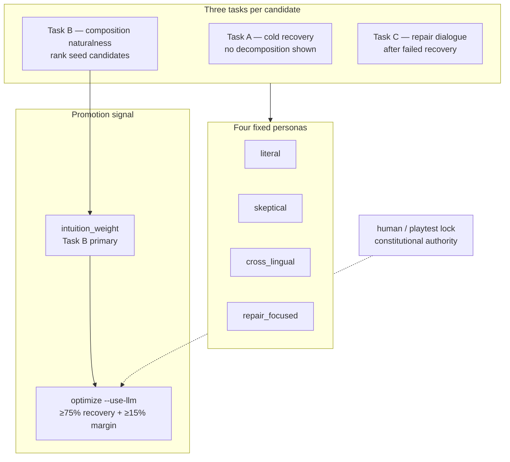

# LLM synthetic playtest experiment

> **Status:** v3 Compositional Intuition Battery — **full inventory complete, 22 promotions applied**  
> **Last run:** 2026-07-02 · 2,432 API calls · `data/fonoran-llm-evaluations.json` (prompt v3)  
> **Command:** `npm run fonoran:llm-intuition`  
> **Research note:** [RN-20 · Synthetic intuition ranking](/research/notes/synthetic-intuition-ranking)  
> **Related:** [fonoran-constitution.md](fonoran-constitution.md) · [fonoran.md](fonoran.md)

---

## Executive summary — is it working?

**Yes, for ranking seed candidates — with caveats.** v3 Task B (composition naturalness) separates competing constructions without v2's MC answer-key failure. Full inventory + optimize pipeline complete; **human Puzzle Conversation is the next gate.**

| Hypothesis | Full-inventory result | Verdict |
| --- | --- | --- |
| Task B discriminates across inventory | 88/111 concepts with ≥0.10 naturalness spread | **Pass** |
| Conservative auto-promote | 22/111 promoted (~20%) | **Pass** (at target boundary) |
| Build integrity after optimize | 111/111, 0 dropped | **Pass** |
| Task A cold recovery discriminates | Still saturated on several concepts | **Fail** — do not rely on cold alone |
| Human correlation on calibration | Not yet measured | **Pending** — Session 4 in learning log |

**Use Task B `intuition_weight` for candidate ranking.** Task A cold recovery needs tightening before it should drive promotion alone.

**Next:** Human-test LLM-promoted compounds in [Puzzle Conversation](/language#puzzle) — use `#puzzle?concept=<id>` for targeted rounds.

### v3 CIB protocol (active)



---

## 0. Protocol history

| Version | Instrument | Status |
| --- | --- | --- |
| v1 `revealed` | Decomposition visible, free-text | Superseded — everything scored as “tool” |
| v2 `puzzle` | MC + repair (mirrors human GUI) | Superseded for ranking — shared MC answer key |
| **v3 `cib-v3`** | Tasks A/B/C, no MC, `intuition_weight` | **Active** — use `npm run fonoran:llm-intuition` |

Legacy v2 runner remains (`npm run fonoran:llm-playtest`) for comparison only; do not use for promotion decisions.

---

## 1. Research question

**Can synthetic root-knower playtests reliably rank pre-seeded compound candidates by meaning recovery, so the dictionary promotes forms that a human listener would likely understand?**

This is not asking whether an LLM can *invent* good Fonoran words. It asks whether an LLM, constrained to known roots and glosses, can *simulate* the Puzzle Conversation recovery task at enough volume to guide preferred-form selection when human playtest data is sparse.

The constitutional criterion remains unchanged:

> If someone only knew the roots, would this expression probably help them recover the intended meaning?

Human playtests are the authority. LLM playtests are a **scalable pre-filter and ranking signal** — advisory until calibrated against real Puzzle Conversation rounds.

---

## 2. What we are testing

| Layer | Question | Method |
| --- | --- | --- |
| **Candidate quality** | Among build-valid seed compositions for concept *C*, which one do root-knowers recover most often? | 4 fixed personas × each candidate → recovery rate |
| **Promotion policy** | When recovery rates diverge clearly, does `--use-llm` promote a better preferred form than heuristic-only selection? | Compare `optimize-compounds` with/without `--use-llm` |
| **Safety** | Does the layer refuse to auto-promote when evidence is weak or split? | Count `llm_split` findings; verify 0 promotions below threshold |
| **Build integrity** | After LLM-guided optimization, does the full inventory still build? | `npm run fonoran:build:approved` → 111 compounds, 0 dropped |

### What we are *not* testing

- Whether LLMs can replace human Puzzle Conversation (they cannot; `human` / `playtest` locks are preserved).
- Whether LLMs should propose new compositions (proposer stays optional/disabled).
- Phonetic ease, segmentation collisions, or teaching-tree depth in isolation — those remain separate audit dimensions.
- Cross-linguistic validity beyond one synthetic non-English persona (`cross_lingual`).

---

## 3. Hypotheses

### H1 — Discrimination (primary)

For concepts where heuristic ranking and communicative intuition disagree, LLM playtests will assign **meaningfully different recovery rates** to seed candidates, not uniform scores.

- **Operationalization:** Winner recovery rate − runner-up recovery rate ≥ 0.15 (margin threshold) for a measurable subset of concepts.
- **Pilot note (v1 `revealed`):** The initial `tool` pilot produced a **four-way tie at 75%** — breakdown was visible upfront and free-text `"a tool"` matched every composition. **v2 `puzzle` protocol** fixes this with cold-first MC + repair.

### H2 — Semantic alignment (directional)

Candidates whose gloss composition more directly expresses the target meaning will score higher than vague compounds (e.g. `thing + X` without functional anchor).

| Concept | Heuristic current => | Competing seed | Expected LLM direction |
| --- | --- | --- | --- |
| `tool` | `useful + thing` | `hand + thing` | `useful + thing` ≥ `hand + thing` on recovery *and* confidence; skeptical persona should penalize vague `hand + thing` |
| `weapon` | `tool + conflict` | `thing + conflict` | `tool + conflict` wins — preserves teaching-tree link and semantic transparency |
| `war` | `tribe + conflict` | `collective + conflict + person` | Shorter tree-aware form wins if recovery is comparable |
| `tribe` | `community + bond` | `community + identity` | Depends on listener interpretation of “shared identity”; may **split** — acceptable if flagged |

These are **directional expectations**, not pass/fail assertions. A split verdict (`llm_split`) is a valid and useful outcome — it triggers human review rather than false automation.

### H3 — Conservative promotion

The optimizer promotes to `llm_consensus` only when:

- Winner recovery ≥ **75%** (`LLM_MIN_RECOVERY`)
- Winner margin over runner-up ≥ **15%** (`LLM_MIN_MARGIN`)
- Winner has ≥ **4 rounds** (`LLM_MIN_ROUNDS`, one per persona)

Concepts failing these gates keep the current preferred form. **Expected:** a minority of concepts auto-promote; many remain heuristic or split.

### H4 — Build survival

After `optimize-compounds --use-llm` + `build:approved`, all 111 compounds compile with 0 drops. LLM promotion must not break dependency order, spelling collision rules, or segmentation.

---

## 4. Experimental design

### 4.1 Units of observation

One **round** = one persona × one candidate composition × one concept.

```
Round {
  concept_id,
  candidate_composition,   // e.g. ["useful", "thing"]
  shown_spelling,          // build-resolved Fonoran form
  persona,                 // fixed synthetic listener
  recovered: boolean,
  guess: string,
  confidence: 0–1,
  tags: PUZZLE_FEEDBACK_TAGS,
  reasoning: string
}
```

Aggregated per `(concept_id, candidate_composition)`:

```
recovery_rate = recovered_count / n
mean_confidence = avg(confidence)
tags = frequency map
```

### 4.2 Independent variables

| Variable | Levels | Notes |
| --- | --- | --- |
| **Candidate composition** | 1–4 build-valid seeds per concept (+ optional demo tree) | From `ASSOCIATION_SEEDS`; LLM does not invent |
| **Persona** | 4 fixed prompts (versioned) | See §5 |
| **Concept** | 111 compound inventory | Full batch scope |
| **Model** | `claude-sonnet-4-6` (default) | Temperature 0; logged in store |

### 4.3 Dependent variables

| Measure | Use |
| --- | --- |
| **Recovery rate** | Primary ranking signal |
| **Mean confidence** | Tie-breaker when recovery rates equal |
| **Tag distribution** | Qualitative diagnostics (`unnatural`, `too_long`, `worked_well`, …) |
| **Consensus winner** | Output of `pickConsensus()` |
| **Promotion count** | Compounds moved to `preferred_source: llm_consensus` |
| **Build drop count** | Post-optimization build failures |

### 4.4 Controls and constraints

- **Build-valid filter:** Only candidates passing boundary, segmentation, and spelling-collision checks enter the test pool.
- **Topological materialization:** Spellings resolved in dependency order (same as optimizer) so intermediate compounds (`tool`, `tribe`, …) reflect live graph state.
- **No concept-id leakage:** Prompt instructs listener not to use English concept names unless inferred.
- **Deterministic post-processing:** LLM `recovered` is AND-ed with `guessMatchesTarget()` (token overlap + small synonym list) before aggregation.
- **Locked forms:** `human` / `playtest` preferred sources are never overwritten.

### 4.5 Stimulus (what the listener sees)

For each round, the model receives:

1. Full list of primitive root glosses (id → English gloss → spelling).
2. Fonoran spelling of the candidate compound.
3. Direct composition (e.g. `useful + thing`).
4. Morpheme breakdown (components with glosses; nested compounds expanded).

The listener does **not** receive the editorial preferred form, heuristic score, or alternate list.

---

## 5. Personas as synthetic listeners

Personas are **fixed, versioned prompts** — not per-word weights. They approximate different failure modes of real root-knowers:

| Persona | Simulates | Penalizes |
| --- | --- | --- |
| `campfire_stranger` | Week-one survival listener (campfire test) | Opaque compounds |
| `literal_root_knower` | Sees glosses only; no compound vocabulary | English idiom leakage |
| `skeptical_listener` | Critical listener | Vague `thing + X`, lazy metaphors |
| `cross_lingual` | Spanish L1, roots are new | English-centric_positional bias |

**Design intent:** No single persona decides. Consensus requires agreement across the panel (via aggregate recovery + margin), mimicking heterogeneous human listeners.

**Known limitation:** All four personas are English-instructed LLM roles. Only `cross_lingual` partially mitigates English-centrism. This is a **validity threat** (§8).

---

## 6. Procedure (full batch protocol)

```bash
# 1. Estimate scope
npm run fonoran:llm-playtest -- --dry-run
# → ~111 concepts × ~300 candidates × 4 personas ≈ 1,200 API calls

# 2. Run batch (crash-safe incremental writes)
npm run fonoran:llm-playtest
# Optional: npm run fonoran:llm-playtest -- --resume

# 3. Inspect aggregates
node tools/fonoran-llm-aggregate.js --report tool
node tools/fonoran-llm-aggregate.js --report weapon

# 4. Promote only where consensus is clear
npm run fonoran:optimize-compounds -- --use-llm

# 5. Verify build
npm run fonoran:build:approved

# 6. Audit
npm run fonoran:compound-audit
```

**Resume key:** `(concept_id, candidate_key, persona, prompt_version)` — reruns skip completed rounds.

---

## 7. Decision rules (promotion logic)

```
IF preferred_source IN (human, playtest):
  → locked; no change

ELSE IF use_llm AND pickConsensus(concept) returns winner W:
  IF W.recovery ≥ 0.75 AND W.margin ≥ 0.15 AND W.n ≥ 4:
    → promote W to preferred_source: llm_consensus

ELSE IF current composition invalid OR flattened length > max:
  → promote best valid candidate (LLM winner if available, else heuristic top)

ELSE:
  → hold current; audit flags llm_split or policy held
```

**Authority tiers after run:**

| `preferred_source` | Meaning |
| --- | --- |
| `human` / `playtest` | Real Puzzle Conversation evidence — locked |
| `llm_consensus` | Synthetic panel agreed clearly |
| `heuristic` | Fallback when no LLM data, split, or below threshold |

---

## 8. Validity threats and mitigations

| Threat | Risk | Mitigation |
| --- | --- | --- |
| **English-centric LLM bias** | Inflated recovery for English-transparent compounds | `cross_lingual` persona; calibrate against human rounds; do not treat LLM as equal to human |
| **Lenient recovery scoring** | Token overlap may mark `"a tool"` as recovered for many compositions | Pilot `tool` tie suggests reviewing `guessMatchesTarget()` strictness if discrimination fails inventory-wide |
| **Persona count (n=4)** | Low statistical power; ties likely | Margin threshold prevents false promotion; splits go to human review; increase personas or re-run in future protocol versions |
| **Gloss leakage** | Compound glosses in `glossById` may hint at target | `literal_root_knower` prompt forbids concept-id use; monitor reasoning for leakage |
| **Stale evals** | Seeds/build graph change after batch | Include `prompt_version` in resume key; re-run when seeds change |
| **Cost / model drift** | Model updates change behavior | Store model id + prompt_version per round; compare across runs |

---

## 9. Pilot results

### v1 (`revealed`, prompt v1) — superseded

Completed 2026-07-02, 16 rounds on `tool`. All four candidates tied at 75% recovery because breakdown was shown immediately and free-text guesses were too lenient. **Do not use v1 aggregates for promotion.**

### v2 (`puzzle`, prompt v2) — current

Re-run 2026-07-02, 16 rounds on `tool`:

| Composition | Cold (turn 1) | Overall | Mean repair | Confidence |
| --- | --- | --- | --- | --- |
| `thing + hand + useful` | 25% | 100% | 0.75 | 0.79 |
| `hand + thing` | 25% | 100% | 0.75 | 0.64 |
| `useful + thing` | 25% | 100% | 0.75 | 0.56 |
| `thing + use` | 25% | **75%** | 0.75 | 0.59 |

**Observations:**

1. **Cold-first MC works** — only 1/4 personas recover on turn 1 per candidate (matches human difficulty).
2. **Overall recovery is inflated by repair** — do not rank candidates on overall alone; use **`cold_recovery_rate`** (primary) and **`mean_repair_turns`** (tie-break).
3. **`thing + use` loses one persona after repair** (guess `"tool"` ≠ MC option) — only candidate below 100% overall.
4. **Cold ties at 25%** for all four — consensus correctly returns none; full batch may need more personas or stricter cold margin.

Promotion ranking uses `cold_recovery_rate` first, then repair turns, then heuristic score.

---

## 10. Success criteria (full batch)

### Must pass (blocking)

- [ ] Batch completes with < 5% API failure rate
- [ ] `fonoran:build:approved` → **111 built, 0 dropped**
- [ ] Zero promotions on locked (`human` / `playtest`) concepts
- [ ] All auto-promotions have consensus above threshold (auditable in `llm_evaluations.json`)

### Should pass (quality)

- [ ] ≥ 30% of evaluated concepts produce a clear LLM consensus winner (not all split)
- [ ] Reference concepts (`tool`, `weapon`, `war`) show expected *direction* even if margin prevents auto-promote
- [ ] `llm_would_promote` findings in audit are reviewable and fewer than blind heuristic promotions would be
- [ ] Tag patterns correlate with intuitive quality (e.g. `unnatural` more frequent on `hand + thing` than `useful + thing`)

### Calibration (ongoing, post-batch)

- [ ] Compare LLM recovery rates to human Puzzle Conversation rounds where both exist
- [ ] Pearson or rank correlation on shared (concept, composition) pairs — target ρ > 0.5 before trusting LLM for bulk promotion
- [ ] Human playtest wins on disagreement (constitution rule)

---

## 11. Expected outcomes (reference concepts)

These are **predictions to evaluate**, not acceptance tests:

| Concept | Current heuristic preferred | Expected LLM signal | Rationale |
| --- | --- | --- | --- |
| `tool` | `useful + thing` | `useful + thing` or `thing + use` over `hand + thing` | Functional gloss beats hand-object vagueness |
| `weapon` | `tool + conflict` | `tool + conflict` over `thing + conflict` | Teaching-tree transparency |
| `war` | `tribe + conflict` | `tribe + conflict` over flat primitive pile | Hierarchical meaning path |
| `tribe` | `community + bond` | Split or slight edge to one of bond/identity forms | Genuinely ambiguous — split is correct behavior |

**Inventory-wide expectation:** Heuristic and LLM agree on most concepts where seeds are thin; disagreements cluster on Phase IV teaching-tree concepts where length-only heuristics previously mis-ranked.

---

## 12. What would invalidate this experiment

Stop or redesign if:

1. **No discrimination:** > 80% of concepts tie within margin — the test adds cost without signal.
2. **Systematic false promotion:** Audit reveals LLM winners that human playtests consistently reject (once calibrated).
3. **Build regressions:** Any auto-promotion causes segmentation collisions or dropped compounds.
4. **English-only artifact:** Recovery rates track English gloss transparency but not persona diversity (all personas agree because prompts are too similar).

If (1) occurs, consider before re-running:

- Tighten `guessMatchesTarget()` (require closer gloss match, not just “tool”).
- Weight `skeptical_listener` recovery more heavily in aggregation.
- Add repair-turn simulation (show breakdown only after first failure).
- Increase personas or run multiple stochastic samples per persona.

---

## 13. Pre-flight checklist

Before committing to the full ~1,200-call batch:

- [x] API key configured; model verified (`claude-sonnet-4-6`)
- [x] Pilot concept (`tool`) completes end-to-end
- [x] Dry-run cost estimate reviewed (~$5)
- [x] Protocol v3 pilot complete (tool, weapon, tribe)
- [x] Calibration 10-concept batch (`npm run fonoran:llm-intuition -- --calibration`)
- [x] Full inventory 111 concepts (`npm run fonoran:llm-intuition -- --resume`)
- [x] Optimize + build (`optimize-compounds --use-llm`, `build:approved`)
- [ ] Task A cold scoring tightened or down-weighted
- [ ] Human Puzzle Conversation on LLM-promoted compounds (Session 4)
- [ ] Identify 5 priority concepts for human Puzzle Conversation calibration
- [ ] Snapshot current compounds (`fonoran:snapshot:export`) for diff comparison

---

## 14. Relation to language development

This experiment serves Fonoran development if and only if it:

1. **Surfaces disagreements** between length/heuristic scores and communicative recovery — making them visible for human review (`llm_split`, `llm_would_promote`).
2. **Promotes conservatively** — auto-changing the dictionary only when synthetic evidence is strong; otherwise preserving status quo.
3. **Feeds the Puzzle Conversation loop** — LLM rounds suggest which concepts and candidates deserve real human playtests next.
4. **Respects the constitution** — compounds remain meaning-attempts; alternates stay; human authority is final.

The full batch is worthwhile when treated as **structured exploratory data collection**, not as automated canonization. The scientific product is a ranked recovery table per concept, plus a clear list of splits for human follow-up — not merely a count of promotions.

---

## 15. v3 experiment (recommended): Compositional Intuition Battery

> **Status:** v3 implemented — pilot run complete (tool, weapon, tribe)  
> **Prompt version:** `3` · **Command:** `npm run fonoran:llm-intuition -- --pilot`

### 15.1 Why v2 is wrong for this job

v2 copied the **human Puzzle UI** (MC + repair), but the human puzzle tests **one live preferred form**. We need to **rank competing seed compositions** for the same concept.

| v2 problem | Effect |
| --- | --- |
| Same MC answer for all candidates (`"useful thing for the hand"`) | Repair becomes “pick the concept gloss after seeing morphemes” |
| Breakdown varies, answer key does not | Weak constructions pass after hint |
| MC forces discrete choice | LLMs reason better with composition + free inference |
| n=4 personas, thin prompts | Ties and low discrimination |

**Human Puzzle Conversation stays as-is for real humans.** v3 is a **different instrument** for synthetic volume — same constitutional question, different method.

### 15.2 What we actually want to measure

Not: *“Can the model pick the right English label from a list?”*

Yes:

1. **Cold recovery** — Hearing only the Fonoran word (+ knowing roots), would a root-knower infer the intended meaning?
2. **Compositional naturalness** — Does `useful + thing` *feel* like a lived way to say “tool”, or a lazy gloss?
3. **Relative preference** — Between two constructions for the same meaning, which communicates better?

Outputs are **weights per candidate** (and eventually per component pattern), fed into preferred-form selection — not binary promotion alone.

### 15.3 Three tasks (no multiple choice)

#### Task A — Cold hearing (recovery)

**Stimulus:** Root glossary (primitive roots only, no compound vocabulary) + Fonoran spelling.  
**Hidden:** composition breakdown, concept id, editorial gloss.

**Prompt:** *“A speaker says [spelling]. You know the roots below. What do you think they mean? How confident are you?”*

**Response (JSON):**

```json
{
  "inferred_meaning": "string",
  "confidence": 0.0,
  "would_understand": true,
  "tags": ["worked_well"],
  "reasoning": "..."
}
```

**Score `recovery`:** strict semantic match of `inferred_meaning` to target concept (not synonym soup — see §15.6).  
**Weight:** `recovery × confidence` per persona; aggregate → `cold_recovery_rate`.

This tests: *does this **spelling** communicate the concept cold?*

---

#### Task B — Composition judgment (naturalness)

**Stimulus:** Root glossary + **composition as root ids with glosses** (e.g. `useful + thing`).  
**Hidden:** concept id. Shown instead: *“The speaker wants to express: [target gloss].”*

**Prompt:** *“They said it this way: [composition]. How naturally does this construction express that meaning? Would a root-knower get it without being told the answer?”*

**Response (JSON):**

```json
{
  "inferred_meaning": "string",
  "naturalness": 0.85,
  "vagueness": 0.2,
  "would_use_this": true,
  "tags": ["unnatural"],
  "reasoning": "..."
}
```

**Scores:**

- `naturalness` — model self-report 0–1 (primary for this task)
- `composition_recovery` — does `inferred_meaning` match target?
- `vagueness` — penalize lazy `thing + X` (skeptical persona weights this higher)

This tests: *is this **construction** a good human strategy for the meaning?* — the question v2 repair accidentally answered with a giveaway MC key.

**This is the main discriminator between `hand + thing` and `useful + thing`.**

---

#### Task C — Pairwise preference (relative rank)

**Stimulus:** Same target gloss + two candidates (A/B): spellings + compositions.

**Prompt:** *“Which expression would a root-knower understand more easily?”*

**Response (JSON):**

```json
{
  "preferred": "A",
  "margin": 0.7,
  "reasoning": "..."
}
```

**Score:** Bradley-Terry / win-rate matrix over all seed pairs per concept → `pairwise_score`.

This tests: *which candidate wins head-to-head* — the decision the optimizer actually needs.

**Cost:** 4 candidates → 6 pairs × 4 personas = 24 calls/concept (calibration only at first).

---

### 15.4 Composite weights (what feeds the pipeline)

Per `(concept_id, candidate_composition)`:

| Field | Source | Use |
| --- | --- | --- |
| `cold_recovery_rate` | Task A | Cold communicative success |
| `mean_naturalness` | Task B | Compositional intuition |
| `mean_vagueness` | Task B | Penalty signal |
| `pairwise_score` | Task C | Relative rank within concept |
| **`intuition_weight`** | composite | Optimizer ranking |

**Proposed composite (tunable, no per-word hardcoding):**

```text
intuition_weight =
  0.35 × cold_recovery_rate
+ 0.40 × mean_naturalness
+ 0.25 × pairwise_score
− 0.15 × mean_vagueness
```

**Promotion policy:** still requires clear margin + minimum n — weights **rank** candidates; they do not auto-canonize without consensus.

**Downstream uses:**

1. **`optimize-compounds --use-llm`** — sort by `intuition_weight`, not heuristic length alone
2. **Audit** — flag concepts where heuristic top ≠ LLM top
3. **Seed generation (future)** — pairwise wins boost component pairs (`tool+conflict` > `thing+conflict`) in proposal ranking
4. **Human playtest queue** — lowest `intuition_weight` on current preferred → priority for Puzzle Conversation

### 15.5 Personas (stronger variation)

Keep four roles but give each a **task-specific system prompt**, not one shared MC template:

| Persona | Task A/B bias |
| --- | --- |
| `campfire_stranger` | Forgiving of opaque spellings if meaning is guessable |
| `literal_root_knower` | Must derive meaning only from roots shown |
| `skeptical_listener` | **`vagueness` weighted 2×** — penalizes `thing + X` |
| `cross_lingual` | Spanish reasoning; rejects English-only transparent glosses |

Optional: **2 samples per persona** at temperature 0.2 → n=8 for stability (~2× cost).

### 15.6 Strict scoring (avoid “everything is tool”)

v1 failed because `"a tool"` matched everything. v3 rules:

1. **Task A/B:** `inferred_meaning` must match target with **token overlap ≥ 0.6** OR share a **small curated synonym group** for that concept only (not global “tool” ↔ anything)
2. **`would_understand: true`** from model is **ignored** unless text match passes
3. **Task B `naturalness`** is kept even when recovery fails — a vague compound can be “understood” but unnatural (hand + thing)
4. **No repair turn for candidate ranking** — repair reserved for human puzzle parity on live preferred forms only

### 15.7 Calibration protocol (before full 111)

**Phase 1 — 10 concepts, Tasks A + B only**

`tool`, `weapon`, `war`, `tribe`, `community`, `knowledge`, `exchange`, `memory`, `language`, `teacher`

~10 × 4 candidates × 4 personas × 2 tasks ≈ **320 calls**

**Phase 2 — Pairwise (Task C) on concepts with flat Task B scores**

~6 pairs × 4 personas × ~5 disputed concepts ≈ **120 calls**

**Phase 3 — Human Puzzle Conversation on 5 live preferred forms**

Same concepts, GUI playtests → compare human recovery to Task A cold recovery.

**Go/no-go for full inventory:**

- Task B separates `tool` candidates (useful+thing > hand+thing on naturalness)
- LLM rank correlates with human intuition on ≥ 7/10 calibration concepts
- If not → iterate prompts/scoring, do not scale

**Phase 4 — Full inventory Tasks A + B** (~900 calls, skip Task C except splits)

### 15.10 Recorded results — pilot (2026-07-02)

**Run:** `npm run fonoran:llm-intuition -- --pilot`  
**Scope:** `tool`, `weapon`, `tribe` · Tasks A + B · 4 personas · 80 rounds stored  
**Model:** `claude-sonnet-4-6` · **Store:** `data/fonoran-llm-evaluations.json` (`prompt_version: 3`, `battery: cib-v3`)

#### `tool` (4 candidates)

| Composition | intuition_weight | cold | naturalness | vagueness | comp_recovery |
| --- | --- | --- | --- | --- | --- |
| thing + hand + useful | **0.62** | 100% | 0.57 | 0.56 | 50% |
| useful + thing | 0.57 | 100% | **0.52** | 0.77 | 50% |
| hand + thing | 0.56 | 100% | 0.48 | 0.71 | 25% |
| thing + use | 0.53 | 100% | 0.42 | 0.74 | 75% |

Heuristic live preferred: `useful + thing`. LLM ranks it **#2** by weight (below longer `thing + hand + useful`). Task B correctly penalizes `hand + thing` naturalness (0.48) vs `useful + thing` (0.52). Cold recovery is saturated at 100% — not trustworthy for this concept yet.

#### `weapon` (3 candidates)

| Composition | intuition_weight | cold | naturalness | vagueness | comp_recovery |
| --- | --- | --- | --- | --- | --- |
| tool + conflict | **0.27** | 0% | 0.58 | 0.58 | 50% |
| conflict + thing | 0.25 | 0% | 0.55 | 0.64 | 75% |
| thing + conflict | 0.23 | 0% | 0.53 | 0.70 | 50% |

Heuristic live preferred: `tool + conflict`. **LLM agrees** — teaching-tree form wins.

#### `tribe` (3 candidates)

| Composition | intuition_weight | cold | naturalness | vagueness | comp_recovery |
| --- | --- | --- | --- | --- | --- |
| community + bond | **0.29** | 0% | 0.64 | 0.58 | 0% |
| collective + person + identity | 0.28 | 0% | 0.58 | 0.50 | 0% |
| community + identity | 0.28 | 0% | 0.60 | 0.55 | 0% |

Heuristic live preferred: `community + bond`. **LLM agrees** (marginal — near tie, consensus none).

#### Commands to reproduce reports

```bash
node tools/fonoran-llm-aggregate.js --report tool
node tools/fonoran-llm-aggregate.js --report weapon
node tools/fonoran-llm-aggregate.js --report tribe
```

---

### 15.11 Readiness — when to run full test

| Stage | Command | ~Calls | ~Cost | Gate |
| --- | --- | --- | --- | --- |
| ✅ Pilot | `--pilot` | 80 | $0.32 | Task B discriminates — **done** |
| ✅ Calibration | `--calibration` (Tasks A,B) | 232 | $0.94 | 7/10 concepts rank sensibly — **done** |
| ✅ Full inventory | (no filter, Tasks A,B) | 2,168 | $8.78 | Complete — **done** |
| ✅ Promote | `optimize-compounds --use-llm` + `build:approved` | — | — | 111/0 build, 22 promoted — **done** |
| **→ Next** | Human Puzzle Conversation | — | — | Validate promotions + calibration splits |
| Optional | `--pilot --tasks A,B,C --resume` | +72 | $0.30 | Pairwise breaks ties on `tool` |

**Human testing (web GUI):**

```bash
npm start
# http://localhost:3000/language#puzzle
# http://localhost:3000/language#puzzle?concept=community
```

**Completed pipeline:**

```bash
npm run fonoran:llm-intuition -- --resume          # all 111 concepts, Tasks A+B
npm run fonoran:optimize-compounds -- --use-llm
npm run fonoran:build:approved
npm run fonoran:compound-audit
```

**Remaining gates:**

- [x] Calibration 10-concept batch complete
- [x] Task B spreads candidates on ≥ 7/10 concepts (not all ties)
- [ ] Human recovery on ≥5 LLM-promoted compounds
- [ ] (Recommended) Task C pairwise on disputed concepts (`tool`, `tribe`)
- [ ] (Recommended) Tighten Task A cold scoring OR reduce its weight in `intuition_weight` until fixed
- [ ] (Optional) 5 human Puzzle Conversation rounds on calibration concepts for correlation check

### 15.8 What v3 is not

- Not a replacement for human playtests
- Not LLM **generating** new compositions (proposer stays separate)
- Not MC gloss-matching after showing the answer
- Not optimizing for shortest flattening

### 15.9 Success criteria for v3

| Metric | Target |
| --- | --- |
| Task B spread on `tool` | `useful+thing` naturalness ≥ 0.15 above `hand+thing` |
| Calibration rank correlation | ≥ 0.6 Spearman vs human/heuristic ordering on 10 concepts |
| Auto-promote rate | < 20% of concepts (majority splits → human review) |
| Build after optimize | 111/111, 0 dropped |

**Ultimate goal:** Weights that make preferred forms **more intuitive human constructs** — compositions a root-knower would invent and understand, not glosses that score well after hints.

