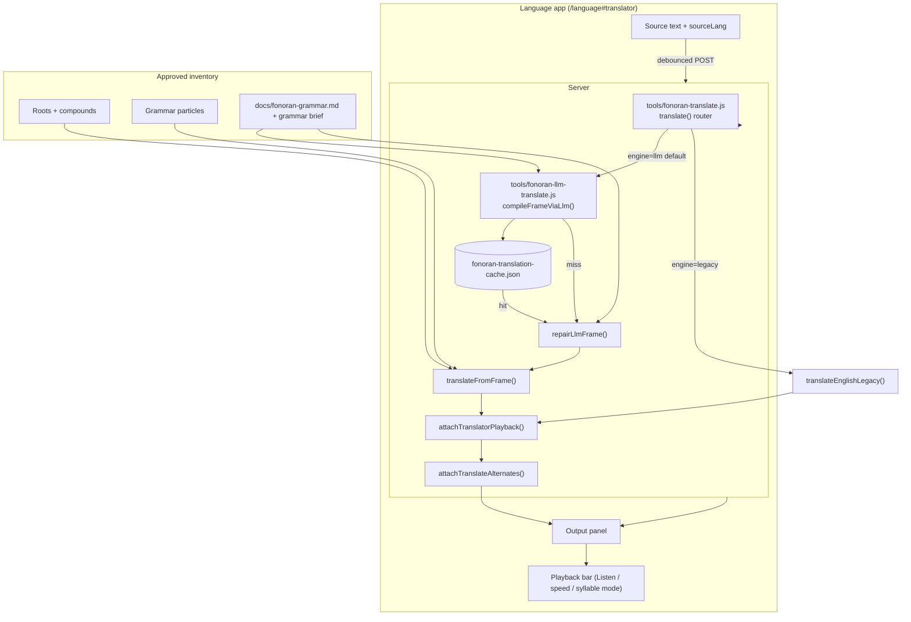
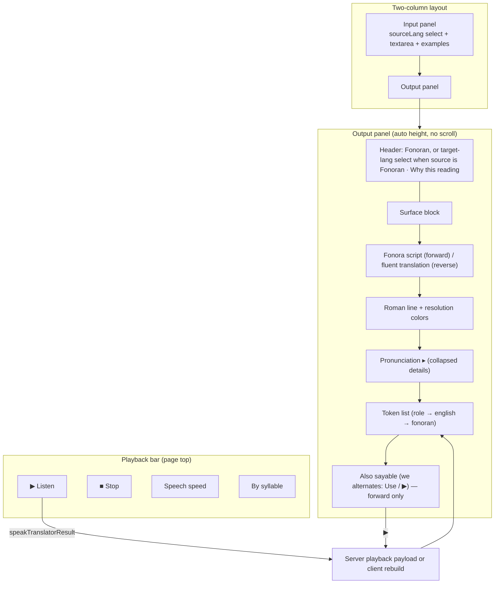

# Fonoran Translator

> **Status**: Active (July 2026). Live path at `/language#translator` and `POST /api/fonoran/translate`.

The Fonoran Translator compiles **meaning** from any source language into Fonoran — it is not a word-for-word gloss. It also supports the reverse path: **Fonoran → natural language** (English or another selected target), with input as **Fonoran (Roman)** or **Fonoran (Fonora)** script. Grammar is language-neutral ([Rule 7](fonoran-grammar.md#rule-7-translator-architecture)); concepts are canonical; spellings come only from the approved lab inventory.

The **default engine** is a multilingual **LLM semantic compiler** (`tools/fonoran-llm-translate.js`) that emits a concept frame, then a **deterministic renderer** (`translateFromFrame()` in `tools/fonoran-translator.js`) builds roman, script, tokens, and playback. The legacy English-only compiler remains for regression (`engine=legacy`).

Research context: [RN-28 · Multilingual LLM semantic compiler](research-notes/RN-28-multilingual-llm-semantic-compiler.md). Legacy compiler spec: [fonoran-interpretive-translator.md](fonoran-interpretive-translator.md).

---

## End-to-end architecture



---

## Compile pipeline (LLM path)

```mermaid
flowchart LR
  subgraph Input
    T["Source text"]
    SL["sourceLang (auto | en | es | …)"]
  end

  subgraph LLM["Anthropic (ANTHROPIC_API_KEY_FONORA_TRANSLATOR)"]
    P["Prompt: grammar brief + concept inventory + few-shot"]
    F["Concept frame JSON<br/>{ slots, is_question, unresolved, reasoning }"]
    T --> P --> F
  end

  subgraph Repair["Deterministic repair"]
    N1["normalizeWePrimaryFrame()"]
    N2["stripExistentialThereFromFrame()"]
    N3["normalizeFrameParticles()"]
    N3b["restoreDroppedNegation() / stripInventedNegation()"]
    N3c["promoteTemporalSceneToTime() — scene out of modifiers"]
    N4["simplifyMotionFrame() — serial want+move, bare destinations"]
    G["checkLlmGrammarViolations()"]
    L["repairFromLegacySlots() on WH misuse / removed particles"]
    F --> N1 --> N2 --> N3 --> N3b --> N3c --> N4 --> G
    G -->|violations| L
  end

  subgraph Render["Deterministic render"]
    V["validateLlmFrame()"]
    ST["slotsToTokens()"]
    BS["buildSurface()"]
    PB["buildPlaybackFromTokens()"]
    L --> V
    G -->|ok| V
    V --> ST --> BS --> PB
  end

  subgraph Output
    TOK["tokens + resolution_kind"]
    SUR["surface (roman, script, pronunciation)"]
    PBK["playback (script, segments, wordSources)"]
    ALT["alternates (we readings + casual Actor-drop)"]
    ST --> TOK
    BS --> SUR
    PB --> PBK
    TOK --> ALT
  end

  CACHE[("Cache lookup / write")] -.-> F
  CACHE -.-> Output
```



**Key invariant:** the LLM chooses **concept ids and slot roles** only. It never invents spellings. Every `fonoran` token on the surface resolves through the live lab (`buildResolveContext()`), including spelling→concept fallback for LLM outputs that used roman instead of ids.

---

## Language app UI



### UI behavior (July 2026)

| Element | Behavior |
| --- | --- |
| **Source language** | Includes natural languages plus **Fonoran (Roman)** and **Fonoran (Fonora)**. Choosing either switches to reverse mode and shows a target-language select (default English) |
| **Translate** | Debounced (~280 ms) POST to `/api/fonoran/translate`; spinner while busy. Reverse sends `direction: "from-fonoran"`, `inputMode`, and `targetLang` |
| **Resolution colors** | Default text = direct lexicon hit; gold = interpreted; orange = semantic / weak alias; red = unresolved |
| **Pronunciation** | Collapsed `<details>` under roman; phonetic key + “sounds like” hint |
| **Why this reading** | Hover/focus popup in output header; shows LLM `reasoning` + engine badge (Cached / LLM) |
| **Listen** | Uses server `playback` as source of truth; speaks Fonoran IPA via Piper; unresolved gaps may use English TTS; Fonoran tokens never fall back to English orthography; `.` `!` `?` retained on roman/script and pause Listen between sentences |
| **Also sayable** | Rule-based alternates (e.g. collective `dan` ↔ dyadic `mi be` for *we*); alternate ▶ highlights alternate tokens |
| **Layout** | 15 px gap below nav; panels `align-items: start`; independent auto heights |

Client modules: `language/fonoran-app.js`, `js/fonoran-playback-build.js`.

---

## Module reference

| Module | Role |
| --- | --- |
| `tools/fonoran-translate.js` | Unified `translate()` router (`to-fonoran` / `from-fonoran`) |
| `tools/fonoran-reverse-translate.js` | Fonoran → natural language (script/roman normalize, lexical resolve, fluent LLM) |
| `tools/fonoran-llm-translate.js` | LLM prompt, frame compile, cache, validation, repair |
| `tools/fonoran-llm-grammar-brief.js` | Grammar rules excerpt + `checkLlmGrammarViolations()` |
| `tools/fonoran-translator.js` | `translateFromFrame()`, `slotsToTokens()`, `buildSurface()`, legacy English compiler |
| `tools/fonoran-english-resolve.js` | Concept resolution cascade, spelling fallback |
| `tools/fonoran-interpretation.js` | Motion rules, existential *there* peel, frame helpers |
| `tools/fonoran-translate-alternates.js` | Optional we-reading alternates (no second LLM call) |
| `tools/fonoran-playback-build.js` | Server wrapper; attaches `playback` to every result |
| `js/fonoran-playback-build.js` | Browser-safe playback builder (shared with Samples pipeline) |
| `tools/fonoran-translation-cache.js` | Read/write `fonoran-translation-cache.json` |
| `language/fonoran-app.js` | Translator page UI |

---

## API

**`POST /api/fonoran/translate`** (public, read-only)

**Forward** (any language → Fonoran):

```json
{
  "text": "We need shelter",
  "sourceLang": "auto",
  "engine": "llm",
  "skipCache": false,
  "simplify": "auto"
}
```

**Reverse** (Fonoran → English / selected language):

```json
{
  "text": "mi gi ye",
  "direction": "from-fonoran",
  "inputMode": "roman",
  "targetLang": "en",
  "sourceLang": "fonoran-roman"
}
```

`sourceLang` values `fonoran-roman` / `fonoran-fonora` also select reverse automatically. `inputMode` is `roman` or `fonora` (script decoded via `fonoraScriptToRoman`).

**Response (success, forward):**

| Field | Description |
| --- | --- |
| `direction` | `to-fonoran` |
| `surface.roman` | Fonoran roman line |
| `surface.pronunciation` | `{ sayLine, englishLine }` for UI + TTS hints |
| `tokens[]` | Per-slot tokens with `role`, `english`, `fonoran`, `resolution_kind`, `concept_id`; `droppable` when addressee Actor may be omitted casually |
| `actor_droppable` | True when primary includes a recoverable addressee that may drop in casual speech |
| `playback` | `{ script, segments, wordSources, tokenIndices, playable }` |
| `reasoning` | One-sentence compiler note (shown in “Why this reading”) |
| `simplified` | Plain-meaning pivot `{ clauses[], text, note }` when the pre-pass ran (shown as “Plain meaning”) |
| `llm_frame` | Normalized concept frame `{ slots, is_question, … }` |
| `alternates[]` | Optional rule-based readings (`roman`, `tokens`, `playback`, `note`) |
| `unresolved[]` | Honest gaps (render red; never fabricated) |
| `engine` | `llm` \| `cached` \| `legacy` |

**Response (success, reverse):**

| Field | Description |
| --- | --- |
| `direction` | `from-fonoran` |
| `translation` | Fluent reading in `targetLang` |
| `literal` | Lexical gloss (shown when it differs from `translation`) |
| `surface.roman` | Normalized Fonoran roman from the input |
| `tokens[]` | Resolved particles / roots / compounds (or unresolved gaps) |
| `playback` | Speaks the **source** Fonoran |
| `engine` | `llm` (fluent) or `lexical` (gloss-only fallback) |

Requires `ANTHROPIC_API_KEY_FONORA_TRANSLATOR` for fluent `engine=llm` (both directions). Reverse falls back to a lexical gloss when the key is unset. See [fonoran-cli-tools.md](fonoran-cli-tools.md).

Module: `tools/fonoran-reverse-translate.js`.

---

## Resolution cascade

Each token carries `resolution_kind` (see [Rule 7 · Resolution cascade](fonoran-grammar.md#resolution-cascade--honest-gaps)):

| Kind | UI color | Meaning |
| --- | --- | --- |
| `direct` | default | Curated alias, concept id, or lab lemma |
| `interpreted` | gold | Tense lemma, idiom, rule-based mapping, concept bridge to an existing concept |
| `composed` | blue | Transparent runtime compound assembled from approved roots via a concept bridge or `+`-path (e.g. `sentience` → `think+self`). Fuses to one word when the Compound Boundary Constraint passes, else renders as a space-separated phrase |
| `loan` | purple (italic, wrapped `«…»`) | Phonetic loanword for a proper noun / unmappable term (the "iPhone stays iPhone" rule). Never composed from roots; always visibly marked |
| `semantic` / `alias_weak` | orange | Weaker semantic or gloss-only alias |
| `unknown` | red | No confident concept — honest gap |

### Concept bridges (abstract / technical vocabulary)

Abstract source words with no root are resolved through curated **concept bridges** ([data/fonoran-concept-bridges.json](../data/fonoran-concept-bridges.json)) plus an optional, untracked **local glossary** ([data/local/glossary.json](../data/local/glossary.json)) for pinning proper-noun/loanword decisions on a private corpus. The local glossary loads **first** so its pins win over the general bridge set. A bridge is one of: `compose` (multi-root path → `composed`), `concept` (redirect to an existing approved concept → `interpreted`), or `loan` (marked phonetic borrow → `loan`). Bridges never invent spellings — every composed part comes from an approved root or compound (Design Rule 0 / Rule 5). Loaded in `loadConceptBridges()` / `buildResolveContext()` and applied in both `resolveConceptId()` (LLM path) and `resolveEnglishToken()` (legacy path).

### Conceptual simplification pre-pass (`simplify`)

For abstract or long prose, the translator can run a **plain-meaning pre-pass** (`simplifyForFonoran()` in [tools/fonoran-llm-translate.js](../tools/fonoran-llm-translate.js)) that rewrites the source into simple, Fonoran-expressible propositions *before* frame compilation — the same "simplify first" step a human translator does. Controlled by the `simplify` request field: `true` (force), `false` (never), `'auto'` (heuristic on abstract/long input; the default the Language app sends). The pivot is returned as `simplified` (`{ clauses, text, note }`) and shown in the UI as a collapsible **Plain meaning** panel, so the compiler stays a language tool rather than a black box.

---

## Cache & warm-up

Successful frames are stored in `external/fonora-data/data/fonoran-translation-cache.json`. Cache hits re-run **repair + render** against the current lab so vocabulary changes propagate without a new LLM call.

```bash
npm run fonoran:translate:cache-warm   # batch warm stranger corpus
```

---

## Testing

| Command | Purpose |
| --- | --- |
| `npm run test:translator` | Golden regression — fails on unexpected drift |
| `npm run test:translator:update` | Accept current output as new baseline |
| `node scripts/fonoran-translate-frame-test.js` | Frame repair + we-alternate smoke tests |

Legacy English golden suite still exercises `engine=legacy` until LLM coverage matches the 1,000-phrase stranger corpus.

---

## Related

- [fonoran-learn.md](fonoran-learn.md) — structured drills (shared vocabulary, different exercise engine)
- [fonoran-grammar.md · Rule 7](fonoran-grammar.md#rule-7-translator-architecture) — constitutional translator rules
- [fonoran-interpretive-translator.md](fonoran-interpretive-translator.md) — legacy English compiler
- [RN-28](research-notes/RN-28-multilingual-llm-semantic-compiler.md) — decision record
- [RN-25](research-notes/RN-25-concept-first-translation-and-honest-gaps.md) — honest gaps
- [RN-15](research-notes/RN-15-compiling-english-into-meaning.md) — original interpretive compiler
