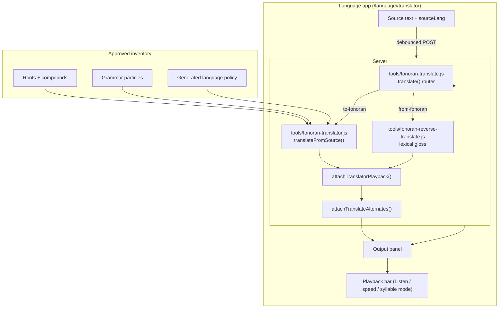
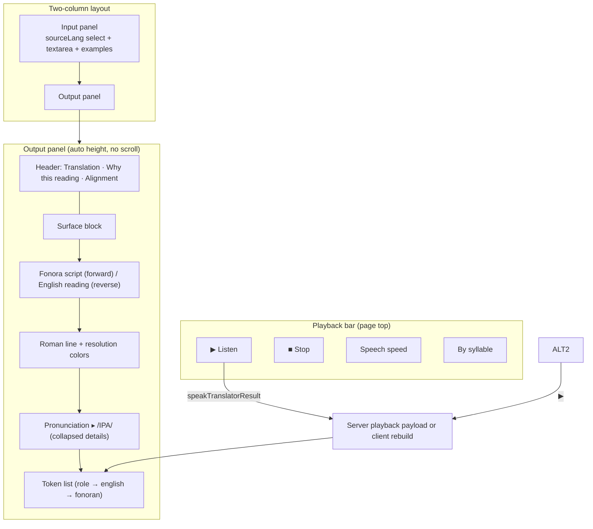

# Fonoran Translator

> **Status**: Active (July 2026). Live path at `/language#translator` and `POST /api/fonoran/translate`.

The Fonoran Translator compiles **meaning** into Fonoran, not a word-for-word gloss. It also supports the reverse path, **Fonoran → English**, with input as **Fonoran (Roman)** or **Fonoran (Fonora)** script. Grammar is language-neutral ([Rule 7](fonoran-grammar.md#rule-7-translator-architecture)); concepts are canonical; spellings come only from the approved lab inventory.

There is **one engine**, the deterministic compiler (`translateFromSource()` in `tools/fonoran-translator.js`, named `engine=legacy` in the API and scripts; `translateEnglishLegacy()` is its English wrapper). The source language is a parser selected by `sourceLang` from the registry in `tools/fonoran-source-parsers.js` — English is the one installed today, and a language with no parser is refused honestly rather than silently read as English. The engine needs no API key, costs nothing per phrase, answers offline, and brackets what it cannot say, for example `[how]`, instead of inventing a form.

A model-driven semantic compiler ran as the default until July 2026. It was removed: it answered essentially every request, so every public translation cost money, the translator failed outright wherever no key was configured, and no golden output could be reproduced from the repo alone. Its cache outlived it for a while because Learn replayed cached frames; Learn now compiles through this engine, so the cache, the client, and the model grammar brief are all deleted and `data/fonoran-llm-quarantine.json` is empty.

One-page algorithm: [fonoran-algorithm-translation.md](fonoran-algorithm-translation.md). Legacy compiler spec: [fonoran-interpretive-translator.md](fonoran-interpretive-translator.md).

---

## End-to-end architecture


```mermaid
flowchart TB
  subgraph UI["Language app (/language#translator)"]
    IN["Source text + sourceLang"]
    PB["Playback bar (Listen / speed / syllable mode)"]
    OUT["Output panel"]
    IN -->|debounced POST| API
    API --> OUT
    OUT --> PB
  end

  subgraph API["Server"]
    RT["tools/fonoran-translate.js<br/>translate() router"]
    LEG["tools/fonoran-translator.js<br/>translateFromSource()"]
    REV["tools/fonoran-reverse-translate.js<br/>lexical gloss"]
    PLAY["attachTranslatorPlayback()"]
    ALT["attachTranslateAlternates()"]
  end

  subgraph Lab["Approved inventory"]
    ROOTS["Roots + compounds"]
    PART["Grammar particles"]
    POLICY["Generated language policy"]
  end

  API --> RT
  RT -->|to-fonoran| LEG
  RT -->|from-fonoran| REV
  LEG --> PLAY
  REV --> PLAY
  PLAY --> ALT
  ROOTS --> LEG
  PART --> LEG
  POLICY --> LEG
  ALT --> OUT
```

**Key invariant:** every `fonoran` token on the surface resolves through the live lab (`buildResolveContext()`). Nothing invents a spelling, and an unresolvable word renders as a visible gap rather than a guess.

---

## Compile pipeline


```mermaid
flowchart LR
  subgraph Input
    T["English text"]
  end

  subgraph Parse["Frame build"]
    TOKS["tokenize + lemmatize"]
    SLOTS["assign slots (Time, Actor, Action, Object, Place, Manner)"]
    RES["resolveEnglishToken() per slot"]
    T --> TOKS --> SLOTS --> RES
  end

  subgraph Rules["Deterministic grammar passes"]
    N1["normalizeWePrimaryFrame()"]
    N2["stripExistentialThereFromFrame()"]
    N3["normalizeFrameParticles()"]
    N3c["promoteTemporalSceneToTime() — scene out of modifiers"]
    N4["simplifyMotionFrame() — serial want+move, bare destinations"]
    N5["applyDisjunction()"]
    RES --> N1 --> N2 --> N3 --> N3c --> N4 --> N5
  end

  subgraph Render["Deterministic render"]
    ST["slotsToTokens()"]
    BS["buildSurface()"]
    PB["buildPlaybackFromTokens()"]
    N5 --> ST --> BS --> PB
  end

  subgraph Output
    TOK["tokens + resolution_kind"]
    SUR["surface (roman, script, pronunciation)"]
    PBK["playback (script, segments, wordSources)"]
    ST --> TOK
    BS --> SUR
    PB --> PBK
  end
```

The grammar passes live in `tools/fonoran-interpretation.js`. They read the frame, the particle seed, and the temporal-scene lists, and nothing else, so the same input always produces the same surface.

---

## Language app UI


```mermaid
flowchart TB
  subgraph Layout["Two-column layout"]
    LEFT["Input panel<br/>sourceLang select + textarea + examples"]
    RIGHT["Output panel"]
  end

  subgraph OutputPanel["Output panel (auto height, no scroll)"]
    HDR["Header: Translation · Why this reading · Alignment"]
    SURF["Surface block"]
    SCRIPT["Fonora script (forward) / English reading (reverse)"]
    ROMAN["Roman line + resolution colors"]
    PRON["Pronunciation ▸ /IPA/ (collapsed details)"]
    TOK["Token list (role → english → fonoran)"]
    HDR --- SURF
    SURF --> SCRIPT --> ROMAN --> PRON --> TOK
  end

  subgraph Playback["Playback bar (page top)"]
    LISTEN["▶ Listen"]
    STOP["■ Stop"]
    SPD["Speech speed"]
    SYL["By syllable"]
  end

  LEFT --> RIGHT
  RIGHT --> OutputPanel
  LISTEN -->|speakTranslatorResult| PB2["Server playback payload or client rebuild"]
  PB2 --> TOK
  ALT2 -->|▶| PB2
```

### UI behavior (July 2026)

| Element | Behavior |
| --- | --- |
| **Source language** | English plus **Fonoran (Roman)** and **Fonoran (Fonora)**. Choosing either switches to reverse mode |
| **Translate** | Debounced (~280 ms) POST to `/api/fonoran/translate`; spinner while busy. Every keystroke is answerable because nothing costs money. Reverse sends `direction: "from-fonoran"` and `inputMode` |
| **Resolution colors** | Default text = direct lexicon hit; gold = interpreted; orange = semantic / weak alias; red = unresolved |
| **Pronunciation** | Collapsed `<details>` under roman; teaching IPA key built from token syllable parts (e.g. `/kʌ · bɛ · sʌk/`) |
| **Why this reading** | Hover/focus popup in output header; shows the compiler's one-sentence note |
| **Listen** | Uses server `playback` as source of truth; speaks Fonoran IPA via Piper; unresolved gaps may use English TTS; Fonoran tokens never fall back to English orthography; `.` and `!` retained on roman/script and pause Listen between sentences; a question's `?` is written as `.`, because `ka` already marks it as a question |
| **Alignment** | Button in the output header, shown once a translation has tokens. Opens a modal drawing a curve from each Fonoran word to the English word(s) it stands for. Multi-sentence input pages one sentence at a time; a sentence too wide for the panel is scaled down so it stays on one line. Where several Fonoran words spell one English word they all link to it, so both halves of `nohu ba` reach *who*; the question marker links to the `?`, which is the only thing English writes it as. A tense particle links to the word whose form carries the tense — `ta` reaches *handed*, `sa` reaches *will* — reported by the parser as `english_source`, never re-derived in the browser. When the server's lemma is a visible prefix of that word, the word is drawn in two colours: the stem (*hand*) keeps the verb's colour and line, and the written grammar (*ed*) takes the particle's; an irregular like *ate* has no seam, so the whole word keeps the verb's colour and both lines converge on it. An English word with no Fonoran form is dotted and unlinked, which is the honest result rather than a rendering failure |
| **Layout** | 15 px gap below nav; panels `align-items: start`; independent auto heights |

Client modules: `language/fonoran-app.js`, `js/fonoran-playback-build.js`.

---

## Module reference

| Module | Role |
| --- | --- |
| `tools/fonoran-translate.js` | Unified `translate()` router (`to-fonoran` / `from-fonoran`, `sourceLang` → parser) |
| `tools/fonoran-source-parsers.js` | Parser contract + registry; the neutral slot structure |
| `tools/fonoran-source-english.js` | English parser: clauses, masking, modals, tense → neutral slots |
| `tools/fonoran-translator.js` | The engine: `translateFromSource()`, `slotsToTokens()`, `buildSurface()` |
| `tools/fonoran-reverse-translate.js` | Fonoran → English (script/roman normalize, lexical resolve) |
| `tools/fonoran-english-resolve.js` | Concept resolution cascade, spelling fallback |
| `tools/fonoran-interpretation.js` | Motion rules, existential *there* peel, frame helpers |
| `tools/fonoran-alignment.js` | Lemma keys saying which English words each token stands for |
| `tools/fonoran-playback-build.js` | Server wrapper; attaches `playback` to every result |
| `js/fonoran-playback-build.js` | Browser-safe playback builder (shared with Samples pipeline) |
| `js/fonoran-alignment-view.js` | Renders the Alignment modal from a translate response |
| `language/fonoran-app.js` | Translator page UI |

---

## API

**`POST /api/fonoran/translate`** (public, read-only, no key required)

**Forward** (English → Fonoran):

```json
{
  "text": "We need shelter",
  "sourceLang": "auto"
}
```

Optional forward fields: `align: true` attaches the alignment keys the Alignment modal draws from; `guess: true` enables the marked guessed tier (see the cascade table below). The live translator sends both; scripts and tests send neither.

**Reverse** (Fonoran → English):

```json
{
  "text": "mi gi ye",
  "direction": "from-fonoran",
  "inputMode": "roman",
  "sourceLang": "fonoran-roman"
}
```

`sourceLang` values `fonoran-roman` / `fonoran-fonora` also select reverse automatically. `inputMode` is `roman` or `fonora` (script decoded via `fonoraScriptToRoman`).

**Response (success, forward):**

| Field | Description |
| --- | --- |
| `direction` | `to-fonoran` |
| `surface.roman` | Fonoran roman line |
| `surface.pronunciation` | `{ sayLine, englishLine }` for UI + TTS hints |
| `tokens[]` | Per-slot tokens with `role`, `english`, `fonoran`, `resolution_kind`, `concept_id` |
| `playback` | `{ script, segments, wordSources, tokenIndices, playable }` |
| `reasoning` | One-sentence compiler note (shown in “Why this reading”) |
| `unresolved[]` | Honest gaps (render red; never fabricated) |
| `engine` | `legacy` |

**Response (success, reverse):**

| Field | Description |
| --- | --- |
| `direction` | `from-fonoran` |
| `translation` | English reading |
| `literal` | Lexical gloss (shown when it differs from `translation`) |
| `surface.roman` | Normalized Fonoran roman from the input |
| `tokens[]` | Resolved particles / roots / compounds (or unresolved gaps), each with `definition` |
| `playback` | Speaks the **source** Fonoran |
| `engine` | `lexical` |

Reverse is English only. The picker used to offer Spanish, French, German, Japanese, Arabic, and Mandarin, but those were translated by the model; the lexical glosser has only English concept names, so the other six returned English under a foreign label.

Each concept is named by its **id**, not its dictionary definition. Definitions read as standalone entries ("the entity spoken to", "a group seen as one"), so splicing them into a sentence gave *the entity spoken to safe at this place* where the id gives *addressee safe here*. A concept whose id reads oddly in a gloss reads oddly everywhere, which makes it a naming decision in the seed rather than something to patch here. The full definition rides along on each token as `definition`.

Module: `tools/fonoran-reverse-translate.js`. See [fonoran-cli-tools.md](fonoran-cli-tools.md).

---

## Resolution cascade

Each token carries `resolution_kind` (see [Rule 7 · Resolution cascade](fonoran-grammar.md#resolution-cascade--honest-gaps)):

| Kind | UI color | Meaning |
| --- | --- | --- |
| `direct` | default | Curated alias, concept id, or lab lemma |
| `interpreted` | gold | Tense lemma, idiom, rule-based mapping, concept bridge to an existing concept |
| `composed` | blue | Transparent runtime compound assembled from approved roots via a concept bridge or `+`-path (e.g. `sentience` → `think+self`). Fuses to one word when the Compound Boundary Constraint passes, else renders as a space-separated phrase |
| `loan` | purple (italic, wrapped `«…»`) | Phonetic loanword for a proper noun / unmappable term (the "iPhone stays iPhone" rule). Never composed from roots; always visibly marked |
| `semantic` / `alias_weak` | orange | Weaker semantic or gloss-only alias |
| `guessed` | orange, italic, dashed underline | Opt-in only (`guess: true` in the request; the live translator sends it): nearest existing concept substituted for a gap word, marked `guessed: true`. Never a minted spelling. Listed in a "Guessed" strip on the alignment view |
| `unknown` | red | No confident concept — honest gap |

### Concept bridges (abstract / technical vocabulary)

Abstract source words with no root are resolved through curated **concept bridges** ([data/fonoran-concept-bridges.json](../data/fonoran-concept-bridges.json)) plus an optional, untracked **local glossary** ([data/local/glossary.json](../data/local/glossary.json)) for pinning proper-noun/loanword decisions on a private corpus. The local glossary loads **first** so its pins win over the general bridge set. A bridge is one of: `compose` (multi-root path → `composed`), `concept` (redirect to an existing approved concept → `interpreted`), or `loan` (marked phonetic borrow → `loan`). Bridges never invent spellings, every composed part comes from an approved root or compound (Design Rule 0 / Rule 5). Loaded in `loadConceptBridges()` / `buildResolveContext()` and applied in `resolveEnglishToken()`.

---

## Testing

| Command | Purpose |
| --- | --- |
| `npm run test:translator` | Grammar spec, golden regression, frame probes |
| `npm run test:translator:update` | Accept current output as new baseline |
| `npm run test:translator:probes` | Frame probes with full output |

The golden corpus is 1,000 phrases in `data/fonoran-translation-tests.json`, with measured gaps in `data/fonoran-translation-gap-baseline-deterministic.json`. Both are reproducible from the repo with no network access.

---

## Related

- [fonoran-learn.md](fonoran-learn.md) — structured drills (shared vocabulary, different exercise engine)
- [fonoran-grammar.md · Rule 7](fonoran-grammar.md#rule-7-translator-architecture) — translator rules
- [fonoran-interpretive-translator.md](fonoran-interpretive-translator.md) — legacy English compiler
- [fonoran-algorithm-translation.md](fonoran-algorithm-translation.md) — the deterministic pipeline in one page
- [fonoran-rulebook.md](fonoran-rulebook.md) — the 13 rules the renderer obeys
