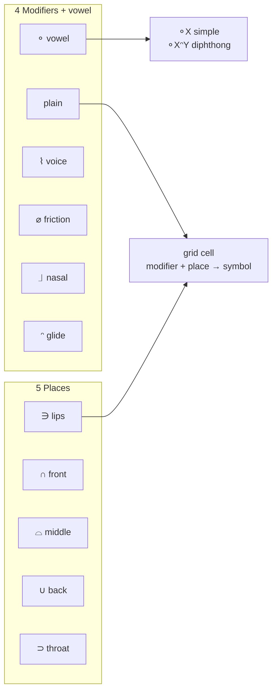

# Language Rules
> **Now a research note.** This document is preserved as a primary source. Related narrative in the research notebook: [RN-01 · Writing sound instead of spelling](/research/notes/writing-sound-instead-of-spelling).

These are the authoritative **encoding rules** for the Fonora phonetic script (Script Layer). The experimental **Fonoran** language is written using this script, see [platform-overview.md](platform-overview.md) and [fonoran.md](fonoran.md) for the language and builder tools.

## Configuration

| key | value |
| --- | ----- |
| fonora_version | v3 |
| ipa_vowel_mode | v3 |

## Places of Articulation

The **5 primary places**: edit symbols here; the sound grid and vowels recompose automatically.

| id | symbol | key_number | key_letter | label | sound | explanation |
| --- | --- | ---: | --- | --- | --- | --- |
| lips | ∋ | 1 | p | Lips | p | Lips/front-most articulation |
| front_tongue | ∩ | 2 | t | Front Tongue | t | Front tongue/alveolar or dental articulation |
| middle_tongue | ⌓ | 3 | c | Middle Tongue | c | Middle tongue/palatal or post-alveolar articulation |
| back_tongue | ∪ | 4 | k | Back Tongue | k | Back tongue/velar articulation |
| throat | ⊃ | 5 | h | Throat | h | Throat/glottal articulation |

## Modifiers

The **4 manner modifiers** plus the **vowel indicator** (keyboard **0**).

| id | symbol | key_number | key_letter | label | explanation |
| --- | --- | ---: | --- | --- | --- |
| vowel | ⚬ | 0 | 0 | Vowel | Vowel indicator; prefixes all vowel spellings |
| voice | ⌇ | 6 | b | Voice | Adds voicing to a place sound |
| friction | ⌀ | 7 | d | Friction | Adds friction/fricative quality |
| nasal | ⏌ | 8 | j | Nasal | Adds nasal airflow |
| glide | ᵔ | 9 | g | Approximant | Transition between vowel positions; used in diphthongs and grid approximant consonants |

## Sound Grid

Symbols are **composed** from Places + Modifiers at load time (`modifier + place`). Five places only, no derived symbols.

| modifier_id | place_id | sound | ipa | status | explanation |
| --- | --- | --- | --- | --- | --- |
| plain | lips | p | /p/ | defined | Plain lips stop |
| plain | front_tongue | t | /t/ | defined | Plain front tongue stop |
| plain | middle_tongue | ch | /tʃ/ | defined | Voiceless palato-alveolar affricate (English "ch") |
| plain | back_tongue | k | /k/ | defined | Plain back tongue stop |
| plain | throat | h | /h/ | defined | Plain throat sound (glottal fricative) |
| voice | lips | b | /b/ | defined | Voiced lips sound |
| voice | front_tongue | d | /d/ | defined | Voiced front tongue sound |
| voice | middle_tongue | j | /dʒ/ | defined | Voiced middle tongue sound |
| voice | back_tongue | g | /g/ | defined | Voiced back tongue sound |
| voice | throat | gh | /ɣ/ | defined | Voiced throat sound (voiced velar/uvular fricative; Arabic غ) |
| friction | lips | f | /f/ | defined | Friction lips sound |
| friction | front_tongue | s | /s/ | defined | Friction front tongue sound |
| friction | middle_tongue | sh | /ʃ/ | defined | Friction middle tongue sound |
| friction | back_tongue | x | /x/ | defined | Voiceless velar fricative |
| friction | throat | kh | /χ/ | defined | Voiceless uvular fricative |
| nasal | lips | m | /m/ | defined | Nasal lips sound |
| nasal | front_tongue | n | /n/ | defined | Nasal front tongue sound |
| nasal | middle_tongue | ñ | /ɲ/ | defined | Nasal middle tongue sound |
| nasal | back_tongue | ng | /ŋ/ | defined | Nasal back tongue sound |
| nasal | throat | | | reserved | No glottal nasal. Reserved for research. |
| glide | lips | w | /w/ | defined | Approximant lips sound |
| glide | front_tongue | l | /l/ | defined | Approximant front tongue sound |
| glide | middle_tongue | r | /r/ | defined | Approximant middle tongue sound |
| glide | back_tongue | y | /j/ | defined | Approximant back tongue sound |
| glide | throat | | /ʕ/ | reserved | Pharyngeal approximant. Research candidate. |

## Vowels

Vowels use a fixed **v3 grammar** (no double-vowel marker):

* **Simple vowel:** `⚬X`, exactly 2 symbols (`X` = vowel class: place or manner glyph)
* **Diphthong:** `⚬XᵔY`, exactly 4 symbols (`ᵔ` = approximant; `Y` = destination articulation place)

Recipe tokens: `vowel` → **⚬**; place ids and manner ids (`voice`, `friction`, `nasal`) compose `X`; `glide` → **ᵔ**; trailing place id → `Y`.

**Vowel design (mouth-intuitive tiers):**

* **Simple** (`a`, `e`, `i`, `o`, `u`): place glyphs, back → front — `a` ∪, `e` ⌓, `i` ∩, `o` ⊃, `u` ∋
* **Long** (`ae`, `ee`, `oh`): manner glyphs — `ae` ⌀, `ee` ⌇, `oh` ⏌
* **Diphthongs**: nucleus and offglide use the simple-vowel place glyphs (e.g. `ay` = `e` + approximant + `a`)

**Mapping rule:** IPA tokens in each table are authoritative. English words in *Example* are teaching aids only.

### Simple Vowels (⚬X)

| key | recipe | ipa | lexical_set | example |
| --- | --- | --- | --- | --- |
| a | vowel, back_tongue | ʌ, ə, ɐ, a | CUP / schwa / open | cup |
| e | vowel, middle_tongue | ɛ, e, eː | DRESS / FACE base | bed |
| i | vowel, front_tongue | ɪ | KIT | sit |
| o | vowel, throat | ɑ, ɒ, ɔ, ɑː, ɔː | LOT / THOUGHT | father |
| u | vowel, lips | ʊ, u, uː, ʉ, ɯ | FOOT / GOOSE | book / boot |
| ae | vowel, friction | æ | TRAP | cat |
| ee | vowel, voice | i, iː | FLEECE | see |
| oh | vowel, nasal | o, oː, oʊ, əʊ | GOAT | go |

### Diphthongs (⚬XᵔY)

| key | recipe | ipa | lexical_set | example |
| --- | --- | --- | --- | --- |
| ay | vowel, middle_tongue, glide, back_tongue | eɪ | FACE | say |
| eye | vowel, throat, glide, back_tongue | aɪ | PRICE | pie |
| ow | vowel, throat, glide, lips | aʊ | MOUTH | now |
| oy | vowel, lips, glide, back_tongue | ɔɪ | CHOICE | boy |

Phoneme keys (`ee`, `i`, `ae`, …) are encoder identifiers. Sound Grid and Alphabet UIs are generated from these tables at load time.

## IPA Supplemental Mappings

| ipa | fonora_phoneme |
| --- | --- |
| ɚ | a, r |

## Derived / Reserved Sounds

Non-grid orderings composed from primary symbols at load time (reversed `place + modifier` or modifier pairs).

| sound | composition | ipa | status | explanation |
| --- | --- | --- | --- | --- |
| th | reverse_front_tongue_friction | /θ/ | defined | Voiceless dental fricative |
| dh | reverse_front_tongue_voice | /ð/ | defined | Voiced dental fricative |
| v | reverse_lips_voice | /v/ | defined | Reversed lips+voice ordering |
| z | reverse_friction_voice | /z/ | defined | Voiced counterpart of /s/ |

## Notes

* **Symbol core:** 5 places + 4 manner modifiers + **⚬** vowel indicator (keyboard 0).
* **V3 vowel grammar:** simple = 2 symbols; diphthong = 4 symbols. The legacy double-vowel marker **⚬⚬** is not used.
* **`docs/language-rules.md`** supplies structure and default symbols; Alphabet tab overrides replace primaries for browser testing.
* Consonant IPA→phoneme normalization is documented in [docs/ipa-normalize.md](docs/ipa-normalize.md) and enforced by `npm test`.
* Sound grid, vowels, derived sounds, and CV examples recompose from active primaries on load.
* Do not use ASCII `=` (U+003D) as a symbol.
