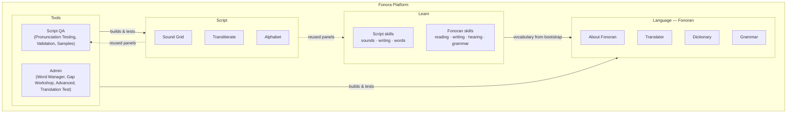
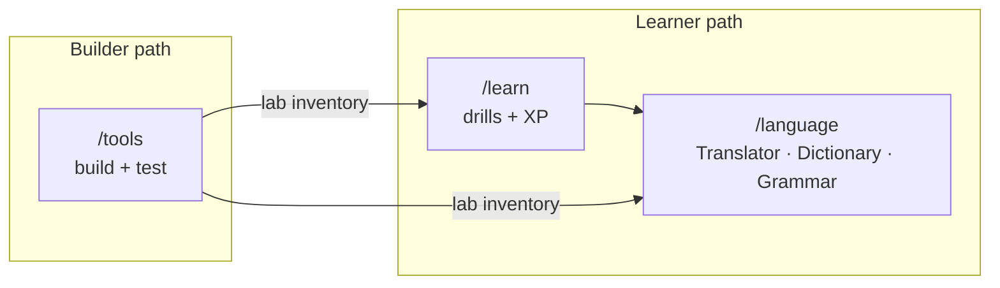

# Fonora platform overview

Fonora is an open-source project exploring new approaches to writing systems, language
design, and language learning.

**What Fonoran is:** a constructed language generated from first principles by deterministic algorithms. The rules it obeys are in [fonoran-rulebook.md](fonoran-rulebook.md).

Fonora has three projects, surfaced as top-level tabs (one more when signed in):

| Tab | Route | What it is | Start here |
| --- | --- | --- | --- |
| **Fonora** | [`/`](/) | Platform home: the project and the hypothesis | This document · [fonoran-rulebook.md](fonoran-rulebook.md) |
| **Script** | [`/script`](/script) | Fonora Script: phonetic writing system | [language-rules.md](language-rules.md) · [Sound Grid](/script#grid) |
| **Language** | [`/language`](/language) | Fonoran: experimental language built on Fonora Script | [fonoran-rulebook.md](fonoran-rulebook.md) · [fonoran-grammar.md](fonoran-grammar.md) |
| **Learn** | [`/learn`](/learn) | Structured drills: Fonora Script + Fonoran language skills | [fonoran-learn.md](fonoran-learn.md) · [`/learn`](/learn) |
| **Tools** | [`/tools`](/tools) | QA/build tooling for Script and Language (sign-in required when OAuth is configured) | [`/tools#tools-home`](/tools#tools-home) |

The **Fonora** sub-nav links to **About** and **Docs**. The language is described by five living documents: the [rulebook](fonoran-rulebook.md), three algorithm pages ([roots](fonoran-algorithm-roots.md), [compounds](fonoran-algorithm-compounds.md), [translation](fonoran-algorithm-translation.md)), and the [architecture map](fonoran-architecture.md). Everything else in this folder is reference material.

[`/learn`](/learn) is public structured practice: **Fonora Script** skills (sounds, writing, words)
and **Fonoran language** skills (reading, writing, hearing, grammar). See [fonoran-learn.md](fonoran-learn.md).
[`/tools`](/tools) hosts Script QA/debugging (Pronunciation Testing, Validation, Samples)
**and** the Fonoran builder admin tools (Word Manager, Gap Workshop, Advanced pipeline, Translation Test).
`/script`, `/learn`, and `/tools` share the same front-end bundle. `/language` is a separate public app
(Translator, Dictionary, Grammar).

```mermaid
flowchart TB
  subgraph platform [Fonora Platform]
    subgraph script [Script]
      SG[Sound Grid]
      TR[Transliterate]
      AL[Alphabet]
    end
    subgraph language [Language — Fonoran]
      Home[About Fonoran]
      Translator[Translator]
      Dict[Dictionary]
      Gram[Grammar]
    end
    subgraph learn [Learn]
      ScriptLearn["Script skills\nsounds · writing · words"]
      FonoranLearn["Fonoran skills\nreading · writing · hearing · grammar"]
    end
    subgraph tools [Tools]
      ScriptTools["Script QA\n(Pronunciation Testing, Validation, Samples)"]
      LangTools["Admin\n(Word Manager, Gap Workshop, Advanced, Translation Test)"]
    end
  end
  script -. "reused panels" .-> learn
  script -. "reused panels" .-> ScriptTools
  learn -->|"vocabulary from bootstrap"| language
  tools -->|"builds & tests"| language
  tools -->|"builds & tests"| script
```

```mermaid
flowchart LR
  subgraph learnerPath [Learner path]
    LearnRoute["/learn\ndrills + XP"]
    LangRoute["/language\nTranslator · Dictionary · Grammar"]
  end
  subgraph builderPath [Builder path]
    ToolsRoute["/tools\nbuild + test"]
  end
  LearnRoute --> LangRoute
  ToolsRoute -->|"lab inventory"| LearnRoute
  ToolsRoute -->|"lab inventory"| LangRoute
```

For the full Fonoran data pipeline (concepts → roots → compounds → lab), see the diagram in **[fonoran.md](fonoran.md)**.

## Front end vs. backend: this is a front-end split only

Script, Language, and Tools are split here as **navigation and presentation**, not as separate
backends. The Fonoran builder's data, API (`/api/fonoran/*`), and tooling remain shared and
intertwined by design — splitting the data model is explicitly out of scope for now. See
[fonoran.md](fonoran.md) for the (single, shared) data architecture.

## Start here

### Learn the script

1. [Sound Grid](/script#grid) and [Alphabet](/script#alphabet)
2. [Transliterate](/script#translator)
3. [language-rules.md](language-rules.md)

### Learn Fonoran

1. [fonoran-rulebook.md](fonoran-rulebook.md) — the three layers, the 13 rules, the vocabulary rings
2. [fonoran-learn.md](fonoran-learn.md) — Learn architecture (Script + Fonoran skill tracks)
3. [`/learn`](/learn) — structured drills: [`#fonoran-reading`](/learn#fonoran-reading), [`#fonoran-writing`](/learn#fonoran-writing), [`#fonoran-hearing`](/learn#fonoran-hearing), [`#fonoran-grammar`](/learn#fonoran-grammar)
4. [`/language`](/language) — Translator / Dictionary / Grammar (exploration)
5. [fonoran-grammar.md](fonoran-grammar.md)

### Build the language

1. `npm start` → [`/language`](/language)
2. `npm run fonoran:build` — assign roots, build curated compounds, import lab
3. **Words** — approve roots and words at [`/tools#word-manager`](/tools#word-manager)
4. **Word Creator** — stack roots and approved words into compounds
5. **Advanced** — import build, lab reset, snapshot export at [`/tools#advanced`](/tools#advanced)

Details: [fonoran.md#pipeline](fonoran.md#pipeline).

---

## Data architecture

### Live vocabulary

**`data/fonoran-sound-bucket.json`** (gitignored locally) is authoritative for your language:

- `sounds[]` — primitive roots
- `compounds[]` — words, derivation trees, review state, DDA metadata
- `history[]` — undo stack

**`npm run fonoran:build`** rebuilds the lab from the concept inventory and curated compounds. User-created roots and words (`created_by: user`) are **preserved** across rebuilds.

### Concept and build files (committed)

| File | Role |
| --- | --- |
| `fonoran-concept-inventory.json` | Semantic concepts |
| `fonoran-root-candidates.json` | Root spellings + review queue |
| `fonoran-approved-roots.json` | Canonical approved roots |
| `fonoran-compounds.json` | Curated compound recipes |

### PostgreSQL

User data only: accounts, lesson progress, community proposals, votes. The language is read from the files above in every environment. See [deploy.md](deploy.md).

---

## Related

- Doc index: [README.md](README.md)
- Fonoran Learn: [fonoran-learn.md](fonoran-learn.md)
- Fonoran rules: [fonoran-rulebook.md](fonoran-rulebook.md)
- Third-party licenses: [third-party.md](third-party.md)
- Contributing: [../CONTRIBUTING.md](../CONTRIBUTING.md)
