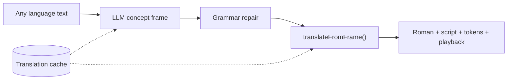

# RN-28 · Multilingual LLM semantic compiler

> **Status**: Active (July 2026). Supersedes the English-only interpretive translator for live `/api/fonoran/translate`.

## Problem

The v1 English semantic compiler (`tools/fonoran-translator.js`, `tools/fonoran-english-resolve.js`) required ever-growing English-specific exception lists. That contradicted Fonoran's design: grammar is language-neutral; concepts are canonical.

## Decision

Replace the live translate path with an **LLM back-translator**:

1. **Input**: text in any language + optional `sourceLang` (or auto-detect).
2. **LLM output**: language-neutral concept frame — `{ slots, is_question, unresolved, reasoning }`.
3. **Deterministic render**: `translateFromFrame()` validates concept ids + particles against the live lab, then reuses `slotsToTokens()` + `buildSurface()`. No invented spellings.
4. **Cache**: successful frames stored in `fonoran-translation-cache.json` (fonora-data).

LLM calls use **`ANTHROPIC_API_KEY_FONORA_TRANSLATOR`** (user-facing), separate from backend tooling's `ANTHROPIC_API_KEY`.

The legacy English compiler remains as `translateEnglishLegacy()` / `engine=legacy` for CI regression until LLM coverage matches or exceeds it on the 1,000-phrase stranger corpus.

## Architecture

Full diagrams (end-to-end, compile pipeline, Language app UI): **[fonoran-translator.md](../fonoran-translator.md)**.

## Implementation

| Module | Role |
| --- | --- |
| `tools/fonoran-llm-translate.js` | Prompt, LLM call, validation, repair |
| `tools/fonoran-llm-grammar-brief.js` | Grammar brief + violation checks |
| `tools/fonoran-translate.js` | Unified `translate()` router |
| `tools/fonoran-translation-cache.js` | Cache read/write + CLI |
| `tools/fonoran-translator.js` | `translateFromFrame()`, `frameSlotsToSemanticSlots()` |
| `tools/fonoran-translate-alternates.js` | Rule-based we alternates |
| `tools/fonoran-playback-build.js` | Playback attachment (Samples-style TTS) |
| `language/fonoran-app.js` | Translator UI at `/language#translator` |

## UI (July 2026)

- Two-column layout: source input | Fonoran output (independent auto heights).
- Loading spinner during compile; debounced translate.
- Resolution colors on tokens (direct / interpreted / gap).
- Pronunciation: collapsed details under roman.
- “Why this reading”: hover popup with LLM reasoning.
- Listen uses server `playback`; optional we-reading alternates.

## Related

- [fonoran-translator.md](../fonoran-translator.md) — living spec
- [RN-15 · Compiling English into meaning](/research/notes/compiling-english-into-meaning) — legacy compiler
- [RN-25 · Concept-first translation and honest gaps](/research/notes/concept-first-translation-and-honest-gaps)
- [RN-27 · Automated refine loop](/research/notes/automated-refine-loop)
