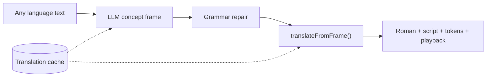

# Multilingual LLM semantic compiler

## Research Question

The v1 English semantic compiler (`tools/fonoran-translator.js`, `tools/fonoran-english-resolve.js`) required ever-growing English-specific exception lists — a pattern that contradicted Fonoran's core design: grammar is language-neutral and concepts are canonical.

**Can replacing the live translate path with an LLM back-translator — one that produces a language-neutral concept frame from any source language — eliminate the English-specific exception lists while matching or exceeding English compiler coverage on the 1,000-phrase stranger corpus?**

## Hypothesis

An LLM can reliably decompose text in any language into a language-neutral concept frame `{ slots, is_question, unresolved, reasoning }`. A deterministic renderer (`translateFromFrame()`) that validates those concept ids and particles against the live lab can then produce grammatically correct Fonoran output without any language-specific exception logic — and without inventing spellings for unresolved gaps.

## Approach

### Architecture

1. **Input**: text in any language + optional `sourceLang` (or auto-detect).
2. **LLM output**: language-neutral concept frame — `{ slots, is_question, unresolved, reasoning }`.
3. **Deterministic render**: `translateFromFrame()` validates concept ids + particles against the live lab, then reuses `slotsToTokens()` + `buildSurface()`. No invented spellings.
4. **Cache**: successful frames stored in `fonoran-translation-cache.json` (fonora-data).

LLM calls use **`ANTHROPIC_API_KEY_FONORA_TRANSLATOR`** (user-facing), separate from backend tooling's `ANTHROPIC_API_KEY`.

The legacy English compiler remains as `translateEnglishLegacy()` / `engine=legacy` for CI regression until LLM coverage matches or exceeds it on the 1,000-phrase stranger corpus.

Full architecture diagrams (end-to-end, compile pipeline, Language app UI): **[fonoran-translator.md](../fonoran-translator.md)**.

### Modules

| Module | Role |
| --- | --- |
| `tools/fonoran-llm-translate.js` | Prompt, LLM call, validation, repair |
| `tools/fonoran-llm-grammar-brief.js` | Grammar brief + violation checks |
| `tools/fonoran-translate.js` | Unified `translate()` router |
| `tools/fonoran-translation-cache.js` | Cache read/write + CLI |
| `tools/fonoran-translator.js` | `translateFromFrame()`, `frameSlotsToSemanticSlots()` |
| `tools/fonoran-translate-alternates.js` | Rule-based we alternates |
| `tools/fonoran-playback-build.js` | Playback attachment (Samples-style TTS) |
| `language/fonoran-app.js` | Translator UI at `/language#translator` |

### UI (July 2026)

- Two-column layout: source input | Fonoran output (independent auto heights).
- Loading spinner during compile; debounced translate.
- Resolution colors on tokens (direct / interpreted / gap).
- Pronunciation: collapsed details under roman.
- "Why this reading": hover popup with LLM reasoning.
- Listen uses server `playback`; optional we-reading alternates.

## Evaluation

**Active (July 2026).** The LLM compiler is live for `/api/fonoran/translate`. The legacy English compiler is retained as `engine=legacy` for CI regression comparison.

Coverage comparison of LLM vs. legacy on the 1,000-phrase stranger corpus is pending. The legacy compiler established 88% coverage (RN-27 post-hygiene baseline); the LLM path must match or exceed this before the legacy path is retired.

## Findings

Separating the user-facing LLM key (`ANTHROPIC_API_KEY_FONORA_TRANSLATOR`) from backend tooling prevents accidental quota bleed during automated refine runs and CI. The deterministic renderer (`translateFromFrame()`) reuses the validated slot/surface pipeline, so LLM frame errors surface as honest gaps rather than invented spellings — the same guarantee as the concept-first English compiler (RN-25).

## What Changed

| File | Change |
|------|--------|
| `tools/fonoran-llm-translate.js` | New: prompt, LLM call, validation, grammar repair |
| `tools/fonoran-llm-grammar-brief.js` | New: grammar brief generation + violation checks |
| `tools/fonoran-translate.js` | New: unified `translate()` router (LLM vs. legacy) |
| `tools/fonoran-translation-cache.js` | New: cache read/write + CLI |
| `tools/fonoran-translator.js` | Added `translateFromFrame()`, `frameSlotsToSemanticSlots()`; legacy path preserved as `translateEnglishLegacy()` |
| `tools/fonoran-translate-alternates.js` | New: rule-based we-reading alternates |
| `tools/fonoran-playback-build.js` | New: playback attachment (Samples-style TTS) |
| `language/fonoran-app.js` | Translator UI at `/language#translator`; two-column layout, spinner, resolution colors, LLM reasoning popup |

## Open Questions

- Does LLM coverage on the 1,000-phrase stranger corpus match or exceed the legacy English compiler (88% post-hygiene)? This comparison must pass before `engine=legacy` is retired.
- How does translation quality hold for non-English source languages beyond initial spot checks? A formal multi-language evaluation corpus does not yet exist.
- What is the cache invalidation strategy as the concept inventory evolves? Cached frames may reference concept ids that have since been demoted or renamed.
- Should `sourceLang` auto-detect be made explicit in the API for logging and debugging purposes?

## References

- [fonoran-translator.md](../fonoran-translator.md) — living spec (full architecture diagrams)
- [RN-15 · Compiling English into meaning](/research/notes/compiling-english-into-meaning) — legacy compiler
- [RN-25 · Concept-first translation and honest gaps](/research/notes/concept-first-translation-and-honest-gaps)
- [RN-27 · Automated refine loop](/research/notes/automated-refine-loop)
- `tools/fonoran-llm-translate.js`, `tools/fonoran-translate.js`, `tools/fonoran-translator.js`
