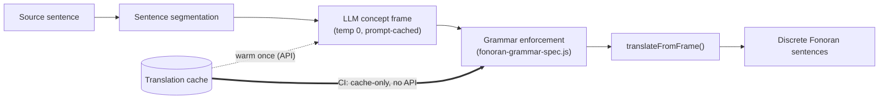

# Allowing drift, enforcing grammar

## Research Question

[RN-28](/research/notes/multilingual-llm-semantic-compiler) put the multilingual LLM semantic compiler on the live translate path but kept the legacy English compiler as the CI gate, leaving one question explicitly open: does the LLM path match or exceed legacy coverage on the 1,000-phrase corpus before the legacy path can be retired?

Two obstacles stood between that question and an answer. An LLM is non-deterministic by construction, which is disqualifying for a regression gate that must give the same result on every run. And hand-testing the live translator showed the failures were not where we assumed: the model's *vocabulary* choices were usually reasonable, but its *grammar* drifted — long passages compiled into a single run-on frame, `this`/`that` were sometimes reified into concepts, and predicate adjectives such as "you are safe here" lost their ordering.

That observation reframed the problem. Grammar is a small set of hard rules; vocabulary is an open, fuzzy space. So the question this note works through is:

**Can the translator be made deterministic and grammatically correct without freezing vocabulary — by letting the LLM choose concepts (drift allowed) while grammar is enforced deterministically on the concept frame, and by committing validated frames to a cache so CI reproduces exactly with no live API calls?**

## Hypothesis

The working hypothesis had four parts, none of them proven going in:

1. **Determinism belongs at the cache, not the model.** If the LLM is treated as a compile-time tool (temperature 0) that emits a concept frame, and validated frames are committed to `data/fonoran-translation-cache.json`, then the runtime render is a pure function of the cache. CI can read cache-only and fail loudly on a miss rather than call the network.
2. **Grammar can be enforced as a deterministic pass over the frame.** A single spec — canonical slot order, the closed set of particles, place-vs-quality modifier precedence, no demonstratives — should be able to normalize whatever frame the LLM emits, so the surface is grammatical regardless of which synonym the model picked.
3. **One sentence per frame.** Segmenting multi-sentence input and rendering each part as its own Fonoran sentence should remove the run-on failure without any schema change.
4. **Honest gaps are the real coverage number.** Once the model stops silently forcing weak matches, "coverage" should fall to a truthful measure of what the language can actually express — extending the gap-baseline idea from [RN-25](/research/notes/concept-first-translation-and-honest-gaps) to the LLM path.

## Approach

The change touched the compiler, the renderer, the cache, and the CI scripts. The offline/deterministic guarantee was preserved: after warming, no runtime network call is needed.

### Pipeline

**Grammar spec.** The hard rules were pulled out of the renderer into a single module, [`tools/fonoran-grammar-spec.js`](../../tools/fonoran-grammar-spec.js): canonical `SLOT_SURFACE_ORDER`, the closed `PARTICLE_FORMS`, `TENSE_PARTICLES`, place classification (`buildPlaceConceptSet`), modifier ordering (`orderModifiers` / `enforceModifierOrder`), a `DEMONSTRATIVES` set, and `grammarInvariantViolations()` for testing. `enforceModifierOrder` is now called inside `translateFromFrame` so *quality before place* holds regardless of the LLM's slot order — "you are safe here" renders `be tampe nam`, not the reverse. Pure-function unit tests live in [`scripts/fonoran-grammar-spec-test.js`](../../scripts/fonoran-grammar-spec-test.js) and need no database or API.

**Sentence segmentation.** [`tools/fonoran-llm-translate.js`](../../tools/fonoran-llm-translate.js) compiles one sentence per frame — from the plain-meaning `clauses[]` when the simplification pre-pass ran, otherwise from a sentence split — and `mergeSentenceResults` recombines them into discrete Fonoran sentences, each with its own terminator. This is what fixed the run-on grammar in passages like "…in a galaxy far, far away."

**Demonstratives and conjunctions.** The compiler prompt was tightened to state that demonstratives (this/that/these/those) have no v1 form and are left to inference, and that coordinated clauses (and/or/but/then) must be folded into the frame rather than dropped — a regression that appeared once the prompt asked for "one sentence at a time." A defensive `cleanGapToken()` in [`tools/fonoran-translator.js`](../../tools/fonoran-translator.js) normalizes `unresolved[]` down to short tokens so model reasoning never leaks into the gap baseline.

**Cache-only determinism and prompt caching.** A `cacheOnly` guard returns an explicit `cache_miss` instead of calling the API. [`tools/fonoran-llm-client.js`](../../tools/fonoran-llm-client.js) gained a `cachePrefix` breakpoint so the large static prompt (grammar brief, concept inventory, bridges, few-shot) is billed at the cache-read rate. Warming (`updateGoldenCorpus` in [`tools/fonoran-translation-gaps.js`](../../tools/fonoran-translation-gaps.js)) runs with bounded concurrency after a single cache-priming call.

**Transliterate robustness.** The phonetic *Transliterate* path in [`tools/fonoran-fonora-bridge.js`](../../tools/fonoran-fonora-bridge.js) now falls back to `encodeSounds` on the whole roman string when a token is not a single CVC syllable, so multi-syllable coined names (marked loanwords) render to valid Fonora script instead of empty output.

**CI wiring.** `package.json` `test:translator` now runs the grammar-spec unit tests plus the cache-only LLM golden assert; `test:translator:legacy` preserves the old engine for comparison, and `test:translator:warm` re-warms the cache with an API key. The admin Translation Test in [`tools/fonoran-api.js`](../../tools/fonoran-api.js) also runs the LLM engine, matching the live app.

## Evaluation

The two engines were compared on the committed 1,000-phrase golden corpus. Legacy runs offline; the LLM gate runs cache-only after a warm.

| Metric | Legacy | LLM (cache-only) |
| --- | --- | --- |
| Golden regression | — | 1000/1000 match, exit 0 |
| Phrase coverage | 90% (896/1000) | 66% (664/1000) |
| Distinct honest gaps | 78 | 120 |
| Resolved (pass) tokens | 3,698 | 4,189 |
| Hard-failed tokens | 109 | 2 |

Warming the full corpus (concurrency 6) cost roughly $5 and about 19 minutes. Prompt caching cut per-call input cost substantially: the first call writes an ~8K-token cache, and subsequent calls read it with only tens of variable tokens each. The grammar-spec unit tests and the frame/segmentation smoke tests pass.

These numbers are a snapshot of one warm against the current inventory, not a stable benchmark — re-warming after concept changes will move them.

## Findings

**Determinism is a caching problem, not a model problem.** Compiling at temperature 0, validating, and committing the frame makes the runtime reproducible; CI needs no API key and cannot drift, and a cache miss becomes an explicit "needs warming" signal instead of a silent live call. This is the mechanism that lets a probabilistic component sit behind a deterministic gate.

**Lower coverage was higher honesty, not a regression.** The 90% → 66% drop is a re-based metric, not lost ground. Legacy scored higher partly by forcing tokens to *some* root (109 hard-failed tokens, no honest "review" tier) and counting semantically wrong matches as passes. The LLM path resolves more tokens correctly (4,189 vs 3,698) with only 2 hard failures, and honestly flags the phrases that contain a concept Fonoran cannot yet express. Coverage now reads as a language-completeness gauge; the translator-quality signals all moved the right way.

**Separating drift from grammar worked in practice.** Letting the model vary vocabulary while grammar was enforced on the frame produced grammatical output without pinning aesthetic choices — the trade the project actually wanted.

**Parallelism exposed a real bug.** The first parallel warm kept only 18 of 1,000 entries: concurrent read-modify-write of the shared cache file clobbered itself. Serializing writes with an in-process lock fixed it (1000/1000 after). A reminder that a shared-file cache needs write serialization the moment concurrency is introduced. This result is provisional in the sense that a multi-process warm would need file-level locking, which we have not built.

## What Changed

This note is currently the head of the translator sequence, so its effects are visible in the present architecture rather than in a successor note yet. What became the new standard: the cache-only LLM path is now the default `npm test` translator gate (legacy demoted to `test:translator:legacy`), and `tools/fonoran-grammar-spec.js` is the single source of truth for grammar enforcement, called from `translateFromFrame`. Sentence segmentation and demonstrative inference are now part of the compile path; prompt caching, bounded-concurrency warming, and the cache write lock are permanent parts of the warm workflow. The gap baseline was re-sourced from the model's `unresolved[]` list so it stays a clean, short-token growth backbone.

Files touched: `tools/fonoran-grammar-spec.js` and `scripts/fonoran-grammar-spec-test.js` (new); `tools/fonoran-llm-translate.js`, `tools/fonoran-llm-client.js`, `tools/fonoran-translator.js`, `tools/fonoran-translate.js`, `tools/fonoran-translation-cache.js`, `tools/fonoran-translation-gaps.js`, `tools/fonoran-fonora-bridge.js`, `tools/fonoran-api.js`, `scripts/fonoran-translation-gaps.js`, `scripts/fonoran-translate-frame-test.js`, and `package.json`.

## Open Questions

- Intra-sentence conjunctions still fold into one frame because the frame schema is single-clause; a structured multi-frame schema would let coordinated clauses split into separate sentences. Disjunction ("or") has no v1 form at all — root or particle?
- The `grammarInvariantViolations` checker has unit coverage but no corpus-level runner yet. Should `--assert` check grammar invariants on every rendered phrase, not only exact-string golden match?
- The 120 gaps sort into vocabulary (`boy`, `girl`, `color`), structure (`and`, `or`, `can`, `when`), and quality (`deep`, `sharp`, `wet`). Should the baseline feed a frequency-ranked root-growth queue, as RN-25 asked?
- Cache invalidation as the inventory evolves (carried over from RN-28): cached frames may reference concept ids later demoted or renamed.
- No multilingual grammar-invariant corpus exists yet (es/fr/de/ja), so the language-neutral claim is still only spot-checked.
- Transliterate: when should a coined name be a marked loan versus a transparent compose path, and how should the boundary markers appear in script versus roman?

## References

- Related commits: `9020aa5` (multilingual LLM translator, RN-28 base), `c1dec38` (Fonoran transliterate mode and translator resolution improvements). The determinism, grammar-spec, segmentation, and warming changes described here are staged and not yet committed at time of writing.

**Documentation:** [`docs/fonoran-translator.md`](../fonoran-translator.md), [`docs/fonoran-grammar.md`](../fonoran-grammar.md) (Rule 7)

**Interactive demo:** Translator (`/language#translator`), Transliterate (`/#translator`)

**Future research notes:** none yet — this is the current head of the translator sequence.
